CÓLOMBIA
VIDA
CÓLOMBIA
VIDA
1º de Novembro de 2017
10:00 a 11:00

# Serie de Documentos Regionales Arauca

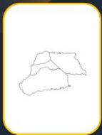

---

COLOMBIA
POTENCIA DE LA
VIDA
Documentos Regionales
Agencia de Renovación
del Territorio - ART

# Presentación

Con el objetivo de proporcionar un análisis detallado y brindar algunas reflexiones que recojan la visión y necesidades de direccionamiento de esfuerzos para la efectiva implementación del Acuerdo Final en la subregión, la ART presenta este informe, como uno de los 16 informes subregionales, que amplían el panorama suministrado en el Informe de Seguimiento a la Implementación de los PDET 2023.

Este documento consta de tres secciones. La primera ofrece una visión general de la subregión, abarcando condiciones intrínsecas a su dinámica demográfica, así como las características territoriales, económicas y ambientales más destacadas. Posteriormente, la segunda sección, presenta un análisis del estado de avance de la implementación, durante el período 2018-2022, del Plan de Acción para la Transformación Regional (PATR), como medio de instrumentalización del Programa de Desarrollo con Enfoque Territorial (PDET) de la subregión. Para este propósito, se analizan indicadores estratégicos de producto y resultado, desde una perspectiva multidimensional que abarca aspectos económicos, sociales, ambientales, justicia y seguridad. Esta mirada se complementa con percepciones de los actores locales, quienes ofrecen perspectivas valiosas para comprender los avances y desafíos presentes en la subregión.

Por último, en la tercera sección, se identifican las apuestas regionales como insumo para el direccionamiento de esfuerzos en apoyo a un proceso de toma de decisiones informadas. Este análisis integral contribuye a la definición de estrategias concretas para aprovechar las potencialidades del territorio y abordar los desafíos hacia una senda de desarrollo sostenible.

2
pdet
Programas de Desarrollo
enfoque Territorial

---

COLOMBIA
POTENCIA DE LA
VIDA
Agencia de Renovación
del Territorio - ART

# Documentos Regionales

# ¿Cuál es la visión de la Subregión?

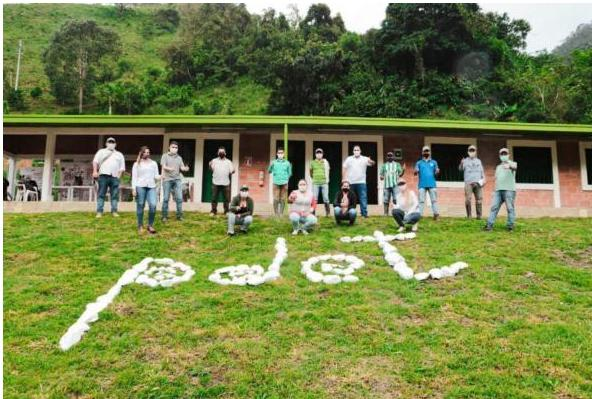

"En el 2028 el Programa de Desarrollo con Enfoque Territorial de la subregión de Arauca, garantiza un territorio ordenado y conectado, con desarrollo productivo agroambiental y agroindustrial competitivo, que privilegia la producción orgánica, la asociatividad, la despensa, el equilibrio, la protección y recuperación ambiental; fomenta la investigación, la innovación y la tecnología, garantiza el acceso a Ya propiedad de la tierra de las personas, el acceso a los servicios, los derechos, la vida digna y el buen vivir.

Respete y reconoce las cosmovisiones y la multiculturalidad en el territorio, promueve la solidaridad, la inclusión, reconoce la autonomía diferencial y transversal de género y protege la soberanía del territorio.

Esta meta será la base para dignificar las comunidades rurales víctimas del conflicto armado, superar la inequidad social y mejorar la calidad de vida con justicia social."

PATR subregión Arauca

3
potet
Programas de Desarrollo
de la Enfoque Territorial

---

COLOMBIA
POTENCIA DE LA
VIDA
Documentos Regionales
Agencia de Renovación
del Territorio - ART

# Panorama Territorial

Contar con el panorama territorial sobre las características de población, economía y recursos es preponderante cuando de avanzar en los diferentes frentes del desarrollo socioeconómico y ambiental en un territorio se trata. Estas variables permiten caracterizar de manera general a los territorios y dan una perspectiva de la magnitud de los desafíos y oportunidades existentes en los diferentes focos a los que la política pública atiende, por esta razón, a continuación, se describen los principales indicadores del panorama territorial de la Subregión de Arauca.

# Demografía

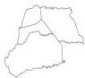

Población (2023)
204.008 habitantes
3,8% del total PDET

Urbano

54%

Rural

46%

Hombres

49,7%

Mujeres

50,3%

De acuerdo con la información del Censo 2018, del total de jefaturas de hogar en la subregión, el 43,3% lo ocupan mujeres.

El 3,6% de las personas se identifican como afrodescendientes y el 3,2% se identifican como indígenas

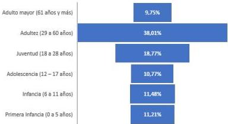
Población según ciclo vital (2023)
Fuente: CNPV 2018 – DANE.

pdet
Programas de Desarrollo
Enfoque Territorial

---

COLOMBIA
POTENCIA DE LA
VIDA
Documentos Regionales
Agencia de Renovación
del Territorio - ART

# Características Económicas

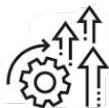

## Valor agregado

$4 billones (2021)

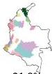
21,8%

28,8%

De acuerdo con las cifras del DANE, para el año 2021 la subregión registró un valor agregado de $4 billones, con una variación positiva de 28,8% respecto a 2020, un crecimiento mayor respecto al promedio PDET (21,8). Con respecto a 2018 se registró un crecimiento del 48,5% (2,7 billones).

## Arauca

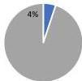

En 2021 la subregión tuvo una participación dentro del total del valor agregado del PDET de 4,1%.

En 2021 fue la octava subregión con mayor valor agregado del total PDET.

El sector primario (agropecuario, silvicultura y pesca y explotación de minas y canteras) registró un valor agregado de 2,5 billones, con una variación de 39,5% frente al 2020 y 73,7% frente a 2018. Este sector participa con el 62,4% del valor agregado de la subregión.

El sector secundario (industrias manufactureras) registró un valor agregado de 280 mil millones, con una variación de 19,3% frente al 2020 y 13,1% frente a 2018. Este sector participa con el 7,1% del valor agregado de la subregión.

El sector terciario (suministro de servicios públicos, comercio, transporte, servicios, entre otros) registró un valor agregado de 1,2 billones, con una variación de 13,2% frente al 2020 y 21,3% frente a 2018. Este sector participa con el 30,5% del valor agregado de la subregión.

5
Edet
Programas de Desarrollo
enfoque Territorial

---

COLOMBIA
POTENCIA DE LA
VIDA
Documentos Regionales
Agencia de Renovación
del Territorio - ART

# Recursos - Biodiversidad y medio ambiente

La subregión cuenta con un total de 280.981 hectáreas de reserva forestal, Ley Segunda¹. las cuales se distribuyen en: 1. Áreas con previa decisión de ordenamiento, 188 mil hectáreas; 2. Tipo C, 52 mil hectáreas; 3. Tipo A, 35 mil hectáreas y 4. Tipo B, 5 mil hectáreas.

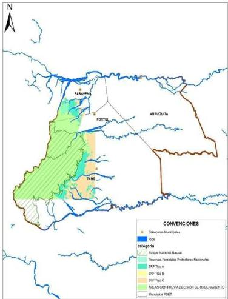
Fuente: SIAC e IGAC

En la subregión se localizan otras áreas de protección ambiental tales como reservas forestales y áreas de protección y conservación nacional. Cuenta con aproximadamente 25.792 hectáreas de cuerpos de agua, y drenajes dobles, destacándose el río Arauca, Casanare y Caranal.

1 Las Zonas de Reserva Forestal (ZRF) son áreas establecidas para el desarrollo de la economía forestal y protección de los suelos, las aguas y la vida silvestre. Para más información sobre las tipologías de Reserva Forestal establecidas por la Ley 2ª de 1959 consultar el siguiente link: https://www.minambiente.gov.co/wp-content/uploads/2021/10/Reservas-Forestales-establecidas-por-la-Ley-2-de-1959.pdf

---

COLOMBIA
POTENCIA DE LA
VIDA
Documentos Regionales
Agencia de Renovación
del Territorio - ART

# Criterios de focalización PDET

## Medición de desempeño municipal

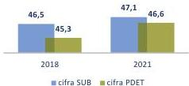

La subregión no ha presentado avances en el indicador que mide el desempeño municipal. Para 2021 se registró un puntaje de 52,6 lo cual representa una reducción de 1,7 p.p. con respecto al año inmediatamente anterior. Así mismo, desde 2018 ha disminuido en 0,3 p.p. A nivel municipal, para 2021 se destaca Fortul, municipio que registró un incremento de 3,6 p.p. pasando de 50,4 a 54. En contraste, Tame redujo su índice en 7,4 p.p. en el mismo periodo pasando de 55,5 a 48,2.

Fuente: DNP

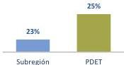
Pobreza

De acuerdo con la encuesta de seguimiento a la línea base de los PDET realizada por la ART, se estima que la pobreza multidimensional en la subregión fue de 25,8%, resultado inferior al total PDET por 1,3 p.p. De acuerdo con las estimaciones, el indicador con mejor resultado en 2022 fue acceso a fuentes de agua mejorada, con una incidencia de 1,5% en el territorio, en contraste, el indicador con mayor reto en la subregión es el de empleo informal con una incidencia de 92% en los hogares de la subregión.

Fuente: Cálculos ART con base en Evaluación Línea base

## Hectáreas de coca

Para 2022 no se registraron cultivos de coca. Desde el 2018 tampoco se registraron cultivos en esta subregión.

Fuente: Ministerio de Justicia - UNODC

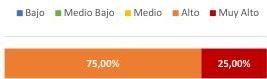
Índice de incidencia del conflicto armado

De acuerdo con la más reciente medición del índice de incidencia del conflicto armado (2021), en la subregión el 0% se encuentran en categoría de riesgo medio bajo. Así mismo, en la categoría muy alto se encuentra el 25% de los municipios. Desde 2018, el cambio más significativo fue la reducción de la categoría muy alto en 50 p.p.

Fuente: DNP

pd
Programas de Desarrollo
Enfoque Territorial

---

COLOMBIA
POTENCIA DE LA
VIDA
Documentos Regionales
Agencia de Renovación
del Territorio - ART

# PDET ¿Cómo vamos?

Para las comunidades de Arauca el desarrollo agropecuario sostenible juega un papel preponderante en el progreso de esta subregión. A través de esta actividad, la comunidad campesina tendrá reconocimiento de sus derechos y será posible promover el emprendimiento, la solidaridad y la asociatividad. En adición a esto, se propone el desarrollo de una oferta turística ecológica comunitaria, que proteja y conserve la biodiversidad y el medio ambiente.

En este sentido se establecen cuatro (4) dimensiones que materializan las potencialidades de la región en lo Económico, Social, Ambiental y Justicia y seguridad con el fin de presentar el estado de avance en el cierre de brechas socioeconómicas a partir de diferentes indicadores, así como la percepción de la comunidad frente a lo que ocurre en territorio. A partir de la metodología de prospectiva desarrollada por la ART, se identifican las potencialidades de la subregión a partir de diversas fuentes e instrumentos de planeación con el fin de proponer una serie de apuestas regionales que permitan orientar los esfuerzos de política pública atendiendo las particularidades y la visión de las comunidades definida en los PATR.

# 1. Dimensión económica

Las acciones por adelantar para satisfacer las necesidades manifestas por las comunidades en sus percepciones de esta dimensión pasan por asegurar que los pequeños productores cuenten con los recursos que le den seguridad al desarrollo de su producción (tierras formalizadas, acceso a presupuesto, apoyo en generación de competencias), así como con medios que les permitan conectar sus territorios, tanto de manera física como digital, como requerimiento esencial para la comercialización. En este sentido, los indicadores medidos a nivel nacional evidencian rezagos y avances en estos ámbitos.

Comenzando por la regularización de la tenencia de la tierra esta es esencial toda vez que brinda seguridad jurídica a los poseedores y contribuye al desarrollo sostenible, la inversión productiva y el acceso a programas de desarrollo rural. De acuerdo con los datos del Observatorio de Tierras Rurales - OTR, para el periodo 2017 - 2021, el número de hectáreas formalizadas y adjudicadas en la subregión fue de 3.654 hectáreas. Se encuentra que el año en que más se formalizaron y adjudicaron hectáreas fue el 2017 con 22.086 hectáreas, mientras que, en el 2022, tan solo se adjudicaron 481 hectáreas. En línea con esto, y de acuerdo con datos del Ministerio de Agricultura, entre 2018 y 2022, no se formalizaron resguardos y/o títulos colectivos en la subregión.

En paralelo con dicha formalización de predios, la financiación de los proyectos a pequeña y mediana escala resulta fundamental con el fin de brindar un desarrollo económico sostenible al territorio. En este aspecto, de acuerdo con cifras de Ministerio de Agricultura y Desarrollo Rural, entre el 2018 y 2022 tanto el número de créditos aprobados a pequeños productores agrícolas como su valor en la subregión crecieron, por una parte, en 131,4 % pasando de 1.343 en 2018 a 3.108 créditos en 2022; y por otra en 173,4 %, pasando de $ 15.032 millones en el 2018 a $ 41.103 millones en el 2022. En contraste, se encuentra que

8
PEDet
Programas de Desarrollo
enfoque Territorial

---

COLOMBIA
POTENCIA DE LA
VIDA
Documentos Regionales
Agencia de Renovación
del Territorio - ART

"Liberar la tensión de la propiedad de la comunidad por medio del "catastro Multipropósito" lo cual consiste en generar las legalidades de sus terrenos a cada miembro poblacional. Añade "esta también puede ser una necesidad PDET."

(funcionario de la Gobernación de Arauca, Evaluación LB 2022)

"La comercialización de los productos después de la pandemia se ha visto más afectado, la economía golpeo bastante al bolsillo de la comunidad, con respecto a los PDET refiere que la comercialización ha seguido igual, no ha habido ni un aumento, ni una disminución en cuanto a la comercialización de sus respectivos productos."

(Líder de Arauquita, Evaluación LB 2022)

la subregión registró un descenso de 0,2 % en la cantidad de créditos aprobados a pequeños productores, con relación al 2021 (3.115) y un crecimiento del 13,7 %, en el valor de los créditos, con relación al año 2021 ($36.138 millones).

Adicionalmente, si bien en búsqueda de impulsar un desarrollo sostenible en la producción agropecuaria, desde las necesidades manifestadas e identificadas de las comunidades de los territorios PDET, el sector agropecuario ha diseñado estrategias para el mejoramiento de procesos, tecnificación y capacitación para los pequeños productores agrícolas. De acuerdo con datos de la Agencia de Desarrollo Rural, entre el 2019 y el 2022, el número de productores en el registro que recibieron el servicio de extensión agropecuaria fue de 557 productores; sin embargo, se observa que en el año 2022 no se registraron nuevos productores a prácticas de extensión agropecuaria.

En lo relacionado con la conectividad digital, las dinámicas actuales del comercio y el relacionamiento con los clientes exigen que la formación de capital humano sea un factor indispensable para la innovación, el emprendimiento y el desarrollo económico de la subregión. A pesar de esto, los datos del Ministerio de Tecnologías de la Información y las Comunicaciones evidencian que, en el 2022 el índice de penetración de internet fijo para la subregión fue de 7 %, lo cual representa un incremento de 0,6 p.p. frente al 2021.

Así mismo, la conectividad al interior de la subregión y con el resto del país se constituye en un factor clave para el desarrollo económico, dado que facilita el establecimiento de alianzas productivas y comerciales entre los diferentes territorios. Por esta razón, se encuentra que la construcción y el mejoramiento de vías de transporte se configuran como medidas detonantes para la economía de la subregión. En línea con esto, según la información obtenida a través de la línea de base para el seguimiento y evaluación de los PDET por parte de la ART, para el 2022 en la subregión 36,3 % de los hogares indicaron que alguna vía cercana a su vivienda había sido mejorada, rehabilitada o le habían hecho mantenimiento en los últimos dos años, lo cual representa una disminución de 10 p.p. con respecto al 2018.

pd
Programas de Desarrollo
enfoque Territorial

---

COLOMBIA
POTENCIA DE LA
VIDA
Documentos Regionales
Agencia de Renovación
del Territorio - ART

"Si, se han visto mejoras, especialmente en las vías primarias, lo que son las terciarias y secundarias están totalmente deterioradas, y en invierno el ingreso y salida es más difícil, desconozco si estas mejoras en las vías principales provienen de los PDET."

(Líder de Arauquita, Evaluación LB 2022)

"En algunos temas de infraestructura si se han visto obras pero aún falta mucho, nosotros somos una zona muy maltratada por el invierno y por esto las zonas de acceso son muy complicadas, no hay mayor contacto para la mejora de este aspecto."

(Líder de Arauquita, Evaluación LB 2022)

"Si, se han podido notar mejoras, especialmente en las vías primarias, las cuales son las más transitadas para proveer a la comunidad de los diversos productos, pero aún falta por mejorar las vías secundarias y terciarias que también son importantes para un direccionamiento interno, ya que cuando se está en invierno son vías de difícil acceso"

(Líder de Fortul, Evaluación LB 2022)

Finalmente, la provisión del servicio de energía eléctrica resulta indispensable para el desarrollo económico ya sea en procesos de tecnificación del campo o el asentamiento industrial. De acuerdo con la información de Ministerio de Minas y Energía, para el periodo 2019 - 2022, el número de nuevos usuarios de energía eléctrica en la subregión fue de 1.133. El año en el que más se conectaron usuarios de energía eléctrica fue el 2019 con 555 usuarios, mientras que en el 2022 se conectaron 372 usuarios.

Unos órdenes de magnitud más claros sobre los rezagos que persisten en las diferentes aristas de desarrollo económico previamente mencionadas, se documentan en la Metodología del Cierre de Brechas (MCB) del Departamento Nacional de Planeación (DNP). Según sus últimos resultados publicados, se cuenta con brechas referentes a tecnologías de la información y las comunicaciones (TIC), energía, agricultura, desarrollo económico y transporte en línea con los indicadores y percepciones descritas a este punto.

Se encuentra que Arauquita presenta la mayor brecha en TIC (67,8 %) y agricultura (46,8 %), para energía es Saravena el de mayor brecha (57,9 %) y Tame en desarrollo económico (65,9 %). Por el contrario, se destaca el municipio de Fortul que presenta la menor brecha

pd
Programas de Desarrollo
enfoque Territorial

---

COLOMBIA
POTENCIA DE LA
VIDA
Agencia de Renovación
del Territorio - ART

# Documentos Regionales

en energía (13,9 %). Resulta relevante aclarar que, para la dimensión de transporte, todos los municipios presentan la misma brecha.

Tabla 1. Brechas dimensión económica

|  Municipio | TIC | Energía | Agricultura | Desarrollo Económico | Transporte  |
| --- | --- | --- | --- | --- | --- |
|  Arauquita | 67,8% | 23,3% | 46,8% | 51,2% | 74,2%  |
|  Fortul | 61,1% | 13,9% | 45,8% | 60,5% | 74,2%  |
|  Saravena | 57,4% | 57,9% | 45,1% | 48,9% | 74,2%  |
|  Tame | 64,6% | 0,0% | 41,5% | 65,9% | 74,2%  |

Fuente: DNP

# Retos y oportunidades de la dimensión económica

Las necesidades de las comunidades están orientadas al mejoramiento de las vías, priorizando las vías secundarias y terciarias. Así mismo, es notoria la necesidad de impulsar el crecimiento de la infraestructura energética del territorio, dado que en el 2022 se registraron pocos usuarios, lo cual deja en evidencia que es importante proponer soluciones para que la población acceda a este servicio, donde opciones como la autogeneración de energía podría ser un buen instrumento e iría en línea con los actuales objetivos en materia de transición energética.

Por otro lado, la difusión de estrategias como la extensión agropecuaria contribuirían a mejorar la economía de los productores de la subregión, dado que, según la percepción de la comunidad la comercialización ha sido constante. Con base en lo anterior, se pone sobre la mesa una oportunidad de expansión a través de instrumentos financieros como los que ya se han introducido en el territorio y han tenido un comportamiento positivo, en conjunto con la capacitación a los productores.

# 2. Dimensión social

Las percepciones de la comunidad dan línea de la necesidad de abordar la dimensión social desde distintos frentes: salud, educación, orden territorial e inclusión. En este sentido, los indicadores medidos a nivel nacional evidencian rezagos y avances en la dimensión social, incluyendo el acceso a la salud, la educación, el goce de una vivienda digna, entre otros.

# Avances y rezagos en materia de salud

El acceso a la salud es un derecho que impacta significativamente el bienestar de una comunidad. Una vez se garantiza su goce efectivo se promueve la equidad y se reduce la carga de enfermedades, permitiendo a los individuos alcanzar su máximo potencial y contribuir plenamente al desarrollo sostenible de la sociedad. De acuerdo con los datos del Ministerio de Salud, en 2022 la cobertura de afiliación al Sistema General de Seguridad

11
6

---

COLOMBIA
POTENCIA DE LA
VIDA
Agencia de Renovación
del Territorio - ART

# Documentos Regionales

Social en Salud (SGSSS) se ubicó en 93,7 % representando un descenso de 0,5 p.p. frente al 2018 (94,2 %). Así mismo, se observa que frente al 2021 (92,8 %) la cobertura aumentó en 0.9 p.p.

"El estado de la dotación de salud no es la mejor, difiere esto porque hace algún tiempo que no se realiza un mapeo general, asimismo hace algún tiempo no se tiene conocimiento de nuevos elementos de salud para el municipio."

(funcionario de Arauquita, Evaluación LB 2022)

"Considero que ha pasado años de mucha ayuda por parte de los PDET, ya que se han logrado obtener dotaciones importantes para las dotaciones del hospital (San Francisco), asimismo elementos de odontología lo cual beneficia a la comunidad en general."

(funcionario de Fortul, Evaluación LB).

"La evaluación que se haría con respecto a la calidad de servicios del sector de la salud dentro el municipio de Arauquita es que es totalmente pésimo, no hay un total cubrimiento con respecto a las necesidades es la comunidad, muchas veces es necesario el traslado de los pacientes a otras entidades médicas de otros municipios por la falta de recursos, con respecto a los medicamentos también se presentan algunas irregularidades, no hay en muchas ocasiones el medicamento."

El acceso a la salud posibilita realizar un seguimiento adecuado a las mujeres en estado de embarazo, asegurando la culminación del proceso de gestación, parto y posparto de forma satisfactoria para la madre y su hijo. Con base en lo anterior, una manera eficaz de monitorear el avance del acceso oportuno a la salud está relacionada con el peso de los menores al nacer. Con base en lo anterior, una manera eficaz de monitorear el avance del acceso oportuno a la salud está relacionada con el peso de los menores al nacer, la mortalidad materna y la mortalidad infantil. De acuerdo con cifras del Ministerio de Salud:

- En 2022 la proporción de menores con bajo peso al nacer se ubicó en 5,8 %, lo cual es un crecimiento de 1,3 p.p. frente al 2018 (4,5 %) y de 0,8 p.p. respecto al 2021 (5 %).

pd
Programas de Desarrollo
Enfoque Territorial

---

COLOMBIA
POTENCIA DE LA
VIDA
Agencia de Renovación
del Territorio - ART

# Documentos Regionales

- En 2021 la Razón de Mortalidad Materna - RMM se ubicó en 142 por cada 100.000 nacidos vivos, lo cual representa un descenso de 10 frente a 2018 (152). Por otro lado, se presentó un aumento de 25 frente al 2020 (117).
- En 2021 la tasa de mortalidad infantil se ubicó en tres muertes por cada 1.000 nacidos vivos, lo cual representa una disminución de dos muertes frente al año 2018 (5 muertes). Así mismo, se presentó una caída de 4 muertes con respecto al 2020 (7).
- Según cifras del Ministerio de Salud en 2022 la tasa de fecundidad adolescente se ubicó en 47,4 por cada 1.000 adolescentes, lo cual representa una disminución de 52,9 con respecto a 2018 (100,4). Así mismo, se presentó una disminución de 52,1 con respecto a la tasa de 2021 (99,5).

“Se conoce que el sector de la educación tiene beneficios alimenticios, así mismo los adultos mayores reciben estos beneficios por parte de los entes gubernamentales. Como sociedad se nota un aumento en los costos de los productos de la canasta familiar, se debe a la inflación actual, o también de podría deber al mal estado de las vías secundarias y terciarias.”

(Líder Fortul, Evaluación LB 2022).

“Si el acceso vial no está en óptimas condiciones, la situación económica empeora, los productos empiezan subir de costo, el combustible también aumentaría su costo, lo que sumaría el costo de muchos productos, entre esos la canasta familiar.”

(Líderes de víctimas, Arauquita, Evaluación LB 2022).

Por otra parte, considerando las características poblacionales de la subregión con una alta concentración en niños, uno de los frentes más importantes para superar las situaciones de vulnerabilidad social es el relacionado con la nutrición. El acceso a una canasta de alimentos básicos se convierte en un desafío crucial para mejorar el bienestar, superar la pobreza y garantizar la seguridad alimentaria en una comunidad. Este aspecto adquiere mayor importancia en la primera infancia, dado que este grupo de población es especialmente vulnerable cuando se ve privado de un consumo adecuado de alimentos. Según cifras del Ministerio de Salud, en la subregión entre 2018 y 2021, el número de muertes por desnutrición en menores de cinco años registró una cifra promedio de seis muertes por cada 100.000 menores de cinco años. Sin embargo, desde el 2019 no se presentan muertes por desnutrición.

En la Subregión Arauca, el porcentaje de hogares con inseguridad alimentaria moderada disminuyó en 2,1 p.p. pasando del 29% en 2018 al 27% en 2022. Sin embargo, la

13
PODER EJECUTIVO
Programas de Desarrollo
Enfoque Territorial

---

COLOMBIA
POTENCIA DE LA
VIDA
Agencia de Renovación
del Territorio - ART

# Documentos Regionales

inseguridad grave disminuyó en 4,2 p.p. pasando del 16% en 2018 al 12% en 2022. Este último tipo es más grave en las zonas urbanas en el 2022.

Como medida contra la desnutrición y con el objetivo de contribuir a la seguridad alimentaria, resulta de especial importancia avanzar no solo en las actividades de comercialización agropecuaria, sino también en aquellas dirigidas al autoconsumo de la comunidad. Al respecto el Departamento Administrativo para la Prosperidad Social (DPS) reportó que, entre 2020 y 2022, el número de hogares beneficiados con proyectos agroecológicos para la producción de alimento y el autoconsumo fue de 1.547 hogares, de los cuales el 2,2 % fueron beneficiados en 2022.

# Avances y rezagos en materia de educación

El acceso a la educación se constituye en un instrumento indispensable para fomentar el desarrollo y la movilidad social de la subregión. No solo se trata de formar capital humano para aspectos productivos, sino también de utilizarlo como un medio para lograr la transformación social y el cierre de brechas. Con base en esto, resulta relevante monitorear el progreso en el acceso a la educación. De acuerdo con cifras del MEN, en 2022 la cobertura neta total en educación fue 70,9 %, lo cual representa una disminución de 2,5 p.p. con respecto al 2021 (73,3 %). Así mismo, se presentó un descenso de 4,2 p.p. frente a 2018 (75 %). En lo que respecta a la cobertura bruta total en educación, se observa que en 2022 esta se ubicó en 99,3 % con una caída de 11,4 p.p. frente al 2018 (110,6 %) y 4,2 p.p. frente al 2021 (103,5 %).

Por un lado, es importante destacar el comportamiento que presentó la cobertura neta de educación transición, la cual incrementó entre 2018 y 2022 en 4,6 p.p., pasando de 64,1 % a 68,7 %. Por otro lado, es importante destacar el comportamiento que presentó la cobertura bruta de educación media, la cual incrementó entre 2021 y 2022 en 4,5 p.p., pasando de 71,7 % a 76,2 %.

"Los PDET se supone que se plantearon para mitigar, con las distancias que hay entre el campo y el pueblo, hacer que la educación se fortalezca, asimismo fortalecer la educación desde otros sectores como la luz eléctrica, el internet que son elementos para fortalecer la educación, así mismo fortalecer las zonas rurales en términos de educación."

"Considero que la educación municipal de Arauquita es muy buena, creo que al pasar los días y años mejorará mucho más. A nivel rural ha mejorado en un porcentaje moderado, ya que se conocen de algunas construcciones de sedes educativas lo cual da a pensar que se le está inyectando capital a la educación. No sé si las inversiones provienen de los PDET."

(Líder Arauquita, Evaluación LB 2022).

14
PEDET
Programas de Desarrollo
Enfoque Territorial

---

COLOMBIA
POTENCIA DE LA
VIDA
Documentos Regionales
Agencia de Renovación
del Territorio - ART

La transformación social generada por la educación no se limita a su cobertura, su calidad tiene un papel de igual relevancia para alcanzar dicho cambio estructural ya que el cierre de las brechas socioeconómicas estará determinado por las capacidades con las que se forman a los jóvenes. En este sentido, los resultados en áreas clave como matemáticas y lectura crítica se convierten en indicadores fundamentales para evaluar y garantizar la calidad educativa. Al respecto, de acuerdo con los resultados de las pruebas Saber 11 realizadas por el ICFES en el año 2022, la proporción de estudiantes en la subregión que se encontraron en niveles mínimos e insuficientes en el área de lectura crítica fue del 42,4 %, lo cual representa un descenso de 2,4 p.p. frente al año anterior. Con respecto al 2018, esta proporción aumentó en 3,1 p.p. Por otro lado, la proporción de estudiantes en la subregión que se encontraron en niveles mínimos e insuficientes en el área de matemáticas en 2022 fue del 41,8 %, lo cual representa una disminución en 5,9 p.p. frente al año anterior. Con respecto al 2018, esta proporción se ha incrementado en 4,2 p.p.

En este orden de ideas, uno de los enfoques clave para mejorar la calidad de la educación a nivel nacional ha sido la intensidad de la jornada escolar, bajo la premisa que la implementación de jornadas escolares completas o únicas permite un mayor desarrollo de los proyectos institucionales de los centros educativos. Sin embargo, la implementación de este tipo de medidas en las instituciones de la subregión, según cifras del DANE para el 2022 la proporción de instituciones educativas con jornada completa y/o única en la subregión fue de 14 %, lo cual representa un incremento de 9,2 p.p. frente al año anterior. Con respecto al 2018, la proporción de instituciones con este tipo de jornada se ha incrementado en 13,3 p.p.

## Avances y rezagos en materia de vivienda

Los equipamientos de vivienda, especialmente el acceso a servicios de acueducto y saneamiento básico, se configuran como detonantes del progreso social y del bienestar de la población. Garantizar el acceso de estos servicios a toda la población se ha convertido en uno de los principales objetivos de la política nacional en busca de una mejor calidad de vida y cierre de brechas. Para el caso de la subregión, de acuerdo con la información de la Superintendencia de Servicios Públicos Domiciliarios, la cobertura de acueducto en el 2022 fue de 73,5 %, lo cual representa un incremento de 7,6 p.p. frente al año anterior. Con respecto al 2018 la cobertura ha aumentado en 18,5 p.p. Adicionalmente, la brecha de las coberturas en territorio urbano (93,6 %) y rural (36,7 %) es de 56,9 p.p.

Por otra parte, de acuerdo con la información de la Superintendencia de Servicios Públicos Domiciliarios, la cobertura de alcantarillado en 2022 2022 fue de 58,3 %, lo cual representa un aumento de 8,9 p.p. frente al año anterior. Con respecto al 2018 la cobertura se ha incrementado en 9,5 p.p. Adicionalmente, se encuentra que la brecha de las coberturas en territorio urbano (90,1 %) y rural (0,4 %) es de 89,7 p.p.

15
PEDI
Programas de Desarrollo
Enfoque Territorial

---

COLOMBIA
POTENCIA DE LA
VIDA
Documentos Regionales
Agencia de Renovación
del Territorio - ART

"Tanto en el casco urbano como en la zona rural los servicios son funcionales, pero con muchas falencias, en algunas zonas como "Nuevo Fortul" esa población no cuenta con agua potable ni alcantarillado, en la zona rural según los distritos cuentan o no con energía, ahí está la importancia del proyecto multiveredal."

(Líder Fortul, Evaluación LB 2022)

"Arauquita es un municipio atípico, somos en su gran mayoría un municipio rural y no todo el municipio tiene el beneficio de contar con todos los beneficios de los servicios públicos, la energía es irregular el agua no llega a todos los sectores, no todo el sector cuenta con el saneamiento básico adecuado, la conectividad de internet no es la mejor. aún existen muchas falencias en los diferentes servicios."

(Líder Arauquita, Evaluación LB 2022).

"Trabajamos en la implementación de la planta de agua potable, la cual se encontraba sin un funcionamiento hace un par de años, por tal razón, y gracias a los recursos PDET, se está llevando a cabo este proyecto."

(funcionario de Fortul, Evaluación LB 2022).

En lo que respecta a las brechas de la dimensión social, en la MCB del DNP se cuenta con brechas referentes a educación, salud, vivienda y ordenamiento territorial, inclusión social, cultura y deporte; sin embargo, es preciso aclarar que para las dos últimas dimensiones todos los municipios cuentan con la misma brecha. A nivel municipal se encuentra que Arauquita ocupa las brechas más altas en educación (38,5 %), vivienda y ordenamiento territorial (48,5 %) e inclusión social (36,7 %), así mismo, es el segundo con la brecha más alta en salud (8,8 %). En la misma línea, Tame presenta la brecha más alta en salud (10,8 %). En contraste, Saravena es el municipio con brechas de menor magnitud en relación con el resto de los municipios de la subregión. Esto representa un incentivo para el desarrollo de políticas públicas que permitan mejorar la dimensión social, dado que Valencia puede servir como referente y una fuente de aprendizaje para lograr un desarrollo más equitativo y balanceado en toda la subregión. Es importante señalar que en cultura y deporte los municipios tienen la misma brecha.

pdet
Programas de Desarrollo
enfoque Territorial

---

COLOMBIA
POTENCIA DE LA
VIDA
Documentos Regionales
Agencia de Renovación
del Territorio - ART

Tabla 2. Brechas dimensión social

|  Municipio | Educación | Salud | Vivienda y ordenamiento territorial | Inclusión Social | Cultura | Deporte  |
| --- | --- | --- | --- | --- | --- | --- |
|  Arauquita | 38,5% | 8,8% | 48,5% | 36,7% | 3,8% | 10,4%  |
|  Fortul | 32,9% | 4,2% | 40,7% | 32,2% | 3,8% | 10,4%  |
|  Saravena | 26,4% | 6,4% | 29,7% | 28,5% | 3,8% | 10,4%  |
|  Tame | 30,1% | 10,8% | 37,6% | 30,0% | 3,8% | 10,4%  |

Fuente: DNP

## Retos y oportunidades de la dimensión social

De acuerdo con los principales indicadores de la subregión, la cobertura en salud ha mejorado y la mortalidad ha disminuido. Por ejemplo, las muertes por desnutrición no se han presentado en los últimos años, así mismo el embarazo en adolescentes ha caído, lo cual muestra las mejoras que se han tenido en materia de salud. Por el contrario, la proporción de niños con bajo peso al nacer incrementó, lo cual muestra que aún hay frentes por atender en materia de calidad del servicio. En consecuencia, la percepción de la comunidad señala que la capacidad, calidad y dotación aún tienen cosas por mejorar en aspectos como la disponibilidad de medicamentos y la atención para evitar traslados a otras zonas para recibir atención.

La educación en la subregión ha mejorado, los resultados en materia de acceso y calidad han mostrado una evolución satisfactoria, manifestándose en la percepción de la comunidad que expresa ha mejorado el servicio de educación, así como la capacidad instalada para los estudiantes en el territorio. Así mismo, el acceso a servicios públicos ha mejorado de acuerdo con la información oficial; sin embargo, la comunidad ha manifestado que aún se debe mejorar el acceso a los servicios, y se debe prestar un mayor entendimiento a las condiciones rurales que son especialmente mayoritarias en algunas zonas.

## 3. Dimensión justicia y seguridad

Los PDET parten de reconocer los impactos diferenciales ocasionados por la situación de conflicto armado en el país. No en vano la incidencia de conflicto armado se constituye en uno de los cuatro criterios de focalización de los PDET. En este contexto, resulta indispensable alcanzar un escenario que priorice el progreso social y el desarrollo económico de la subregión.

En esta sección, se analizan los principales indicadores que reflejan el progreso en materia de justicia y seguridad en la subregión, con el fin de contrastarlos contra las percepciones

17
pdet
Programas de Desarrollo
enfoque Territorial

---

COLOMBIA
POTENCIA DE LA
VIDA
Agencia de Renovación
del Territorio - ART

# Documentos Regionales

de las comunidades. Adicionalmente, se presentan las metas identificadas para lograr un avance significativo en el mediano plazo.

# Índice de Riesgo de Victimización

Según los criterios de focalización PDET, la ocurrencia de hechos relacionados con el conflicto armado tiene un impacto significativo en las dimensiones económicas, sociales y ambientales de la subregión. Por lo tanto, uno de los principales desafíos de la política pública es reducir el riesgo de que ocurran hechos violentos en estas áreas. De acuerdo con la Unidad para las Víctimas, el índice de riesgo de victimización para 2022 fue de 0,72 (categoría alto), lo cual representa un incremento de 0,2 frente al 2018 (0,7).

Hay percepciones opuestas en el tema de mejoramiento de la seguridad frente a años anteriores. Funcionarios y algunos líderes de Fortul y Arauquita reconocen una mejoría frente a cierto tipo de hechos victimizantes con relación a otros, pese la permanencia de estructuras criminales con influencia en el municipio

"Es notorio como ha existido una disminución en términos de conflictos, secuestros, extorsiones y asesinatos hace algunos años para acá, aunque no todo es perfecto, pero esta mejora hace que uno pueda estar un poco más confiado tanto a nivel personal como familiar, ya no hay tanta zozobra. Desconozco exactamente desde qué año somos municipios PDET, pero en términos generales en los últimos 4 años con la pandemia, se han podido ver algunos cambios positivos en términos de seguridad. También he notado una mejora en cuanto a crecimiento de la fuerza pública."

(Líder Arauquita, Evaluación LB 2022).

"Los grupos al margen de la ley son los mismos y la inseguridad es la misma con o sin PDET, eso no cambia para nada y uno se siente igual que hace 20 años la verdad a los PDET les falta mucho interés en temas que son competencia de ellos. Los grupos armados al margen de la ley tienen sus propias leyes y son ellos quienes manejan los municipios donde ellos son los que dirigen el pueblo, la gente o mejor los muchachos ya no quieren vivir en el municipio y emigran a las grandes ciudades a hacer su vida y perderse de la inseguridad con estos grupos."

(Líder Fortul, Evaluación LB 2022).

Los cambios en el índice de riesgo de victimización son resultado de múltiples factores en el territorio. Por lo tanto, analizar los hechos violentos ocurridos en la subregión proporcionará un contexto más completo de la situación de justicia y seguridad. Por un lado,

18
programa de Desarrollo
enfoque Territorial

---

COLOMBIA
POTENCIA DE LA
VIDA
Agencia de Renovación
del Territorio - ART

# Documentos Regionales

de acuerdo con información de MinDefensa, la tasa de víctimas de secuestro para 2022 fue de 15 víctimas, lo cual representa un incremento de 3 víctimas frente a 2021 (3) y 8 víctimas con respecto a 2018 (7). Por otro lado, se encontró que la tasa de hurtos por cada 100.000 habitantes para 2022 (52) mejorando frente a años anteriores así: 19 menos con respecto a 2018 (71) y 13 menos frente a 2021 (65).

Para la dimensión de justicia y seguridad, se cuenta con brechas referentes al gobierno territorial y justicia; sin embargo, se encuentra que, para la dimensión de justicia, todos los municipios cuentan con la misma brecha (20 %). Se puede observar que el municipio de Saravena es el que tiene la menor brecha en la dimensión de gobierno territorial (11,8 %), seguido por Tame (17,7 %) y Fortul (19,2 %). Por el contrario, el municipio que presenta la brecha más alta es Arauquita (24, 6 %).

Tabla 3. Brechas dimensión justicia y seguridad

|  Municipio | Gobierno Territorial | Justicia  |
| --- | --- | --- |
|  Arauquita | 24,6% | 20,0%  |
|  Fortul | 19,2% | 20,0%  |
|  Saravena | 11,8% | 20,0%  |
|  Tame | 17,7% | 20,0%  |

Fuente: DNP

# Retos y oportunidades de la dimensión justicia y seguridad

De acuerdo con los indicadores más relevantes en materia de seguridad y la percepción opuesta de líderes de la subregión, es notorio que persiste el reto de mejorar la seguridad en territorio, dado que el índice de riesgo de victimización incremento y sigue categorizándose en riesgo alto. Así mismo, la tasa de secuestro incrementó, aunque la de hurto disminuyó, lo cual puede indicar que los crímenes de pequeña escala han disminuido. Por lo anterior, es esencial implementar estrategias que mejoren el bienestar de la comunidad y evitar así la migración por motivos relacionados con la inseguridad.

# ¿Cómo avanza la subregión hacia la Paz Total?

Arauca continúa siendo una de las subregiones con mayores desafíos en cuanto a la seguridad, así lo reflejan las alertas defensoriales y las percepciones de sus habitantes. Desde 2019, la Defensoría del Pueblo, por ejemplo, viene alertando sobre las acciones armadas del Ejército de Liberación Nacional, y las facciones disidentes de las ex FARC-EP contra la fuerza pública. De manera particular, se menciona el nivel de riesgo de la población civil de los municipios de Arauquita, Fortul, Saravena y Tame con ocasión de las restricciones a la movilidad, la instalación de artefactos explosivos, y el reclutamiento, uso y utilización de niños, niñas y adolescentes (Defensoría del Pueblo, 2019, Alerta Temprana 029-19). En 2022, la alerta se agudizó por las posibles confrontaciones entre ambas

19
POD
Programas de Desarrollo
Enfoque Territorial

---

COLOMBIA
POTENCIA DE LA
VIDA
Agencia de Renovación
del Territorio - ART

# Documentos Regionales

organizaciones armadas, el aumento de los asesinatos selectivos contra líderes sociales y el secuestro

Frente a este contexto, actores locales de la subregión que fueron consultados como parte de la Evaluación que midió el avance en la implementación PDET en 2022 con respecto a 2018, identificaron en su mayoría que la seguridad en su zona de residencia en los últimos cinco años se mantiene igual (48,2%) o que ha empeorado (34%), y una menor proporción dijo que ha mejorado (13%).

Las razones expresadas por algunos líderes municipales que explican esto, coinciden con lo denunciado por la Defensoría del Pueblo: de un lado la continuidad del accionar de grupos al margen de la ley, y el control que ejercen sobre la población civil:

“Existen muchas zonas donde el conflicto permanece, no todos los grupos delincuenciales se sumaron a los diálogos de paz, lo cual hace que aun exista zozobra por parte de la comunidad” (líder de Fortul, Evaluación LB 2022).

“(…) Los grupos armados al margen de la ley tienen sus propias leyes y son ellos quienes manejan los municipios, donde ellos son los que dirigen el pueblo. La gente, o mejor los muchachos, ya no quieren vivir en el municipio y emigran a las grandes ciudades” (líder de Fortul, Evaluación LB 2022).” (Líder de Fortul, Evaluación LB 2022)

Se percibe, sin embargo, una apertura de oportunidades económicas para la subregión a partir de los PDET. El 65.1% de una muestra representativa de personas encuestadas de la subregión está de acuerdo en que han mejorado las condiciones económicas

“El cambio ha sido supremamente notorio, después de los diálogos de paz la situación conflictiva ha mejorado tanto para la fuerza pública, para nosotros los servidores públicos y por supuesto para la comunidad en general, lo que ha impactado de manera positiva diferentes sectores productivos: la ganadería, el comercio común. Las zonas rurales también se han visto favorecidas gracias a esta mejora de la seguridad. Claro, no todo es perfecto, pero el cambio es positivo” (funcionario de la Gobernación de Arauca)

Aunque, el cambio frente a las condiciones sociales es menos optimista pues solamente el 11.6% está de acuerdo en que los PDET han aportado a mejorarlas, y el 68% no lo está. En el tema de reconciliación es más desafiante pues la mayoría de las personas (39.21%) considera que no se ha avanzado en esa dirección, mientras que el 23.8% cree que las condiciones sí se han visto favorecidas para ello.

Otros indicadores alrededor del capital social de la subregión reflejan la necesidad de fortalecer la reconstrucción del tejido social y favorecer aspectos como la asociatividad y la confianza en las instituciones locales.

- El contexto para la emergencia de nuevos liderazgos no sigue siendo favorable: El 28.8% de las personas encuestadas de la subregión percibe que en su comunidad hay más posibilidades de tener nuevos líderes ahora que participen en organizaciones de la sociedad civil, juntas de acción comunal y asambleas municipales, frente a un 68.8% que opina lo contrario.
- La Iglesia y la Junta de Acción Comunal son las instituciones en la que la población más confía: Dos instituciones son las que les generan mayor confianza: la iglesia

20
PORT
Programas de Desarrollo
Enfoque Territorial

---

COLOMBIA
POTENCIA DE LA
VIDA
Agencia de Renovación
del Territorio - ART

# Documentos Regionales

(44.4%) y la Junta de Acción Comunal (45.6%); mientras que tres encabezan las de poca confianza: la gobernación (96.2%), las instituciones de justicia (90.9%), y el gobierno nacional (88.7%). El 17.5% de las personas encuestadas en la subregión señala que confía mucho en otros miembros de la comunidad, frente a un 82.4% que confía poco.

- La mayoría de las personas que han vivido algún evento de vulneración de sus DDHH decide no tomar acciones frente a ello: El 16.7% de los encuestados o a algún miembro de su familia, fue víctima de la violación del derecho a la vida, a la seguridad personal, a la libertad de expresión o a la libre circulación en los últimos 12 meses. El 90% optaron por no tomar alguna acción frente a esta situación, y solo el 5% puso una denuncia. Este bajo porcentaje podría explicarse en que el 29.7% de las personas consultadas expresaron que sintieron miedo de las represalias por denunciar ante alguna entidad del estado, el 68.5% expresaron no sentirlo.

Algunos actores consultados para la evaluación hicieron algunas recomendaciones para mejorar la reconciliación y trabajar hacia la construcción de una paz total para la subregión: primero, garantizar la presencia municipal de organizaciones no gubernamentales y humanitarias como la CRUZ ROJA "con la finalidad de realizar un acompañamiento más cercano para la comunidad" (Subintendente Policía Nacional Arauquita). Finalmente, fortalecer la implementación de los comités de vigilancia y convivencia de manera permanente para "que aborden estos temas que alteran el orden público" (productor Arauquita, Evaluación LB 2022).

# 4. Dimensión Medio Ambiente

El Plan Nacional de Desarrollo (PND) 2022-2026 "Colombia Potencia Mundial de la Vida" tiene como objetivo el cambio del relacionamiento con el ambiente y una transformación productiva sustentada en el conocimiento y armonía con la naturaleza. Es por esto por lo que el artículo 26 del PND propone una coordinación interinstitucional para el control y vigilancia contra la deforestación y otros crímenes ambientales.

En primer lugar, de acuerdo con cifras del IDEAM, la tasa de deforestación por cada 1000 ha de bosque estable presentó una tendencia decreciente desde el 2018, pues se registró una reducción del 52% hasta el último año, pasando de 11,7 ha en 2018 a 5,6 ha en 2022. Con respecto al 2021, la reducción fue del 15% en el 2022. El mayor nivel de deforestación durante el 2022 se presentó en el municipio de Arauquita.

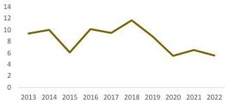
Tasa de Deforestación por cada 1000 ha de Bosque Estable

En esta misma línea, también resulta relevante analizar la tasa de delitos ambientales por cada 100.000 habitantes, la cual hace seguimiento y control al aprovechamiento ilícito de

21
Programas de Desarrollo
Enfoque Territorial

---

COLOMBIA
POTENCIA DE LA
VIDA
Agencia de Renovación
del Territorio - ART

# Documentos Regionales

recursos ambientales y biológicos, tráfico de fauna, deforestación, daños en los recursos naturales, ecocidio y contaminación ambiental.

De acuerdo con información del Ministerio de Defensa, para el 2022 no se presentaron delitos ambientales en la subregión de Arauca, lo que significa una disminución de la tasa de 4 delitos ambientales respecto al 2021. Del mismo modo, se observa una disminución de 11 delitos ambientales respecto al 2018.

A partir de la dimensión de ambiente y desarrollo de la MCB del DNP, es posible afirmar que todos los municipios de la subregión presentan brechas inferiores al 14 %, observándose que la más alta se presenta en Tame (13,9%) y en contraste, Saravena con la brecha más baja (3,4 %).

Tabla 4. Brechas dimensión ambiental

|  Municipio | Ambiente y Desarrollo Sostenible  |
| --- | --- |
|  Arauquita | 9,5%  |
|  Fortul | 4,2%  |
|  Saravena | 3,4%  |
|  Tame | 13,9%  |

Fuente: DNP

# Apuestas Regionales

Líneas de acción que identificó el PME como estratégicas para impulsar la economía de la subregión:

Desde los ejercicios realizados por la FAO en torno a las líneas productivas, proyectos detonantes en los territorios y retos a trabajar en los PDET se identificaron distintas líneas de trabajo para potenciar la economía agropecuaria de estos territorios:

- Investigación para la expansión de cultivos
- Desarrollo de semillas
- Banco de germoplasma
- Plantas de procesamiento de alimentos

Para las comunidades de Arauca alcanzar el desarrollo económico y social a largo plazo con enfoque étnico-territorial requiere la armonización de los ejercicios propios de planeación a través de los planes de vida y de etnodesarrollo, que permitan la transformación y el posicionamiento territorial.

22
PORT
Programas de Desarrollo
Enfoque Territorial

---

COLOMBIA
POTENCIA DE LA
VIDA
Agencia de Renovación
del Territorio - ART

# Documentos Regionales

La dimensión económica se propone impulsar nuevas alternativas para la transformación económica de la subregión, la diversificación y sofisticación de los sectores productivos tradicionales y de interés colectivo tales como:

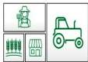

## AGROPECUARIO

Impulsar las cadenas productivas de Plátano, Cacao, Arroz y sacha inchi, así como la carne bovina y la producción de leche y subproductos lácteos para la cual: Construcción y adecuación para la puesta en marcha de un frigo matadero de categoría nacional en Tame" (DNP, PPI 2022-2026).

356 iniciativas PATR al sector agropecuario

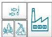

## INDUSTRIA

Terminación y puesta en funcionamiento de la Planta Procesadora de Plátano, Corocito – Tame.

Terminación y puesta en funcionamiento de centros agroindustriales: Plátano (Tame), Lácteos (Arauquita), Frigorífico (Arauca). (DNP, PPI 2022-2026).

18 iniciativas dirigidas a impulsar el sector industrial

## INFRAESTRUCTURA

Las vías hacen parte de la infraestructura fundamental para la comercialización de productos agropecuarios e insumos y desarrollo industrial y turístico, por lo tanto, su fortalecimiento y mantenimiento permitirá la competitividad socioeconómica como son:

Rehabilitación de la vía Arauca- Arauquita- Saravena y la vía Arauca – Tame.

Construcción del Puente Internacional Río Arauca, Puerto Conteras — Saravena y el mejoramiento de los aeropuertos de Arauca, Saravena y Tame.

(DNP, PPI 2022-2026).

335 iniciativas encaminadas a mejorar la infraestructura

## SERVICIOS

Reactivar y promocionar de la ruta de comercio internacional con Venezuela.

Impulsar el turismo por medio del programa Territorios Turísticos de Paz en la subregión donde se destacan el alto de San Miguel y la quebrada el espejo en Saravena y el acceso al Nevado del Cocuy, el río Tame y la chamiza, así como el parque ecoturístico los libertadores".

23
2021
Programas de Desarrollo
Enfoque Territorial

---

COLOMBIA
POTENCIA DE LA
VIDA
Agencia de Renovación
del Territorio - ART
Documentos Regionales

(PME, FAO)

14 iniciativas encaminadas a mejorar el sector de servicios

## POBREZA

Superación de todas las formas de pobreza, mediante alternativas de producción que generen ingresos

IPM
2021: 23,4
IPM 2030: 7,2%

## SALUD

"La atención oportuna y de calidad es la necesidad más apremiante en la comunidad de la subregión, por lo tanto, la construcción de la nueva infraestructura física del hospital San Lorenzo del Municipio de Arauquita, Departamento de Arauca E.S.E Moreno y Clavijo." (DNP, PPI 2022-2026).

Cobertura SGSSS
2022: 94%
2030: 100%

## EDUCACIÓN

- Construcción y fortalecimiento de la infraestructura educativa rural
- Universidad Rural de Tame
- Complejo educativo de educación superior pública en la región PDET Arauca

Cobertura neta educación media:
2021: 36 %
2030: 62 %

## SERVICIOS PÚBLICOS

Mejorar la provisión efectiva de los servicios de agua potable, alcantarillado y energía eléctrica como reducción de las brechas sociales de los municipios de la subregión. (DNP, PPI 2022-2026).

Cobertura agua potable:
2021: 73 %
2030: 76%

Cobertura en energía:
2021: 76%
2030: 100%

De acuerdo con lo observado en los diferentes indicadores relacionados con justicia y seguridad y en conjunto con la percepción de las comunidades, desde la ART en los

24
programa de Desarrollo
enfoque Territorial

---

COLOMBIA
POTENCIA DE LA
VIDA
Agencia de Renovación
del Territorio - ART

# Documentos Regionales

ejercicios de prospectiva se identifica una meta clave a alcanzar en la subregión, relacionada con la disminución de hechos violentos hacia grupos de población especialmente vulnerable que reside en el territorio. Entre el 2021 y 2022 se han presentado 3 masacres en la región y en lo corrido del año 2023 han asesinado 5 líderes y firmantes de paz, en 2022 fueron 13 firmantes.

Por lo anterior, la apuesta más importante es reducir los niveles de criminalidad que están impactando principalmente a niños, niñas y adolescentes, mujeres, indígenas, líderes y lideresas, población rural y población venezolana en general. (Observatorio de DDHH, Conflictividades y Paz, 2023)

Riesgo de victimización
&gt; 2022: 73 %
&gt; 2030: 16 %

# ¿Cómo perciben las comunidades la implementación de los PDET?

Las entrevistas y grupos focales realizados en la evaluación de la Línea Base PDET en 2022, y los encuentros subregionales realizados en 2023, permitieron identificar tres ideas centrales sobre cómo va la implementación.

- Hay dificultades de la comunidad para realizar el seguimiento de los proyectos lo que ha afectado el nivel de confianza: “El nivel de confianza por parte de la mayoría de la comunidad está totalmente perdida, ya hay cansancio social”.

→ La comunidad y el Grupo Motor piden ser más tenidos en cuenta en la socialización de los proyectos.
→ Un líder comunitario dice: “El desconocimiento del manejo gubernamental en todas sus funciones hace que no tengamos una percepción completa de los movimientos PDET” (productores, Arauquita, Evaluación Línea Base 2022).
→ Se percibe que hay formas de hacer política tradicional que han permeado la implementación PDET: “La participación de nosotros como líderes es muy regular debido a que estos proyectos vienen o están amarrados a una parte política a la cual nosotros no tenemos acceso porque somos simplemente escuchas de la comunidad” (mujer líder, Fortul, Evaluación Línea Base 2022).

- Los productores y el campesinado son actores que se sienten “aislados” de la implementación.

→ Pese a que en Arauca los cultivos ilícitos lograron ser erradicados, los voceros de las familias inscritas en el PNIS piden ser tenidos en cuenta en las

25
2
Programa de Desarrollo
Enfoque Territorial

---

COLOMBIA
POTENCIA DE LA
VIDA
Agencia de Renovación
del Territorio - ART

# Documentos Regionales

instancias de participación y socialización de la implementación PDET (actas encuentro subregional Arauca, 2023).

→ “El abandono gubernamental para con nosotros es importante, claramente nos sentimos aislados y hasta cierto punto ‘solos’ e inseguros, sin tener en cuenta la población de las zonas rurales” (Productores, Arauquita, Evaluación Línea Base 2022).

- Delegados de los grupos étnicos en las instancias de participación PDET piden que el enfoque diferencial se fortalezca

→ Se proponen realizar mesas de trabajo para priorizar las iniciativas étnicas que se puedan realizar. Asimismo, que exista un delegado indígena municipal que represente las iniciativas étnicas propuestas en escenarios de incidencia para que sean tenidas en cuenta en las priorizaciones de recursos. (actas encuentro subregional Arauca, 2023).

26
pdet
Programas de Desarrollo
enfoque Territorial