Gobierno
de
España

Gobierno
Departamental

★★★★

# DLA PROFESIONAL UNIVERSITARIO DEL DESPACHO DE LA GOBERNACIÓN DE ARAUCA

# CERTIFICA QUE:

En la página web de la Gobernación de Arauca www.arauca.gov.co se publica la ORDENANZA N° 161 DE 2024, (SANCIONADA EL DÍA 7 DE JUNIO DE 2024).

"POR MEDIO DE LA CUAL SE ADOPTA EL PLAN PARTICIPATIVO DE DESARROLLO DEPARTAMENTAL 2024 - 2027".

Dada en Arauca, a los 7 días del mes junio de 2024

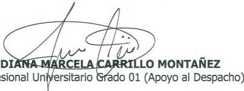

Proyectó y digitó: María Patricia Cedeño Chávez. - Secretaria Despacho del Gobernador

FR-GC-02

VERSIÓN: 02

FECHA EMISION: 15/06/2021

GOBERNACIÓN DE ARAUCA

"COMPROMETIDOS CON LA CALIDAD"

Calle 20 Carrera 21 Esquina, Telefax 8851946; Código Postal 810001

Arauca-Arauca (Colombia). E-mail: archivogeneral@arauca.gov.co

NIT. 800102838 - 5

---

Gobierno Departamental

1

Arauca, 7 de junio de 2024

Diputado

**ELÍAS ROJAS BECERRA**

Presidenta Asamblea Departamental

Arauca - Arauca

Cordial saludo Honorable Diputado:

Para su conocimiento y fines pertinentes, de manera atenta remito a su despacho la siguiente Ordenanza.

**ORDENANZA Nº 161 DE 2024:** "POR MEDIO DE LA CUAL SE ADOPTA EL PLAN PARTICIPATIVO DE DESARROLLO DEPARTAMENTAL 2024 - 2027".

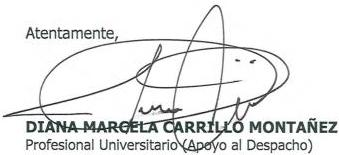

Anexo: una (1) carpeta original

Revisó: Diana Marcela Carrillo Montañez – profesional universitario (apoyo al despacho)

Digitó: María Patricia Cedeño C.- secretaria despacho del gobernador

FR-GC-02

VERSIÓN: 02

FECHA EMISION: 15/06/2021

GOBERNACIÓN DE ARAUCA

"COMPROMETIDOS CON LA CALIDAD"

Calle 20 Carrera 21 Esquina, Telefax 8851946; Código Postal 810001

Arauca-Arauca (Colombia). E-mail: archivogeneral@arauca.gov.co

NIT. 800102838 - 5

---

Gobierno de
Departamental

Arauca, 7 de junio de 2024

# LA PROFESIONAL UNIVERSITARIO (APOYO AL DESPACHO)

## CERTIFICA:

Que hoy 7 de junio de 2024, se ha ordenado publicar en la página Web de la Gobernación de Arauca, LA ORDENANZA Nº 161 DE 2024, SANCIONADA EL DÍA 7 DE JUNIO DE 2024.

ORDENANZA Nº 161 DE 2024: "POR MEDIO DE LA CUAL SE ADOPTA EL PLAN PARTICIPATIVO DE DESARROLLO DEPARTAMENTAL 2024 - 2027".

Revisó: Diana Marcela Carrillo Montañez – Profesional universitario (apoyo al despacho)
Digitó: María Patricia Cedeño C.- Secretaria despacho del gobernador

FR-GC-02
VERSIÓN: 02
FECHA EMISION: 15/06/2021
GOBERNACIÓN DE ARAUCA
"COMPROMETIDOS CON LA CALIDAD"
Calle 20 Carrera 21 Esquina, Telefax 8851946; Código Postal 810001
Arauca-Arauca (Colombia). E-mail: archivogeneral@arauca.gov.co
NIT. 800102838 - 5
PAG. 2

---

Gobierno de la Arauca

Gobierno Departamental

ORDENANZA No. 161 DE 2024

# "POR MEDIO DE LA CUAL SE ADOPTA EL PLAN PARTICIPATIVO DE DESARROLLO DEPARTAMENTAL 2024 - 2027"

El Gobernador del Departamento de Arauca, en uso de sus facultades Constitucionales y Legales, en especial las previstas en el artículo 305, numeral 9° de la Carta Política; artículo 100 y subsiguientes Ley 2200 de 2022 y demás disposiciones concordantes, imparte:

## SANCION

A la totalidad de los veinte (20) artículos de la presente Ordenanza

## PUBLIQUESE Y CUMPLASE

Dada en Arauca, el 07 de junio de 2024

NASSER ANTONIO CRUZ MATUS

Gobernador Encargado del Departamento de Arauca
Resolución 1599 de 2024

FR-DE-06
VERSIÓN: 02
FECHA EMISION: 01/07/2021
GOBERNACIÓN DE ARAUCA
"COMPROMETIDOS CON LA CALIDAD"
Calle 20 Carrera 21 Esquina, Teléfono. 885 2402; Código Postal 810001
Arauca-Arauca (Colombia). E-mail: archivogeneral@arauca.gov.co
NIT. 800102838 - 5
PAG. 1

---

Gobierno de
Departamental

# REVISION JURÍDICA ORDENANZA No. 161 DE 2024

**REMITIDO POR:**
**ASUNTO:**
**COORDINACION JURIDICA**
**REVISION DE LEGALIDAD DE LA ORDENANZA No. 161 DEL 30 DE MAYO DE 2024 “POR MEDIO DE LA CUAL SE ADOPTA EL PLAN PARTICIPATIVO DE DESARROLLO DEPARTAMENTAL 2024 - 2027”**

1. **COMPETENCIA:** Es función del Gobernador del Departamento de Arauca de conformidad con lo establecido en el numeral 4 del artículo 305 de la Constitución Política...“Presentar oportunamente a la asamblea departamental los proyectos de ordenanza sobre planes y programas de desarrollo económico y social, obras públicas y presupuesto anual de rentas y gastos”... Esta competencia debe ejercerse atendiendo lo establecido en el artículo 339 de la Constitución Política y la Ley 152 de 1994.

2. **TERMINO LEGAL:** La iniciativa fue presentada dentro del plazo señalado en la Ley, esto es, dentro de los cuatro meses siguientes de la vigencia en que inicia el periodo de gobierno del Gobernador.

3. **UNIDAD TEMÁTICA:** La Ordenanza 161 de 2024 guarda Unidad Temática, atendiendo lo señalado en el artículo 96 de la Ley 2200 de 2022.

... “**ARTÍCULO 96. Unidad temática.** Todo proyecto de ordenanza debe referirse a una misma materia. Serán inadmisibles las disposiciones que no se relacionan con la misma temática”... (...)

4. **EXPOSICIÓN DE MOTIVOS:** La Exposición de Motivos incluyó el referente normativo que regula el proceso de **CONSTRUCCION DE LOS PLANES DE DESARROLLO**, adicionando a los referentes o soporte de estructuración, los **DOCUMENTOS CONPES** como instrumentos que instrumentalizan las políticas del Estado en los ejes económico y social.

5. **ASPECTOS TÉCNICOS:** La parte técnica contenida en la Exposición de Motivos que involucra el proceso participativo para la construcción del **PLAN DE DESARROLLO DEPARTAMENTAL** es del resorte o competencia funcional de la Secretaría de Planeación Departamental, observándose que se realizó el procedimiento de conformidad con las disposiciones que regulan la materia.

6. Las normas incluidas dentro del articulado del Proyecto de Ordenanza guardan coherencia con el tema a regular.

La Secretaría de Planeación Departamental, en la fase de revisión del proyecto de Ordenanza ante la Duma Departamental, solicitó concepto a la Coordinación Jurídica, respecto a la inclusión de un articulado que guarda relación directa con el tema objeto de estudio. Se emitió el siguiente concepto:

FR-DE-06
VERSION: 02
FECHA EMISION: 01/07/2021

GOBERNACIÓN DE ARAUCA
“COMPROMETIDOS CON LA CALIDAD”
Calle 20 Carrera 21 Esquina, Teléfono. 885 2402; Código Postal 810001
Arauca-Arauca (Colombia). E-mail: archivo@general@arauca.gov.co
NIT. 800102838 - 5
PAG. 2

---

GOBIERNO DE ESPAÑA
ARAUCA
Gobierno Departamental

...

Si es la Entidad Pública quien advierte que en el Proyecto de Ordenanza se OMITIÓ incluir unos ARTÍCULOS, que los mismos guardan relación directa y no transgreden el principio de UNIDAD TEMÁTICA de conformidad con lo establecido en el artículo 96 de la Ley 2200 de 2022, deberá solicitarse a la DUMA DEPARTAMENTAL que, a través de la Comisión de Estudio correspondiente, se adicione la iniciativa, presentado los documentos que correspondan.

Si es la Duma Departamental quien advierte que en el Proyecto de Ordenanza se OMITIÓ incluir unos ARTÍCULOS, que los mismos guardan relación directa y no transgreden el principio de UNIDAD TEMÁTICA de conformidad con lo establecido en el artículo 96 de la Ley 2200 de 2022, deberá aplicar el procedimiento definido en el párrafo 1 del artículo 112 de la Ordenanza 103 de 2022, norma que prescribe a su tenor literal:

... “Parágrafo 1 durante el primero y el segundo se le pueden introducir los cambios, reformas, supresiones o adiciones que se consideren convenientes, siempre que se refieran a la materia o asunto de que trate el proyecto”…”…

En PLENARIA se incluyeron y aprobaron los artículos pertinentes.

7. PROCESO CONSTRUCTIVO DEL PLAN DE DESARROLLO: La esquematización del PROYECTO DE ORDENANZA cumplió con las prescripciones normativas que regulan la materia y se acompañó de los documentos técnicos que permiten determinar, el paso a paso en el proceso constructivo del PLAN DE DESARROLLO DEPARTAMENTAL.

8. DOCUMENTOS SOPORTE: Se acompaña la iniciativa de los documentos; constancias y/o certificaciones que soportaron la estructuración del PLAN DE DESARROLLO DEPARTAMENTAL 2024 – 2027, detallándolos a continuación:

- Certificación de fecha 30 de abril de 2024, suscrita por el Secretario de Planeación Departamental en donde se hace constar que el Plan de Desarrollo Departamental vigencia 2024–2027 responde a los compromisos adquiridos en el PROGRAMA DE GOBIERNO “ARAUCA MEJOR” registrado por el Ingeniero RENSON JESÚS MARTÍNEZ PRADA, de conformidad con lo estipulado en la Ley 131 de 1994.

- Certificación de fecha 30 de abril de 2024 suscrita por el Secretario de Planeación Departamental en donde se señala que: ... Los sectores de inversión y programas presupuestales consignados en el Plan de Desarrollo Departamental 2024 – 2027, responde a las competencias legales asignadas constitucional y legalmente al señor Gobernador de conformidad con lo estipulado en el Estatuto Orgánico de Presupuesto – EOP (Decreto 111 de 1996), lo establecido en el artículo 2.2.6.2.1 del Decreto 1082 de 2015 (Decreto Único Reglamentario del Sector Planeación) que indica que los proyectos de inversión se clasifican de acuerdo con los lineamientos que defina el Departamento Nacional de Planeación y las competencias enmarcada en la Ley 2200 de 2022.

FR-DE-06
VERSION: 02
FECHA EMISION: 01/07/2021
GOBERNACIÓN DE ARAUCA
"COMPROMETIDOS CON LA CALIDAD"
Calle 20 Carrera 21 Esquina, Teléfono. 885 2402; Código Postal 810001
Arauca-Arauca (Colombia). E-mail: archivo@general@arauca.gov.co
NIT. 800102838 - 5
PAG. 3

---

GOBERNACIÓN DE ARAUCA

Gobierno Departamental

^{}[]

Certificación de fecha 30 de abril de 2024 suscrita por el Secretario de Planeación Departamental en donde hace constar que el Plan Territorial de Salud 2024 – 2027 se encuentra armonizado con el Plan Decenal de Salud Pública 2022 – 2031, de conformidad con el marco normativo y reglamentario vigente sobre la materia.

CONSTANCIA de fecha 30 de abril de 2024 suscrita por la Secretaría de Hacienda Departamental en la que se hace constar que la planificación financiera para garantizar indique que se ha realizado la correspondiente planificación financiera para garantizar la ejecución de los programas presupuestales contenidos en el Plan de Desarrollo Departamental 2024 - 2027, se encuentra conforme a las certificaciones de proyección de ingresos emitidas por el área de presupuesto y acorde con lo consignado en el marco fiscal conforme a las certificaciones de proyección de ingresos emitidas por el área de presupuesto, y acorde a lo consignado en el marco fiscal de mediano plazo.

Acta del Consejo de Gobierno de fecha 29 de febrero de 2024 – SOCIALIZACIÓN DEL DOCUMENTO PRELIMINAR DEL PLAN PARTICIPATIVO DE DESARROLLO 2024 – 2027.

Acta del Consejo de Gobierno de fecha 29 de abril de 2024 – PLAN DE DESARROLLO DEPARTAMENTA, CONVENIO RESA, PAE y ARTICULACIÓN DE ENTES DESCENTRALIZADOS.

Matriz Plan Plurianual de Inversión 2024 – 2027.

24 Arboles del Problema.

Diagnóstico Integral del departamento.

Relatorías Mesas Sectoriales - Actas de Concentración comunitaria del PDD de los 7 Municipios.

Marco Fiscal de Mediano Plazo 2023 - 2032.

Concepto Ambiental con número consecutivo 300.8.224 – 0223 de fecha 21 de marzo de 2024 proferido por la CORPORACIÓN AUTÓNOMA DE LA ORINOQUIA – CORPORINOQUÍA.

Concepto Favorable del CONSEJO TERRITORIAL DE PLANEACIÓN de fecha 30 de marzo de 2024.

Documentos de carácter técnico.

FR-DE-06

VERSION: 02

FECHA EMISION: 01/07/2021

GOBERNACIÓN DE ARAUCA

"COMPROMETIDOS CON LA CALIDAD"

Calle 20 Carrera 21 Esquina, Teléfono. 885 2402; Código Postal 810001

Arauca-Arauca (Colombia). E-mail: archivo@eneralfbarauca.gov.co

NIT. 800102838 - 5

PAG. 4

---

GOBIERNO DEPARTAMENTAL

Gobierno Departamental

9. DEBATES: El proyecto de Ordenanza surtió DOS (2) debates en días distintos, tal y como se acredita con la Certificación SGADA – 2024 – 028 de fecha 31 de mayo de 2024 suscrita por el Secretario General de la Asamblea Departamental, cumpliéndose con la exigencia señalada en el artículo 97 de la Ley 2200 de 2022. Se respeta el límite temporal que se señala en la norma ibídem, en torno a los debates en días distintos.

PRIMER DEBATE: 16, 17, 18, 19, 20, 21 y 22 de mayo de 2024 EN COMISIÓN PLENARIA.

SEGUNDO DEBATE: 27, 28, 29 Y 30 de mayo de 2024 EN PLENARIA APROBADO POR UNANIMIDAD.

10. MATERIA DE LA ORDENANZA: A través de esta iniciativa se ADOPTA EL PLAN DE DESARROLLO DEPARTAMENTAL.

11. DISPOSICIONES NORMATIVAS SOPORTE: Artículos 339; 341 y 342 de la Constitución Política de Colombia; Ley 152 de 1994; Ley 489 de 1.998; Ley 1757 de 2015; Ley 2056 de 2020; Ley 2166 de 2021; Ley 2200 de 2022; Ley 2294 de 2023; y demás disposiciones concordantes.

12. INFORME DE LA COMISIÓN PRIMERA PERMANENTE: La Comisión otorgó AVAL a la iniciativa de la Entidad Territorial. Diputado Ponente: ORLANDO ARDILA TRASLAVIÑA.

13. REVISIÓN TÉCNICA DE LA ORDENANZA: Atendiendo la competencia funcional de la Secretaría de Planeación Departamental, se destaca que a dicha dependencia le correspondió EMITIR el respectivo CONCEPTO TÉCNICO, mediante el Memorando No. 095 de 2024 de fecha 07 de junio de la misma anualidad, insumo previo y necesario para el proceso de SANCION de la Ordenanza 161 de 2024.

En virtud de lo anterior consideramos que la Ordenanza No. 161 de 2024, es viable jurídicamente.

Este concepto se rinde con los alcances que le otorga el artículo 28 del Código de Procedimiento Administrativo y de lo Contencioso Administrativo (Sustituido por el ARTÍCULO 1 de la Ley 1755 de 2015).

Dado a los siete (07) días del mes de junio de 2024.

LIBARDO JOSÉ TORRES BRIEVA
Coordinador Jurídico Departamental
Revisó y Aprobó: Aspectos Jurídicos

Proyecto y revisó jurídicamente:
Liliana Vivas Parada
Profesional Especializado

FR-DE-06
VERSIÓN: 02
FECHA EMISION: 01/07/2021

GOBERNACIÓN DE ARAUCA
"COMPROMETIDOS CON LA CALIDAD"
Calle 20 Carrera 21 Esquina, Teléfono. 885 2402; Código Postal 810001
Arauca-Arauca (Colombia). E-mail: archivogeneral@arauca.gov.co
NIT. 800102838 - 5
PAG. 5

---

MEMORANDO No. 095 DE 2024

CIUDAD Y FECHA: Arauca, 7 de junio de 2024

PARA: Dr. LIBARDO JOSÉ TORRES BRIEVA, Coordinador Área Jurídica Departamental

DE: GERMAN ALBERTO LEON CORONEL, Secretario de Planeación Departamental.

ASUNTO: Revisión Técnica Ordenanza No. 161 de 30 de mayo de 2024
“POR MEDIO DE LA CUAL SE ADOPTA EL PLAN PARTICIPATIVO DE DESARROLLO DEPARTAMENTAL 2024-2027”.

En atención a su solicitud mediante Nota Interna No. 2024-05393 de fecha 5 de junio de 2024 (recibida el 6 de junio de 2024), asignada y recibida en el Sistema Integrado Administrativo Ciudadano SIAC, se realizó revisión a la Ordenanza del asunto, por lo anterior, me permito comunicarle lo siguiente:

## ASPECTOS GENERALES

☑ Contiene las partes técnicas de una Ordenanza: Título, Preámbulo, y Parte Dispositiva.
☑ Al observarse la Ordenanza, se dimensiona la conveniencia legal, técnica y económica que sustenta la Ordenanza.
☑ Presenta como anexo Exposición de motivos firmada por el gobernador encargado del departamento de Arauca mediante Resolución No. 1300 de 2024. Presenta como anexo Exposición de Motivos ajustada, firmada por el gobernador encargado del departamento de Arauca mediante Resolución No. 1413 de 2024.
☑ Es coherente con los Artículos 339 al 344 de la Constitución Política de Colombia, Ley 152 de 1994, Ley 2200 de 2022 y demás normas concordantes".
☑ Se observa que el Proyecto de Ordenanza de estudio en la referencia surtió los dos debates reglamentarios extraordinarios los días 16, 17, 18, 18, 20, 21 y 22 de mayo de 2024 en Comisión Primera y los días 27, 28, 29 y 30 de mayo de 2024 en Plenaria aprobado por unanimidad en cumplimiento del Artículo 97 de la Ley 2200 de 2022, tal como certifica la Secretaría General de la Asamblea Departamental de Arauca.
☑ Presenta como anexo Preámbulo al proyecto de Ordenanza firmada por el Secretario de Planeación Departamental de Arauca.

FR-GC-02
VERSION 02
FECHA EMISION: 15/05/2021
GOBERNACIÓN DE ARAUCA
"COMPROMETIDOS CON LA CALIDAD"
Calle 20 Carrera 21 Esquina, Telefax 8851946; Código Postal 810001
Arauca-Arauca (Colombia). E-mail: arcivogenera@arauca.gov.co
NIT. 800102838 - 5

---

#

#

☑ Se anexa concepto del Plan Participativo de Desarrollo 2024-2027 por parte del Consejo Territorial de Planeación de fecha 30 de marzo de 2024 firmado por el Presidente y el Secretario del Consejo Territorial de Planeación.

☑ Se anexa concepto jurídico del Plan Participativo de Desarrollo de Arauca de fecha 30 de abril de 2024 firmado por el Asesor de Despacho Coordinador Jurídico Departamental. Igualmente se emite concepto jurídico de corrección a unas imprecisiones de transcripción en el concepto de 30 de abril de 2024, con fecha de 14 de mayo de 2024 y firmado por el Coordinador Jurídico Departamental.

☑ Se anexa Plan Territorial de Salud de Arauca 2024-2027 y su respectiva certificación de competencias del Plan de Salud. (en formato digital).

☑ Se anexan matrices por ejes estratégicos (en formato digital).

Cordialmente,

GERMAN ALBERTO LEON CORONEL
Secretario de Planeación Departamental

Proyectó y Digitó: Ángel Arnold Arenas, Profesional Universitario Secretaría de Planeación
Revisó Aspectos Jurídicos: Richar Alexander Ramírez Garrido Apoyo Jurídico Planeación CPS 018 de 2024

FR-QC-02

VERSION 02

FECHA EMISION 15/09/2021

GOBERNACIÓN DE ARAUCA

"COMPROMETIDOS CON LA CALIDAD"

Calle 20 Carrera 21 Esquina, Telefax 8951946; Código Postal 810001

Arauca-Arauca (Colombia). E-mail: archiv.ogenerall@arauca.gov.co

NIT. 600102638 - 5

---

Asamblea Departamental de Arauca

# ORDENANZA No. 161 de 2024

## "POR MEDIO DE LA CUAL SE ADOPTA EL PLAN PARTICIPATIVO DE DESARROLLO DEPARTAMENTAL 2024 – 2027"

### LA HONORABLE ASAMBLEA DEPARTAMENTAL DE ARAUCA

En ejercicio de sus atribuciones constitucionales y legales, en especial las que le confiere la Constitución Política de Colombia en los artículos 339 a 344, la Ley 152 de 1994, la Ley 2200 de 2022 y demás normas concordantes y complementarias,

## ORDENA:

**ARTÍCULO 1. ADOPCIÓN DEL PLAN.** Adóptese el Plan Participativo de Desarrollo Departamental para el periodo administrativo de gobierno 2024 – 2027.

**ARTÍCULO 2. CONTENIDO DEL PLAN.** El Plan Participativo de Desarrollo Departamental 2024-2027 contiene:

### PARTE 1.

1. FILOSOFÍA
1.1. VISIÓN
1.2. MISIÓN
1.3. CONTEXTO DEMOGRAFICO
1.4. PROSPECTIVA DE DESARROLLO
1.5. FUNDAMENTO Y ARTICULACIÓN CON EL PROGRAMA DE GOBIERNO
1.6. PRINCIPIOS
1.6.1. Unidad
1.6.2. Participación
1.6.3. Compromiso
1.6.4. Planificación
1.6.5. Innovación
1.7. ENFOQUES
1.7.1. Enfoque de curso de vida
1.7.2. Enfoque en seguridad humana y paz integradora
1.7.3. Enfoque en derechos y capacidades
1.7.4. Enfoques diferenciales
1.7.5. Enfoque territorial
1.7.6. Enfoque de sostenibilidad
1.7.7. Enfoque interseccional
1.7.8. Enfoque de equidad de género
2. ¿CÓMO SE HIZO?
2.1. PLAN DE TRABAJO
2.2. MECANISMOS DE PARTICIPACIÓN
2.2.1. Medios digitales

---

Asamblea Departamental de Arauca
ORDENANZA No. 161 de 2024

# "POR MEDIO DE LA CUAL SE ADOPTA EL PLAN PARTICIPATIVO DE DESARROLLO DEPARTAMENTAL 2024 - 2027"

2.2.2. Correo electrónico
2.2.3. Audiencias participativas
2.3. ARTICULACIÓN
2.3.1. Articulación con Objetivos de Desarrollo Sostenible
2.3.2. Articulación con el Plan Nacional de Desarrollo
2.3.3. Articulación regional
2.3.4. Articulación local
2.3.5. Articulación con los Programas de Desarrollo con Enfoque Territorial
2.3.6. Articulación con políticas públicas nacionales
2.3.7. Articulación con políticas públicas departamentales
2.3.8. Planeación y gestión orientada a resultados
3. DIAGNÓSTICO SITUACIONAL Y PLAN ESTRATÉGICO
4. DIAGNÓSTICO FINANCIERO Y PLAN PLURIANUAL DE INVERSIONES
4.1 DIAGNÓSTICO FINANCIERO
4.1.1 Análisis de la tendencia de las cifras contables históricas 2020-2023
4.1.2 PLAN FINANCIERO 2024-2027
4.1.3 Estrategias y políticas de financiación
4.1.4 Estrategias para incrementar los tributos departamentales
4.1.5 Alternativas de financiación de infraestructura
4.2. PLAN PLURIANUAL DE INVERSIONES 2024-2027
5. CAPÍTULO DE INVERSIONES CON CARGO AL SISTEMA GENERAL DE REGALÍAS
5.1. DIAGNÓSTICO
5.2. ANÁLISIS PRESUPUESTAL Y AVANCE DE LOS PROYECTOS DE INVERSIÓN REGIONALIZADA DEL SISTEMA GENERAL DE REGALÍAS (SGR)
5.2.1. Ejecución presupuestal del SGR
5.2.1.1. Gastos de inversión del SGR
5.3. SISTEMA DE SEGUIMIENTO, EVALUACIÓN Y CONTROL DEL SISTEMA GENERAL DE REGALÍAS - REGIÓN LLANOS
5.4. HISTÓRICO SISTEMA DE SEGUIMIENTO, EVALUACIÓN Y CONTROL DEL SGR PARA EL BIENIO 2023-2024
5.5. PROYECTOS INVERSIÓN SGR BIENIO 2023-2024 REGIÓN LLANOS
5.6. DIAGNÓSTICO DE REGALÍAS DEL DEPARTAMENTO DE ARAUCA
5.7. PROYECTOS DE INVERSIÓN DEL SISTEMA GENERAL DE REGALÍAS BIENIO 2023-2024 PARA EL DEPARTAMENTO ARAUCA
5.8. LISTA DE PROYECTOS FINANCIADOS CON RECURSOS DEL SGR PARA EL BIENIO 2023-2024 EN EL DEPARTAMENTO DE ARAUCA
5.9. BALANCE GENERAL DE ALERTAS DEL SISTEMA DE SEGUIMIENTO, EVALUACIÓN Y CONTROL DEL SGR
5.9.1. Medición del desempeño-IGPR
5.9.2. Metodología Cierre de Brechas

---

Asamblea Departamental de Arauca

# ORDENANZA No. 161 de 2024

## "POR MEDIO DE LA CUAL SE ADOPTA EL PLAN PARTICIPATIVO DE DESARROLLO DEPARTAMENTAL 2024 – 2027"

5.10. REGIÓN ADMINISTRATIVA Y DE PLANIFICACIÓN - RAP LLANOS
5.11. PROCESO PARTICIPATIVO
5.11.1. Proceso de participación ciudadana en el departamento de Arauca
5.11.2. Fase de alistamiento
5.12. PASOS PARA LA CONSTRUCCIÓN DEL CAPITULO CON CARGO AL SGR.
5.12.1. Identificación de iniciativas o proyectos de inversión pública
5.13. SISTEMATIZACIÓN Y CONSOLIDACIÓN DE RESULTADOS DE LAS MESAS DE PARTICIPACIÓN
5.14. MESAS DE PARTICIPACIÓN CIUDADANA
5.15. REVISIÓN Y VALIDACIÓN DE LAS INICIATIVAS Y/O PROYECTOS PRESENTADOS
5.16. COMPONENTE ESTRATÉGICO
5.17. COMPONENTE FINANCIERO
5.18. ANEXOS CAPITULO SGR
6. SISTEMAS DE SEGUIMIENTO Y EVALUACIÓN DEL PLAN PARTICIPATIVO DE DESARROLLO DEPARTAMENTAL 2024 - 2027
REFERENCIAS BIBLIOGRÁFICAS
7. ANEXOS

## ARTÍCULO 3. PARTE 1. FILOSOFÍA

### 1.1. VISIÓN

En el año 2027, la población del departamento de Arauca tendrá una mejor calidad de vida como resultado de procesos económicos de desarrollo sostenibles, impulsados por conectividad, productividad, innovación, industrias creativas y culturales, economías populares y fortalecimiento del tejido empresarial. Se potencializarán las fortalezas del territorio, la resiliencia del capital humano y la movilización institucional.

También, se reducirán las brechas sociales de la población, fortaleciendo el acceso a la salud y la educación superior, vinculando a los grupos poblacionales con enfoque diferencial en un entorno de inclusión, legalidad, paz integradora y seguridad. La sociedad, el Gobierno y las instituciones trabajarán articuladamente y harán uso de los recursos con ética, transparencia y eficiencia, en el contexto de un escenario nacional competitivo.

### 1.2. MISIÓN

El departamento de Arauca, en su planificación, ejecutará acciones estratégicas para impulsar el desarrollo competitivo y económico, promover la igualdad de oportunidades y el buen gobierno. Para lograrlo, es esencial establecer una estructura que facilite la

---

Asamblea Departamental de Arauca

# ORDENANZA No. 161 de 2024

# "POR MEDIO DE LA CUAL SE ADOPTA EL PLAN PARTICIPATIVO DE DESARROLLO DEPARTAMENTAL 2024 - 2027"

armonización del ordenamiento territorial, que aproveche la vocación productiva e integre aspectos cruciales como educación, salud, conectividad y productividad, todo con un enfoque sostenible. Además, se busca fomentar el desarrollo humano, reconstruir el tejido social y promover la seguridad y convivencia en el marco de la construcción de una paz integradora y duradera.

## 1.3. CONTEXTO DEMOGRAFICO

El Departamento de Arauca, ubicado en oriente del país se extiende desde las estribaciones de la cordillera oriental hasta las grandes sabanas de la Orinoquia, entre los márgenes de los ríos Casanare como límite sur y el río Arauca, como límite norte, ocupando el 2.1 % del territorio nacional y con una población de 317.398 (DANE, 2024), ocupando el puesto 23 en densidad demográfica del país, con mayor población en el rango etario entre 25 – 29 años, como se muestra en la Figura 1.

Figura 1. Pirámides poblacionales 2024 Vs 2035
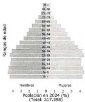
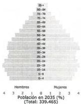

Fuente: DANE, proyecciones de población con base en censo 2028.

Por otro lado, es importante indicar que, de esta población, el 64 % corresponde a población del área urbana y el 36 % restante corresponde a población residente en la zona rural.

---

Asamblea Departamental de Arauca

# ORDENANZA No. 161 de 2024

# "POR MEDIO DE LA CUAL SE ADOPTA EL PLAN PARTICIPATIVO DE DESARROLLO DEPARTAMENTAL 2024 - 2027"

Desde tiempo prehispánicos, el territorio era ocupado por diferentes pueblos indígenas, que, debido a la presión demográfica y a la pérdida de sus territorios ancestrales han venido reduciéndose en número, encontrando que, de la población total, solo el 7.27 % pertenece a algún grupo étnico, entre los que se destacan la población indígena y la afrodescendiente, como se muestra en la Figura 2.

Figura 2. Población étnica 2024
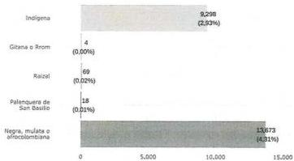
Fuente: DANE, proyecciones de población con base en censo 2028.

La población restante corresponde a población criolla del departamento y descendientes de los colonos que llegaron al departamento a partir de la década de 1960 provenientes de los departamentos de Santander, Boyacá y Cundinamarca principalmente.

Adicionalmente, al tratarse de un departamento fronterizo con Venezuela y como resultado de las dinámicas sociales del país vecino, Arauca se ha convertido en una ruta de tránsito para población venezolana hacia el interior del país y otros de la región.

Con corte a agosto de 2023, cuenta con 77.737 habitantes provenientes de Venezuela, que representa el 2.7 % del total de la población migrante concentrada en Colombia, distribuida en los diferentes municipios, tal como se muestra en la Figura 3.

---

Asamblea Departamental de Arauca

# ORDENANZA No. 161 de 2024

# "POR MEDIO DE LA CUAL SE ADOPTA EL PLAN PARTICIPATIVO DE DESARROLLO DEPARTAMENTAL 2024 - 2027"

Figura 3. Población migrante por municipio

|  Municipio | N° Migrantes  |
| --- | --- |
|  Arauca | 49.011  |
|  Saravena | 9.064  |
|  Arauquita | 8.433  |
|  Tame | 8.173  |
|  Fortul | 2.616  |
|  Cravo Norte | 440  |
|  Puerto Rondón | 0  |

Fuente: Migración Colombia, 2023

El Observatorio de Migración del DNP muestra que para el 2022, el desempleo de larga duración en migrantes era del 26.9%. La tasa de informalidad del 51.6%, el 0.2% recibe remesas del interior y el 0% recibe remesas del exterior. Frente a actividades principales, 4.341 personas están buscando trabajo, 1.640 migrantes están trabajando, 2.021 están estudiando, 2.406 hacen oficios del hogar, y 2.442 están sin actividad.

Referente al tipo de seguridad social, el 47.8% no tiene ninguna seguridad social, el 47.1% está en el régimen subsidiado y el 5% en el contributivo. El 73% no cotiza pensión y el 26.8% no aplica o no responde. En relación con las personas que se encuentran ocupadas, 715 personas están trabajando independiente, 218 personas están trabajando de jornalero, 443 son empleados domésticos, y 70 personas están trabajando como empleados de empresas.

Bajo este contexto, el Plan de Desarrollo del Departamento, busca establecer una planificación estratégica que sea incluyente y transversal, que integre todos los grupos poblacionales presentes en el departamento.

## 1.4. PROSPECTIVA DE DESARROLLO

El papel de la entidad territorial se ha centrado en «arreglar problemas», lo cual implica el destino de recursos de acuerdo con las urgencias presentadas, dejando de lado la visión a largo plazo y ocasionando que el timón de la economía vaya a la deriva. Ello ha

---

Asamblea Departamental de Arauca

# ORDENANZA No. 161 de 2024

# "POR MEDIO DE LA CUAL SE ADOPTA EL PLAN PARTICIPATIVO DE DESARROLLO DEPARTAMENTAL 2024 - 2027"

generado que se pierda de vista la planificación territorial y las relaciones funcionales (sociales, económicas y ambientales) para el cierre de brechas que explican la desigualdad y la inequidad.

En ese sentido, el Plan de Desarrollo Departamental está fuertemente ligado al planteamiento de un modelo económico regional que visibilice los efectos de toda actividad humana y productiva sobre la naturaleza, teniendo en cuenta tanto las externalidades negativas como positivas. Es nuestro entorno y su evolución lo que garantizará unas mejores condiciones de vida para las comunidades rurales y urbanas. Bajo este precepto, urge la intervención del Estado para superar varios cuellos de botella a través del accionar público para guiar la política y la actividad empresarial.

En los escenarios de futuro, este Gobierno apalancará la creación de riqueza por encima del desgaste del aparato estatal en la redistribución de esta. El propósito se logrará mediante la simbiosis del ecosistema empresarial, emprendedor y el de innovación a través de los lazos más fuertes entre lo público y lo privado.

Por lo tanto, la gran misión institucional se orientará hacia el bienestar social, que será consecuencia del círculo virtuoso de la productividad (producción sostenible-empleo-innovación-producción sostenible). Se requiere entonces una nueva forma de pensar y actuar frente a los retos impuestos por la economía global y las dinámicas sociales. Localmente, se necesita focalizar inversiones de manera sistemática para garantizar el crecimiento económico y la competitividad.

Como iniciativas de gobierno, se han definido seis (6) catalizadores del desarrollo regional, teniendo en cuenta su gran incidencia en la productividad y competitividad: educación superior; vías secundarias; salud; energía; productividad; seguridad y paz integradora. Entendidas estas dos (2) últimas como la consecuencia de las cuatro (4) primeras. Esta estrecha correlación motivará una nueva dinámica económica y social en el departamento, que tendrá un efecto multiplicador sobre la generación de empleo y nuevos emprendimientos que a su vez configurarán un sólido tejido empresarial y social.

En ese orden de ideas, ubicaremos el papel y efecto de cada una de las iniciativas prioritarias de gobierno definidas como motor de desarrollo regional, tal y como se aprecia en la Figura 4.

---

Asamblea Departamental de Arauca

ORDENANZA No. 161 de 2024

# “POR MEDIO DE LA CUAL SE ADOPTA EL PLAN PARTICIPATIVO DE DESARROLLO DEPARTAMENTAL 2024 – 2027”

## Figura 4.

Apuestas de gobierno

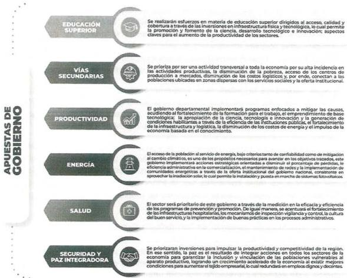

Finalmente, para el logro de los fines de gobierno, el seguimiento y la evaluación de la ejecución del Plan Participativo de Desarrollo Departamental 2024-2027, serán vitales para cumplir con un gran propósito: elevar la posición en el Índice Departamental de Competitividad. Actualmente, el departamento de Arauca ocupa la posición número veinticuatro (24) entre los treinta y tres (33) entes territoriales medidos (Incluido Bogotá D.C.). El reto para la Administración actual, bajo los parámetros propuestos en este Plan

---

Asamblea Departamental de Arauca

# ORDENANZA No. 161 de 2024

## "POR MEDIO DE LA CUAL SE ADOPTA EL PLAN PARTICIPATIVO DE DESARROLLO DEPARTAMENTAL 2024 – 2027"

Participativo de Desarrollo Departamental 2024-2027, es alcanzar el puesto número veinte (20) en el ranquin nacional una vez finalizado el cuatrienio.

### 1.5. Fundamento y articulación con el Programa de Gobierno

El departamento clama por la materialización de una visión de desarrollo colectivo y sostenible; que trace una ruta hacia un mejor desarrollo económico, que se refleje en más bienestar social y una mayor productividad. El sentir público se centra en la interpretación de la realidad del entorno, en el reconocimiento del inventario de las necesidades de los distintos actores: agremiaciones, organizaciones sociales, de productores, población vulnerable, profesionales con prospectiva de desarrollo y distintos líderes políticos de nuestro territorio, quienes son conscientes de la crisis social y económica que atraviesa el departamento.

El desarrollo productivo ha sido identificado como el motor del desarrollo social; esto convoca a la construcción de un plan de desarrollo participativo cuya esencia es la capacidad de escucha a las comunidades y a los diferentes sectores económicos, que entregan información de alta relevancia para así poder establecer un lineamiento estratégico acorde a las competencias del Gobierno departamental y con una gran fuerza orientada hacia la articulación del accionar público con el privado de cara a la atención de las demandas territoriales.

Las principales fortalezas de los araucanos son la vocación productiva, la diversidad cultural y étnica, su capacidad de afrontar y superar los retos, así como su amor por la tierra. Estos rasgos característicos de la gente son la principal motivación para comprometer toda la capacidad institucional de trabajo y gestión, conducida con responsabilidad, sentido común, actitud de servicio para, finalmente, brindar oportunidades a quienes reclaman un Arauca mejor.

El Programa de Gobierno orientado por el ingeniero Renson Jesús Martínez Prada se fundamentó en la creencia en los valores y principios del ser humano que habita la tierra araucana y lo que ella produce. Se inspiró en el precepto de hacer las cosas bien y actuar siempre con rectitud. El hoy gobernador tuvo la firme convicción de utilizar su amplio conocimiento, experiencia y compromiso para plasmar en un documento cómo generar desarrollo en el departamento de Arauca, para, de esa manera, mejorar la calidad de vida de la población.

---

Asamblea Departamental de Arauca

# ORDENANZA No. 161 de 2024

# "POR MEDIO DE LA CUAL SE ADOPTA EL PLAN PARTICIPATIVO DE DESARROLLO DEPARTAMENTAL 2024 - 2027"

El objetivo principal del Programa de Gobierno era establecer un marco integral de políticas y acciones que promovieran la productividad, el bienestar social y el buen gobierno.

Pilares del Plan de Desarrollo Departamental
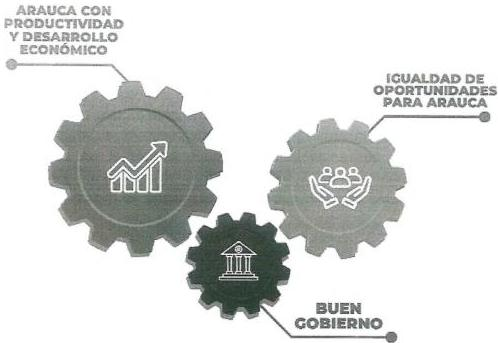
Figura 5.

Los pilares contemplados en el Programa de Gobierno y que hoy son la base de la estructura del Plan Participativo de Desarrollo Departamental 2024 - 2027, tal y como se aprecian en la Figura 5, plantean la productividad como el aprovechamiento eficiente de los recursos disponibles, lo que a su vez contribuye a generar riqueza y mejorar la calidad de vida de la población. Por otra parte, para generar bienestar social se requiere garantizar el acceso igualitario a servicios básicos de calidad, reducir la pobreza y la desigualdad. Finalmente, el Buen Gobierno se relaciona con la transparencia en la gestión pública, la lucha contra la corrupción, la participación ciudadana y el

---

Asamblea Departamental de Arauca

# ORDENANZA No. 161 de 2024

# "POR MEDIO DE LA CUAL SE ADOPTA EL PLAN PARTICIPATIVO DE DESARROLLO DEPARTAMENTAL 2024 - 2027"

fortalecimiento de la democracia. Todo lo anterior es primordial para construir una sociedad justa, equitativa y próspera.

En el Programa de Gobierno, la base fundamental del desarrollo se sustentó en un crecimiento económico, sostenible y robusto, que es la consecuencia de la productividad de los sectores. Para tal fin, se estableció el pilar estratégico denominado «Arauca con productividad y desarrollo económico», entendido como las acciones significativas para la producción de bienes y servicios bajo el concepto de: optimizar los recursos, y generar el menor impacto ambiental, reduciendo las externalidades.

La productividad está estrechamente relacionada con la competitividad, ya que las empresas y los países más productivos tienden a ser más competitivos a nivel internacional. Existen diversos factores que pueden afectar la productividad, como la infraestructura deficiente, la falta de educación y capacitación, la ineficacia de la gestión empresarial, y la falta de acceso a tecnología avanzada. Por otra parte, es de vital importancia reconocer el entorno económico regional, nacional y global, las políticas públicas, los incentivos fiscales y la confianza para la inversión privada.

Desde la perspectiva de desarrollo propuesta y como alternativa para el crecimiento económico de la región, se han estructurado los siguientes ejes estratégicos, estrechamente asociados a la relación productividad-competitividad:

- Desarrollo productivo, competitivo y sostenible: el resultado de planes estratégicos: Este enfoque se define como la consecuencia natural de la implementación de planes, programas y proyectos orientados a fortalecer el tejido empresarial con un claro objetivo de crecimiento y sostenibilidad. Se priorizan las cadenas productivas con alto potencial y se interviene en cada uno de sus eslabones a través de procesos de formación, investigación, desarrollo tecnológico y asistencia técnica. El objetivo final es garantizar la implementación de buenas prácticas, diferenciar los productos y servicios locales en los mercados regionales, nacionales e internacionales, y así impulsar el crecimiento económico y la generación de empleo.

- Generación de empleo y formación para el trabajo como elementos claves para fortalecer el capital humano en la región debido a su gran incidencia en materia de competitividad. Comprende la adquisición de competencias específicas por parte de los trabajadores y emprendedores para mejorar su desempeño y capacidad de llevar a cabo tareas de manera eficiente en diferentes áreas laborales, lo que

---

Asamblea Departamental de Arauca

# ORDENANZA No. 161 de 2024

## "POR MEDIO DE LA CUAL SE ADOPTA EL PLAN PARTICIPATIVO DE DESARROLLO DEPARTAMENTAL 2024 – 2027"

permitirá la aplicación de estándares y procedimientos encaminados a la productividad. En estas condiciones, se recrea un escenario propicio para la generación de empleo.

- Infraestructura, vías y transporte. Condición habilitante para dinamizar los procesos productivos de manera eficiente, acercando a la región a los mercados globales y permitiendo la movilidad de la población desde y hacia diferentes destinos nacionales. De igual forma, se aborda la mejora de las condiciones del espacio público, el urbanismo y los equipamientos colectivos, para promover la convivencia, el desarrollo integral de las personas y para fomentar la cohesión social.

- Minas y energía
En sintonía con las iniciativas del Gobierno nacional en materia de transición energética, este eje estratégico busca reconocer el gran potencial de las energías alternativas, que son más limpias y sostenibles, lo que las hace beneficiosas tanto para el medio ambiente como para la economía.

- Industria, comercio y turismo
Este sector se concibe como motor de desarrollo para impulsar la generación de empleo, la economía local, mejorar la calidad de vida de los ciudadanos y aumentar la competitividad de la región. Considera el fortalecimiento de las cadenas productivas del plátano, cacao, carne, leche, forestal, turística, apicultura y todas aquellas actividades agrícolas y pecuarias que busquen garantizar la seguridad alimentaria y la transformación y comercialización de los excedentes bajo un enfoque sostenible y productivo.

- Tecnologías de la Información y la Comunicación (TIC), y Ciencia, Tecnología e Innovación (CTI)
El Programa de Gobierno del ingeniero Renson Jesús Martínez Prada consideró el conocimiento como elemento estructural, lo que implica su apropiación, divulgación y materialización a través de la creación de nuevas alternativas de producción, la modernización del aparato productivo y la contribución a la diversificación y sofisticación de los productos y servicios generados en la región. Para ello, se debe ampliar la infraestructura tecnológica en materia de conectividad y la creación de proyectos de base tecnológica en todos los sectores de la economía.

---

Asamblea Departamental de Arauca

# ORDENANZA No. 161 de 2024

# "POR MEDIO DE LA CUAL SE ADOPTA EL PLAN PARTICIPATIVO DE DESARROLLO DEPARTAMENTAL 2024 - 2027"

- Recursos naturales, sostenibilidad ambiental, ecosistemas estratégicos y gestión del riesgo

El presente eje estratégico integra el cúmulo de acciones necesarias para disminuir el impacto en el medio ambiente de las actividades humanas cotidianas y los agentes económicos, acciones que está desencadenando externalidades negativas que implican inversiones sustanciales para su mitigación. Desde esta perspectiva, se persigue la integración entre la ciudad y el campo, que, como un solo cuerpo, defienden la protección de los recursos naturales y los ecosistemas estratégicos, tal y como se consigna en la transformación productiva, internacionalización y acción climática, contemplada en el Plan Nacional de Desarrollo.

En segunda instancia, el Programa de Gobierno entregó todos los insumos para la definición del pilar estratégico denominado «Igualdad de oportunidades para Arauca», entendido como principio fundamental que garantice a todas las personas las mismas posibilidades de su desarrollo en diferentes ámbitos de la vida, procurando así construir una sociedad justa y equitativa. Se refiere al acceso, en términos de calidad y oportunidad, a la educación, salud, vivienda, agua potable, saneamiento básico, espacios para el fomento de la cultura, el deporte y la recreación. Todo ello, reconociendo el tejido social como producto de las diferentes manifestaciones pluriétnicas, multiculturales, de orientación sexual, género, edad, capacidades cognitivas y físicas.

En el contexto de este pilar, se abordan los siguientes ejes estratégicos:

- Educación

Se considera la iniciativa de mayor relevancia dentro del Programa de Gobierno y por ello el Plan Participativo de Desarrollo 2024 - 2027 busca su fortalecimiento. A través de la educación, se transmiten conocimientos, habilidades y valores que son fundamentales para vivir en comunidad. Además, esta contribuye a la formación de ciudadanos responsables y conscientes de sus derechos y deberes. También impacta la economía de la región, ya que la educación de calidad prepara a las personas para el mercado laboral y fomenta el crecimiento económico y la competitividad.

En el Plan Participativo de Desarrollo 2024 - 2027, se pretende que haya acceso y cobertura universal para que, de esa manera, se les pueda brindar a todas las personas las herramientas necesarias para su desarrollo personal y profesional.

---

Asamblea Departamental de Arauca

# ORDENANZA No. 161 de 2024

# "POR MEDIO DE LA CUAL SE ADOPTA EL PLAN PARTICIPATIVO DE DESARROLLO DEPARTAMENTAL 2024 - 2027"

- Salud y protección social

Las acciones estratégicas del eje se centran en el optimizar la atención y prestación de los servicios de la salud a través de habilitación de nuevas áreas y servicios especializados en la red hospitalaria del departamento; mejorar la infraestructura de todos los hospitales; gestionar recursos financieros para el pago oportuno de los servicios prestados a la población migrante y garantizar la sostenibilidad financiera de los hospitales.

Con base en las anteriores premisas, se prioriza la calidad de la salud como factor esencial para el bienestar de las personas y el desarrollo de la sociedad; se garantizará el acceso a servicios médicos para asegurar el diagnóstico, tratamiento y atención adecuada, lo que contribuirá así al aumento de la esperanza de vida y a la reducción de la carga de enfermedades.

- Deporte y recreación

El deporte, la recreación y la actividad física fomentan la integración social, previenen enfermedades, ayudan a reducir el estrés, estimulan la mente, promueven valores, ayudan a prevenir conductas delictivas y a desarrollar habilidades blandas. Estas actividades están subordinadas a la política social, con un enfoque especial en el desarrollo humano, el liderazgo, la convivencia y la paz.

- Cultura

Comprende la importancia del fomento, promoción y gestión cultural, así como el cuidado del patrimonio inmaterial, dos acciones concretas que buscan afianzar los valores y creencias transmitidos por esta y la adaptación del individuo a su entorno. Todo ello sin dejar de lado los efectos económicos, los cuales tienen una destacada influencia a través de las industrias culturales, la valorización del patrimonio cultural y el emprendimiento asociado a dichas actividades. Estas actividades no solo generan empleo y contribuyen al crecimiento del Producto Interno Bruto (PIB), sino que también impulsan la innovación y la creatividad. Además, el turismo cultural se destaca como un motor económico importante, puesto que atrae a visitantes de todo el mundo que desean conocer y experimentar la cultura de los llaneros.

- Vivienda digna

El acceso a una vivienda digna es un asunto de inclusión, equidad, bienestar y de paz. La vivienda constituye la base de la estabilidad y de la seguridad física y emocional de los individuos y de las familias. Es el centro de la vida social. Con

---

Asamblea Departamental de Arauca

# ORDENANZA No. 161 de 2024

# "POR MEDIO DE LA CUAL SE ADOPTA EL PLAN PARTICIPATIVO DE DESARROLLO DEPARTAMENTAL 2024 - 2027"

base en ese precepto, el Programa de Gobierno reconoce esta necesidad como un derecho fundamental de carácter asistencial que requiere de un desarrollo legal previo y que debe ser prestado directamente por la administración o por las entidades asociativas creadas para tal fin.

- Agua potable y saneamiento básico

La importancia del agua potable y el saneamiento básico radica en su papel fundamental para la salud pública, el desarrollo económico y la protección del medio ambiente. Para garantizar estos aspectos, es necesario enfocarse en la preservación de los recursos hídricos y en la gestión adecuada de los residuos sólidos. Esto implica promover una cultura del respeto al medio ambiente, por lo que habrá de fomentarse el ahorro de agua y la correcta disposición de los residuos. Además, es fundamental invertir en infraestructuras que garanticen el acceso universal a agua potable y saneamiento básico de calidad.

Merece resaltarse el énfasis en la implementación de la economía circular, la cual se basa en la transformación de los procesos productivos para reducir al mínimo los residuos, y en el fomento de la reutilización y reciclaje de materiales. También se busca promover la utilización de energías renovables, la reducción de emisiones y fomentar la colaboración entre los diferentes sectores de la economía para lograr la máxima eficiencia en el uso de los recursos. Estos principios consagrados en el Programa de Gobierno son la base para un modelo económico sostenible en armonía con el medio ambiente.

- Inclusión social

El Programa de Gobierno plantea un nuevo paradigma en materia de la implementación del enfoque diferencial, pues busca proporcionar un trato específico y adaptado a cada persona o grupo en función de sus necesidades y características particulares. Esto implica diseñar y ejecutar políticas, programas y acciones que tomen en cuenta las diferencias existentes en la sociedad, como la edad, el género, la etnia, la discapacidad, entre otras. Para llevar a cabo esta implementación, es necesario contar con un análisis previo de las problemáticas a través de la participación de los diferentes actores sociales y políticos, así como la asignación de recursos adecuados para asegurar el éxito de esta aproximación diferenciada en la búsqueda de la equidad y la igualdad de oportunidades para todos.

Existen varios desafíos en materia de inclusión social, entre ellos está generar espacios de participación y concertación conducentes a mejorar la calidad de vida de los grupos poblacionales de protección especial; afianzar las inversiones para

---

Asamblea Departamental de Arauca

# ORDENANZA No. 161 de 2024

## "POR MEDIO DE LA CUAL SE ADOPTA EL PLAN PARTICIPATIVO DE DESARROLLO DEPARTAMENTAL 2024 – 2027"

crear un ambiente favorable para el empleo, la generación de ingresos y el mejoramiento de las condiciones de vivienda a través de procesos de autoconstrucción.

En tercera instancia, el Programa de Gobierno considera como elemento estructural un tercer pilar para materializar las acciones de los dos primeros y consiste en el «Buen Gobierno», entendido como el conjunto de principios y prácticas que buscan garantizar la transparencia, eficiencia y responsabilidad en el ejercicio del poder público. Se caracteriza por la participación ciudadana, el respeto a los derechos humanos y la garantía del Estado de derecho. Implica la adopción de medidas para prevenir la corrupción y promover la rendición de cuentas de los gobernantes. El Buen Gobierno busca la equidad, la justicia y el desarrollo sostenible, además que las políticas y decisiones sean tomadas de manera ética y en beneficio de la sociedad en su conjunto.

Este pilar pretende potenciar los procesos de planificación mediante la implementación y ejecución de políticas públicas que faciliten el enfoque de la inversión pública y privada en sectores estratégicos que promuevan el crecimiento sostenible, el conocimiento, la innovación, el empleo de calidad y la disminución de la huella de carbono. En ese sentido, se han priorizado seis (6) iniciativas de gobierno: educación superior, productividad, energía, vías secundarias, seguridad y paz integradora. Estos propósitos se lograrán siempre y cuando se ejecuten con prospectiva, anticipando los escenarios de futuro que ayuden a disminuir la conflictividad social; además, promoviendo la cooperación pública y privada; aprovechando la condición de frontera; ordenando del territorio con enfoque de sostenibilidad y fortaleciendo el Buen Gobierno a través de la transformación digital del ente territorial y la promoción de una cultura organizacional que colme las expectativas de los ciudadanos en lo alusivo a los servicios ofertados.

En concordancia con los postulados anteriores, se han planteado los siguientes ejes para materializar la visión estratégica del Plan Participativo de Desarrollo Departamental 2024 - 2027:

- Cooperación internacional, frontera, seguridad y paz

El Programa de Gobierno planteó generar condiciones habilitantes para el desarrollo integral del individuo. Para ello, es fundamental articular esfuerzos con las entidades de diferente orden para poner en marcha planes, programas y proyectos encaminados a recrear un ambiente de seguridad y paz, entendida no como el uso de la Fuerza Pública, sino como la consolidación de la institucionalidad para minimizar las amenazas al bienestar, la libertad de las

---

Asamblea Departamental de Arauca

# ORDENANZA No. 161 de 2024

# "POR MEDIO DE LA CUAL SE ADOPTA EL PLAN PARTICIPATIVO DE DESARROLLO DEPARTAMENTAL 2024 - 2027"

personas y comunidades, así como la protección del orden constitucional. Puede evidenciarse la fuerte conexión de la presente acción estratégica con la transformación propuesta en el Plan Nacional de Desarrollo «Colombia Potencia Mundial de la Vida» denominada «Seguridad humana y justicia social».

- Gobierno, planificación estratégica y desarrollo territorial

Para la construcción de un futuro prometedor, es necesario cimentar las acciones estratégicas que tengan efecto en el corto, mediano y largo plazo. Este aspecto, considerado en muchas ocasiones como retórica, encontró en el Programa de Gobierno un espacio privilegiado, teniendo en cuenta que se cuenta con instrumentos como el Plan de Ordenamiento Territorial, el Plan Regional de Competitividad, las iniciativas clúster, el Plan Integral de Desarrollo Agropecuario con Enfoque Territorial, el Plan Departamental de Extensión Agropecuaria, el Plan Estratégico Departamental en Ciencia Tecnología e Innovación y once (11) políticas públicas aprobadas mediante ordenanza departamental.

En ese sentido, la planificación debe ser flexible e innovadora para responder al menos a los desafíos planteados por dos factores: el plazo para el que se planifica y la complejidad y volatilidad del entorno de lo planificado.

---

Asamblea Departamental de Arauca

# ORDENANZA No. 161 de 2024

# "POR MEDIO DE LA CUAL SE ADOPTA EL PLAN PARTICIPATIVO DE DESARROLLO DEPARTAMENTAL 2024 - 2027"

Ejes estratégicos
Figura 6.
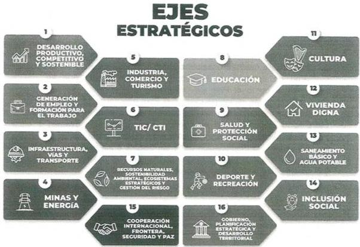

La Figura 6 representa los dieciséis ejes estratégicos que conforman el Plan Participativo de Desarrollo Departamental 2024 - 2027 y su articulación con las seis (6) iniciativas de gobierno.

Finalmente, el horizonte de inversiones circunscritos al nuevo Plan Participativo de Desarrollo Departamental 2024 – 2027, observará los lineamientos estratégicos del Plan Nacional de Desarrollo, específicamente en lo alusivo a la transformación del ordenamiento del territorio alrededor del agua y la justicia ambiental, puesto que se pretende reconocer la diversidad cultural, ambiental y social de la población, según el territorio en el que habita. Se avanzará hacia un modelo de planeación del territorio con acciones físicas, socioculturales y administrativas en el suelo urbano y rural que

---

Asamblea Departamental de Arauca

# ORDENANZA No. 161 de 2024

# "POR MEDIO DE LA CUAL SE ADOPTA EL PLAN PARTICIPATIVO DE DESARROLLO DEPARTAMENTAL 2024 - 2027"

promuevan el mejoramiento de las conditiones de vida de las comunidades urbanas, rurales y étnicas con enfoque diferencial.

El futuro Plan Participativo de Desarrollo Departamental 2024 - 2027, propone una meta general que albergue todos los indicadores propuestos en las diferentes matrices estratégicas que se diseñan y consiste en escalar cuatro (4) lugares en el Índice Departamental de Competitividad, informe que se emite anualmente por parte de la Universidad del Rosario y el Consejo Privado de Competitividad. Dicha calificación pondera las variables asociadas a cuatro (4) factores de competitividad con sus respectivos pilares, tal y como se aprecia en la Figura 7:

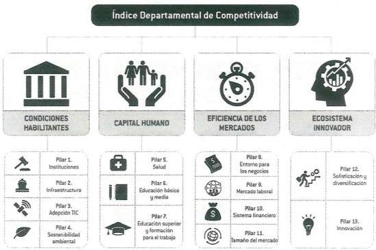
Figura 7.
Índice Departamental de Competitividad 2023

Se eligió la educación superior, la productividad, la energía, las vías secundarias y la salud como punta de lanza para jalonar el desarrollo de la región. El análisis del IDC (Índice Departamental de Competitividad) conduce a concentrar gran parte de este

---

Asamblea Departamental de Arauca

# ORDENANZA No. 161 de 2024

# "POR MEDIO DE LA CUAL SE ADOPTA EL PLAN PARTICIPATIVO DE DESARROLLO DEPARTAMENTAL 2024 - 2027"

propósito en fortalecer el talento humano, sin dejar de lado las condiciones habilitantes, la eficiencia de los mercados y la dinamización del ecosistema innovador. Esta asociación de variables se constituye en la columna vertebral del presente Plan Participativo de Desarrollo 2024 - 2027, una iniciativa de gobierno que procura consolidar la seguridad y la paz integradora en el territorio.

En síntesis, puede observarse, en la Figura 8, la relación funcional entre pilares, iniciativas de gobierno, ejes y acciones estratégicas:

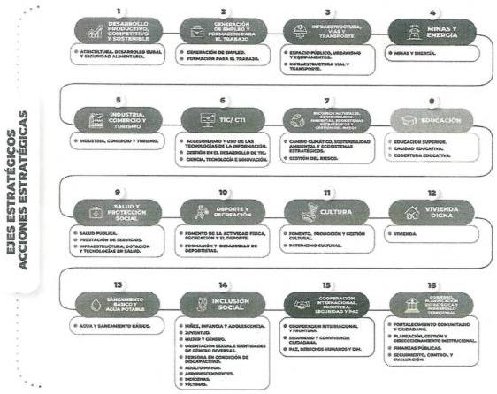
Figura 8.
Relación funcional entre pilares, apuestas, ejes y acciones estratégicas

---

Asamblea Departamental de Arauca

# ORDENANZA No. 161 de 2024

# "POR MEDIO DE LA CUAL SE ADOPTA EL PLAN PARTICIPATIVO DE DESARROLLO DEPARTAMENTAL 2024 - 2027"

## 1.6. Principios

### 1.6.1. Unidad

Se requiere de la convergencia de todos los actores sociales y políticos para lograr un Arauca con desarrollo económico y bienestar, de tal forma que se articule el trabajo con el Gobierno departamental. Es necesario que la ciudadanía ayude a construir y a proponer soluciones que resuelvan de manera eficaz sus necesidades.

### 1.6.2. Participación

Es necesario que exista una interacción permanente entre el Gobierno departamental y las comunidades. Que se generen espacios de participación ciudadana en la gestión pública y el control social, de tal forma que exista un interés del ciudadano por enterarse o intervenir en lo público y del gobernante en facilitar y promulgar los mecanismos oportunos y eficientes de construcción colectiva.

### 1.6.3. Compromiso

El compromiso del gobernante es total y absoluto. El gobernador Renson Martínez se propone cumplir a cabalidad con los programas y proyectos promovidos durante la campaña y que fueron plasmados en el Programa de Gobierno «Arauca Mejor». Su buena administración permitirá recobrar la confianza en lo público y enrutar al departamento hacia las nuevas tendencias de desarrollo social integral.

### 1.6.4. Planificación

La planificación debe ser un principio transversal en todas las áreas de la administración pública. En el Gobierno departamental, la planificación será estructurada con metas, objetivos e indicadores de gestión, que permitirán obtener los resultados esperados.

### 1.6.5. Innovación

El Gobierno departamental pretende generar en los ciudadanos la capacidad para transformar su entorno; orientando sus conocimientos hacia procesos disruptivos y creativos. Para ello, la entidad se apoyará, entre otros, de la tecnología como la mejor forma de producir bienes y servicios.

## 1.7. Enfoques

Las acciones de gobierno, enmarcadas en los pilares del Plan Participativo de Desarrollo Departamental 2024 - 2027, reconocen las diferentes manifestaciones y expresiones presentes en el territorio; y observa tanto el marco normativo como la

---

Asamblea Departamental de Arauca

# ORDENANZA No. 161 de 2024

# "POR MEDIO DE LA CUAL SE ADOPTA EL PLAN PARTICIPATIVO DE DESARROLLO DEPARTAMENTAL 2024 - 2027"

generación y apropiación de los mecanismos de participación para una eficaz y eficiente implementación de las políticas públicas.

La estructura programática del Plan de Desarrollo se sustenta en diversos enfoques, sin exclusiones, con una actitud permanente de vocación por la comprensión de la dinámica social, alineada con la gestión pública y la generación de condiciones de igualdad de oportunidades, centrándose en el bienestar de los individuos como respuesta al ciclo causa/efecto del crecimiento económico y sostenible de la región. Al amparo de esta premisa, se definen los siguientes enfoques:

## 1.7.1. Enfoque de curso de vida

Es vital reconocer los factores determinantes para las buenas condiciones de salud en edad temprana. Ese reconocimiento permitirá recrear un contexto social, ambiental, familiar, económico y cultural propicio para el desarrollo humano. En consecuencia, ha de potenciarse las capacidades y oportunidades desde el ciclo de gestación, primera infancia, juventud y adultez, desde el concepto de prevención y mitigación de riesgos.

## 1.7.2. Enfoque en seguridad humana y paz integradora

El concepto de seguridad no se ciñe estrictamente a la protección física, sino a tratar a las personas como centro de acciones de las políticas públicas, cuyo fin es el empoderamiento. Según el Programa de Naciones Unidas para el Desarrollo, la seguridad humana contempla las siguientes dimensiones: seguridad alimentaria, seguridad en salud, seguridad de la comunidad, seguridad económica, seguridad ambiental, seguridad personal y seguridad política.

## 1.7.3. Enfoque en derechos y capacidades

Este enfoque marca una ruta para la protección, promoción y garantía del goce efectivo de los derechos del ser humano; su reconocimiento, su bienestar, su multiculturalidad y el restablecimiento de derechos con el fin de orientar acciones dirigidas a los segmentos más marginados de la población.

Por otro lado, se pretende generar capacidades en el individuo para que este interactúe de manera sostenible con territorio para que, de esta manera, pueda tener acceso a la oportunidad de un desarrollo humano integral.

## 1.7.4. Enfoques diferenciales

La apropiación de capacidades y generación de oportunidades para el ser humano se circunscribe en las diferentes dimensiones del desarrollo económico; lo uno no se concibe

---

Asamblea Departamental de Arauca

# ORDENANZA No. 161 de 2024

# "POR MEDIO DE LA CUAL SE ADOPTA EL PLAN PARTICIPATIVO DE DESARROLLO DEPARTAMENTAL 2024 - 2027"

sin lo otro. Es decir, la visión integral de desarrollo pasa por mitigar los riesgos de vulnerabilidad, discriminación, exclusión y goce efectivo de derechos; de esa manera, se recreará el escenario para la inserción del individuo al aparato productivo de cara a la generación de ingresos que le han de servir para satisfacer sus necesidades básicas. Eso sí, habrá que reconocer sus características particulares: edad, etnia, género, nacionalidad, orientación sexual y situación de discapacidad.

## 1.7.5. Enfoque territorial

La planeación estratégica territorial reconoce las bondades del territorio, la dinámica social y económica a nivel nacional y global. Desde esta perspectiva, se pretende integrar al desarrollo endógeno factores como: condiciones habilitantes, capital humano, eficiencia de los mercados y ecosistema innovador.

Se atenderá lo consignado en el ejercicio participativo que dio origen a los programas de desarrollo con enfoque territorial, instrumento de planeación y gestión producto del Acuerdo de Paz, cuyo objetivo se centra en transformar el territorio, superar la pobreza y la debilidad institucional.

## 1.7.6. Enfoque de sostenibilidad

La interacción con el entorno debe estar revestida del respeto por la biodiversidad, los recursos naturales y la mitigación de todo hecho generador de la degradación del medio ambiente. El enfoque se apuntalará entonces a fortalecer las competencias ciudadanas de cara a la transformación de la economía y los sistemas de producción.

## 1.7.7. Enfoque interseccional

Perspectiva que permite conocer la presencia simultánea de dos o más características diferenciales de las personas (género, discapacidad, etapa del ciclo vital, pertenencia étnica y campesina entre otras) que en un contexto histórico, social y cultural determinado incrementan la carga de desigualdad, produciendo experiencias sustantivamente diferentes entre los sujetos (adaptado de Corte Constitucional-Sentencia T-141-15).

## 1.7.8. Enfoque de equidad de género

---

Asamblea Departamental de Arauca

# ORDENANZA No. 161 de 2024

# "POR MEDIO DE LA CUAL SE ADOPTA EL PLAN PARTICIPATIVO DE DESARROLLO DEPARTAMENTAL 2024 - 2027"

Se parte del constructo social que traduce la diferencia biológica en diferencias sociales entre mujeres y hombres. El género determina lo que se espera, lo que se permite y lo que es valorado de un hombre o de una mujer en un contexto específico. En las sociedades hay diferencias e inequidades entre mujeres y hombres en roles y responsabilidades asignadas, actividades asumidas y permitidas, control sobre recursos, toma de decisiones, el acceso a oportunidades, entre otras. Estas diferencias y desigualdades entre los sexos serán abordadas e intervenidas de manera integral por este gobierno.

## 2. ¿CÓMO SE HIZO?

### 2.1. Plan de trabajo

El proceso de elaboración del Plan Participativo de Desarrollo Departamental 2024 - 2027 empezó con la revisión de las herramientas metodológicas y digitales dispuestas por el DNP a través del Sistema de Planeación Territorial (SisPT). Se buscó la definición y conexidad entre el componente estratégico y el plan financiero, para materializar las iniciativas contempladas en el Programa de Gobierno.

El propósito del ejercicio de formulación se afianza en los siguientes preceptos:

- Materializar los cambios propuestos a la ciudadanía en el Programa de Gobierno.
- Cumplir a cabalidad con las funciones y competencias del ente territorial.
- Alcanzar un óptimo nivel de ejecución y seguimiento de las metas y los recursos de inversión.
- Ampliar las posibilidades de gestión a nivel nacional e internacional.

Lo anterior, con el objetivo de darle un enfoque transformador a las condiciones de vida de la población y territorio, generando que haya un mayor grado de confianza de los ciudadanos en las instituciones, y que propicie el éxito del Gobierno departamental. Todo ello, ha de darse en condiciones de gobernabilidad y una relación armónica con la comunidad.

El ejercicio de construcción colectiva permitió adquirir los insumos necesarios para trazar la ruta estratégica del Plan, la cual se resume en seis (6) grandes hitos:

1. Alistamiento institucional.
2. Diagnóstico.
3. Diseño y planificación por ejes estratégicos.
4. Elaboración de la estrategia financiera.

---

Asamblea Departamental de Arauca

# ORDENANZA No. 161 de 2024

# "POR MEDIO DE LA CUAL SE ADOPTA EL PLAN PARTICIPATIVO DE DESARROLLO DEPARTAMENTAL 2024 - 2027"

5. Adopción y divulgación.
6. Evaluación y seguimiento.

La ruta metodológica contempló las siguientes actividades:

- Conformación de las comisiones de empalme para generar un diagnóstico de gestión de las dependencias del departamento y sus entes descentralizados.
- Conformación del equipo de trabajo interdisciplinario conocedor de las condiciones del territorio.
- Revisión del informe de gestión y balance de resultados del gobierno anterior, así como la estructura de la entidad.
- Determinar el estado actual del Banco de Proyectos y el estado actual de los proyectos de inversión.
- Revisión del Plan Nacional de Desarrollo «Colombia Potencia Mundial de la Vida» para determinar las acciones estratégicas hacia el territorio y las iniciativas incluidas en el Plan Plurianual de Inversiones.
- Análisis situacional y diagnósticos de cada uno de los ejes establecidos en la estructura del Plan Participativo de Desarrollo Departamental 2024 - 2027.
- Revisión del marco normativo de participación e instrumentos de planeación dispuestos por el DNP.
- Elaboración de la estrategia y metodología para la participación ciudadana.
- Consolidación y cuantificación del inventario de fuentes de financiación para el funcionamiento de la entidad y la ejecución de los futuros proyectos de inversión.
- Análisis del Marco Fiscal de Mediano Plazo y el histórico de ejecución presupuestal con el fin de identificar los recursos disponibles.
- Adopción de la estructura del Plan Participativo de Desarrollo Departamental 2024 - 2027.
- Desarrollo y análisis de los ejercicios participativos en los siete (7) municipios del departamento.
- Desarrollo del ejercicio de priorización de iniciativas (por municipio) con recursos del Sistema General de Regalías (SGR).
- Concertación y consolidación del capítulo especial de paz.
- Elaboración de las matrices estratégicas de acuerdo con la estructura del Plan, recursos financieros y aportes del ejercicio participativo.
- Consolidación de la Matriz Plurianual de Inversiones.

---

Asamblea Departamental de Arauca

# ORDENANZA No. 161 de 2024

## "POR MEDIO DE LA CUAL SE ADOPTA EL PLAN PARTICIPATIVO DE DESARROLLO DEPARTAMENTAL 2024 – 2027"

- Remisión del documento preliminar del Plan de Desarrollo a la Corporación Autónoma Regional (Corporinoquia), al Consejo Territorial de Planeación (CTP) y a la Asamblea Departamental.
- Incorporación de las recomendaciones dadas por Corporinoquia y el CTP
- Realización de audiencias participativas para obtener insumos para el Plan Plurianual de Inversiones.
- Acto público de entrega del Plan Participativo de Desarrollo Departamental 2024 - 2027 para estudio por parte de la Asamblea Departamental.
- Acompañamiento de la discusión del Plan Participativo de Desarrollo Departamental 2024 - 2027 en la Asamblea Departamental.
- Sanción, adopción y publicación del Plan Participativo de Desarrollo Departamental 2024 - 2027.
- Promoción e implementación de escenarios de pedagogía del Plan Participativo de Desarrollo Departamental 2024 - 2027 dirigidos a la ciudadanía.

## 2.2. Mecanismos de participación

En concordancia con lo preceptuado en la Ley 152 de 1994, la elaboración del Plan Participativo de Desarrollo Departamental 2024 - 2027 se sustenta en la generación de espacios para la transmisión de información, formación, debate y concertación, orientado a garantizar la pertinencia, representatividad, calidad y utilidad del ejercicio.

La realidad de territorio y su enfoque estratégico se fundamenta en escuchar e interpretar a las comunidades. Actuando en consecuencia, se concibieron los siguientes espacios para la recolección de insumos:

### 2.2.1. Medios digitales

A través de la página de la Gobernación, se estableció el micrositio https://arauca.gov.co/plan-de-desarrollo-departamental-2024-2027/, en el cual se promovió la captura de información a través de un formulario para conocer las propuestas o iniciativas de la comunidad.

De igual manera, se transmitió el acontecer diario de la estructuración del Plan mediante la emisión de boletines de prensa a través de los perfiles de la Gobernación en las redes sociales Facebook e Instagram, las cuales cuentan con más de 49 mil y 4500 seguidores, respectivamente.

---

Asamblea Departamental de Arauca

# ORDENANZA No. 161 de 2024

# "POR MEDIO DE LA CUAL SE ADOPTA EL PLAN PARTICIPATIVO DE DESARROLLO DEPARTAMENTAL 2024 - 2027"

## 2.2.2. Correo electrónico

Para efectos de la interacción con los diferentes grupos de interés, se creó la dirección de correo electrónico plandes@arauca.gov.co, a través del cual se envió información masiva a las diferentes instancias de concertación y participación del sector público, organizaciones sociales, líderes comunitarios y sector privado.

## 2.2.3. Audiencias participativas

Con el objetivo de ampliar el espectro de participación, se recrearon nueve (9) espacios para el análisis de problemáticas con sus causas y efectos, y para escuchar propuestas e iniciativas que sirvieran para nutrir el plan estratégico.

Con el fin de generar insumos que fueran fácilmente tabulados como resultado de las jornadas participativas, se usaron los siguientes formatos, que forman parte de los anexos documentales:

Formato 3. Diagnóstico –«Causas y efectos»: en el que se identifica la problemática central para cada acción estratégica, así como las causas y efectos.

Formato 4. Diagnóstico «Diario de campo»: herramienta que permitió plasmar los aportes de las comunidades al análisis de la problemática, así como identificar las oportunidades y fortalezas. También, se recolectaron insumos para crear la visión a largo plazo.

Formato 6. Relatoría de «Mesas Sectoriales»: basado en el registro de información en los formatos 3 y 4. Se hizo la consolidación por municipio y se categorizaron las ideas de acuerdo con cuatro rangos: iniciativas homogéneas, heterogéneas, integradoras y de gestión.

Así mismo, para la elaboración del capítulo especial para inversión del Sistema General de Regalías, se diligenciaron los siguientes formatos:

Formato «Propuestas de Iniciativas»: en el que se plasmaron la totalidad de las iniciativas propuestas por las comunidades en cada uno de los municipios y en cada mesa sectorial.

Formato «Priorización de Iniciativas»: en el que, de acuerdo con la votación hecha por los participantes en las mesas sectoriales, se identificaron y calificaron tres (3) iniciativas que fueron priorizadas para la disponibilidad de recursos. De igual manera, se plasmaron

---

Asamblea Departamental de Arauca

# ORDENANZA No. 161 de 2024

# "POR MEDIO DE LA CUAL SE ADOPTA EL PLAN PARTICIPATIVO DE DESARROLLO DEPARTAMENTAL 2024 - 2027"

la totalidad de las iniciativas propuestas por las comunidades en cada uno de los municipios y en cada mesa sectorial¹.

Los resultados obtenidos se resumen en la Tabla 1:

Relación de participantes en audiencias
Tabla 1

|  FECHA | MUNICIPIO | PARTICIPANTES  |
| --- | --- | --- |
|  17 de febrero de 2024 | Cravo norte | 315  |
|  18 de febrero de 2024 | Puerto Rondón | 323  |
|  19 de febrero de 2024 | Tame | 621  |
|  20 de febrero de 2024 | Fortul | 484  |
|  21 de febrero de 2024 | Saravena | 461  |
|  22 de febrero de 2024 | Arauquita | 627  |
|  24 de febrero de 2024 | Arauca | 554  |
|  23, 24 y 25 de febrero de 2024 | Comunidades indígenas | 45  |
|  24 de febrero de 2024 | Comunidades negras, afrodescendientes, raizales y palenqueras | 28  |
|  TOTAL |   | 3458  |

¹ Ver la lista de anexos a este documento.

---

Asamblea Departamental de Arauca

# ORDENANZA No. 161 de 2024

## "POR MEDIO DE LA CUAL SE ADOPTA EL PLAN PARTICIPATIVO DE DESARROLLO DEPARTAMENTAL 2024 – 2027"

### 2.3. Articulación

#### 2.3.1. Articulación con Objetivos de Desarrollo Sostenible

La estrategia del Gobierno departamental se alinea con dieciséis (16) de los diecisiete (17) Objetivos del Desarrollo Sostenible (ODS), a excepción del número 14 por abordar aspectos relacionados con el océano y sus costas. En ese sentido, cada uno de los pilares le apunta a los siguientes ODS, según lo consignado en la figura 9:

**Figura 9.**

*Articulación del plan de desarrollo con los ODS*

---

Asamblea Departamental de Arauca

# ORDENANZA No. 161 de 2024

# "POR MEDIO DE LA CUAL SE ADOPTA EL PLAN PARTICIPATIVO DE DESARROLLO DEPARTAMENTAL 2024 – 2027"

Donor fin a la pobreza en todas sus formas y en todo el mundo.

1. Desarrollo productivo, competitivo y sostenible.
2. Infraestructura, vías y transporte.
3. Inclusión social-niñez, infancia y adolescentes.
4. Inclusión social-mujer y género.
5. Inclusión social-orientación sexual e identidad de género diversa.
6. Inclusión social-discapacidad.
7. Inclusión social-adulto mayor.
8. Inclusión social-víctimas.

Donor fin al hambre, moral, la soledad intelectual y la mejora de la población y garantizar la agricultura sostenible.

1. Desarrollo productivo, competitivo y sostenible.
2. Inclusión social-niñez, infancia y adolescentes.
3. Inclusión social-mujer y género.
4. Inclusión social-orientación sexual e identidad de género diversa.
5. Inclusión social-discapacidad.
6. Inclusión social-adulto mayor.
7. Inclusión social-víctimas.

Garantizar una vida sana y promover el bienestar de todas las personas a todas las edades.

1. Salud y protección social.
2. Deporte y recreación.
3. Inclusión social-niñez, infancia y adolescentes.
4. Inclusión social-mujer y género.
5. Inclusión social-orientación sexual e identidad de género diversa.
6. Inclusión social-discapacidad.
7. Inclusión social-adulto mayor.
8. Inclusión social-víctimas.

Garantizar una educación inclusiva y equitativa de calidad y promover cuatro efectos de aprendizaje permanente para todos y todos.

1. Educación.
2. Cultura.
3. Inclusión social-niñez, infancia y adolescentes.
4. Inclusión social-mujer y género.
5. Inclusión social-orientación sexual e identidad de género diversa.
6. Inclusión social-discapacidad.
7. Inclusión social-adulto mayor.
8. Inclusión social-víctimas.

Legrar la igualdad de género y empoderar a todas las mujeres y las niñas.

1. Inclusión social-mujer y género.
2. Inclusión social-orientación sexual e identidad de género diversa.
3. Inclusión social-discapacidad.
4. Inclusión social-adulto mayor.
5. Inclusión social-víctimas.

Garantizar la disponibilidad y la gestión sostenible del agua y el saneamiento para todos y todos.

1. Saneamiento básico y agua potable.

Garantizar el acceso a una energía sostenible, fiable, sostenible y moderna para todos y todos.

4. Minas y energía.

Promover el rendimiento económico, social en todos y cada una, el empleo pleno y productivo y el trabajo social en para todos y todos.

1. Generación de empleo y formación para el trabajo.
2. Inclusión social-mujer y género.
3. Inclusión social-orientación sexual e identidad de género diversa.
4. Inclusión social-discapacidad.
5. Inclusión social-adulto mayor.
6. Inclusión social-víctimas.

A

---

Asamblea Departamental de Arauca

# ORDENANZA No. 161 de 2024

# "POR MEDIO DE LA CUAL SE ADOPTA EL PLAN PARTICIPATIVO DE DESARROLLO DEPARTAMENTAL 2024 – 2027"

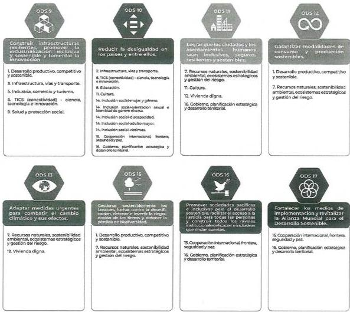

## 2.3.2. Articulación con el Plan Nacional de Desarrollo

El propósito trascendente del Gobierno del Cambio es hacer de Colombia una «Potencia mundial de la vida». Para ello, el eje axial estructurante es la «Paz Total», que se obtendrá a partir, como se plantea en las bases del Plan Nacional de Desarrollo 2022-2026, de transformaciones estructurales en el ordenamiento territorial alrededor del agua, la seguridad humana y la justicia social, el derecho humano a la alimentación, la transformación productiva y acción climática y la convergencia regional del desarrollo; todo ello, en el marco de unas finanzas públicas sanas, fundamentadas en la justicia tributaria.

---

Asamblea Departamental de Arauca

# ORDENANZA No. 161 de 2024

## "POR MEDIO DE LA CUAL SE ADOPTA EL PLAN PARTICIPATIVO DE DESARROLLO DEPARTAMENTAL 2024 – 2027"

Las estrategias consideradas en las cinco transformaciones tienden a consolidar la Paz Total; es decir, buscan que la seguridad sea integral, que incluya la atención a las necesidades prioritarias de las personas, a la seguridad alimentaria, a las posibilidades de movilidad y acceso a mercados y fuentes de financiación; acceso a la educación, a la salud, seguridad para el desarrollo de la cultura y para la construcción de futuro; opciones reales de creación de procesos que incluyan cadenas de adición de valor en las áreas rurales; ordenamiento urbano basado en la contención del crecimiento y el freno a la expansión, e igualdad en las oportunidades tanto para las personas como para las regiones (DNP, 2022).

El propósito de las cinco (5) transformaciones contempla los siguientes aspectos:

1. Ordenamiento territorial alrededor del agua

Esta transformación reconoce la necesidad de comprender los territorios en todas sus dimensiones, que se derivan, entre otras cosas, de las actividades productivas, el uso del suelo y la interacción con el entorno. Por lo tanto, implica un cambio en la planificación del desarrollo territorial y el ordenamiento, en el que la protección de los elementos ambientales fundamentales y las áreas de especial importancia para garantizar el derecho a la alimentación se convierten en objetivos primordiales. Desde una perspectiva funcional del ordenamiento territorial, se busca dirigir procesos participativos de planificación territorial en los que las voces de quienes residen en estos territorios sean escuchadas y tenidas en cuenta.

**Figura 10 Catalizadores ordenamiento territorial**

---

Asamblea Departamental de Arauca

# ORDENANZA No. 161 de 2024

# "POR MEDIO DE LA CUAL SE ADOPTA EL PLAN PARTICIPATIVO DE DESARROLLO DEPARTAMENTAL 2024 - 2027"

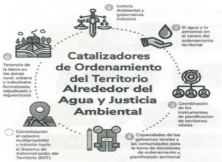

Fuente: DNP (2022)

# 2. Seguridad humana y justicia social

Lograr este objetivo implica que el Estado y la ciudadanía armonicen sus esfuerzos para mejorar el acceso a los servicios públicos, la salud, las condiciones de la niñez, juventud y vejez, la educación y el trabajo. Así mismo, ha proveerse más y mejores posibilidades para que los individuos y comunidades alcancen su proyecto de vida.

---

Asamblea Departamental de Arauca

# ORDENANZA No. 161 de 2024

# "POR MEDIO DE LA CUAL SE ADOPTA EL PLAN PARTICIPATIVO DE DESARROLLO DEPARTAMENTAL 2024 - 2027"

Figura 11
Transformación de seguridad humana y justicia social
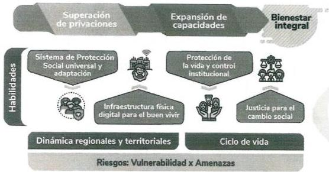
Fuente: DNP (2022)

## 3. Derecho humano a la alimentación

Los pueblos y las comunidades de las diferentes subregiones identificaron la necesidad de contar con suelos para la vida, la democratización del recurso de tierras, vías regionales como soporte del sistema agroalimentario, el desarrollo de proyectos productivos con asistencia técnica de la Nación y la garantía del derecho a la alimentación. La sistematización de estas necesidades fueron los insumos que enmarcan lo que se concibe como «Derecho humano a la alimentación».

---

Asamblea Departamental de Arauca

ORDENANZA No. 161 de 2024

# "POR MEDIO DE LA CUAL SE ADOPTA EL PLAN PARTICIPATIVO DE DESARROLLO DEPARTAMENTAL 2024 - 2027"

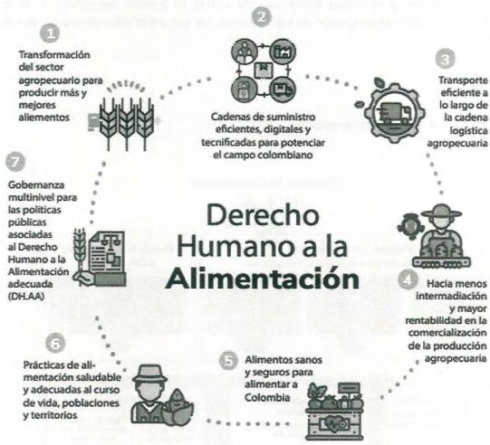
Figura 12
Transformación derecho humano a la alimentación

Fuent: DNP (2022)

## 4. Convergencia regional

Esta transformación pretende el fortalecimiento de las vocaciones productivas específicas de cada región. El propósito es mejorar la productividad y competitividad,

---

Asamblea Departamental de Arauca

# ORDENANZA No. 161 de 2024

## "POR MEDIO DE LA CUAL SE ADOPTA EL PLAN PARTICIPATIVO DE DESARROLLO DEPARTAMENTAL 2024 – 2027"

basándose en un desarrollo incluyente para propiciar encadenamientos entre el campo, las ciudades y el mundo.

Lograr este objetivo implica armonizar los esfuerzos para reducir las desigualdades sociales y económicas entre hogares y regiones del país. El propósito es garantizar la provisión de bienes y servicios públicos, así como el acceso equitativo a mejores oportunidades para la construcción de tejido social y el progreso económico en todos los territorios.

### Figura 13
Transformación de convergencia regional

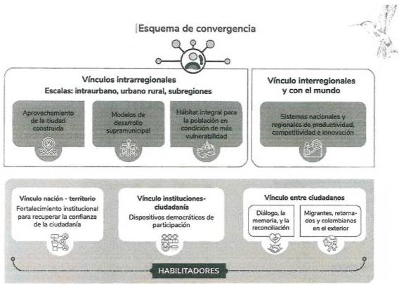

Fuente: DNP (2022)

---

Asamblea Departamental de Arauca

# ORDENANZA No. 161 de 2024

# "POR MEDIO DE LA CUAL SE ADOPTA EL PLAN PARTICIPATIVO DE DESARROLLO DEPARTAMENTAL 2024 - 2027"

5. Transformación productiva, internacionalización y acción climática

Para consolidar a Colombia como potencia mundial de la vida, el desarrollo económico del país y la sostenibilidad social y ambiental no pueden seguir siendo asumidos como procesos independientes. Por ello, es necesario garantizar la transición hacia una economía productiva limpia, justa y equitativa, soportada en modelos de negocio sostenibles y con un uso intensivo del conocimiento.

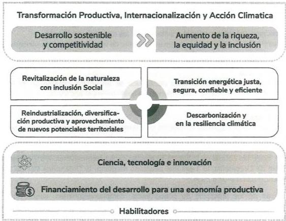
Figura 4
Transformación productiva, internacionalización y acción climática

Fuent: DNP (2022)

---

Asamblea Departamental de Arauca

ORDENANZA No. 161 de 2024

# "POR MEDIO DE LA CUAL SE ADOPTA EL PLAN PARTICIPATIVO DE DESARROLLO DEPARTAMENTAL 2024 - 2027"

## 2.3.3. Articulación regional

Tejer alianzas para el desarrollo regional es un propósito de este Gobierno departamental, a través de instancias como:

- La Región Administrativa y de Planificación (RAP) Llanos. Constituida mediante el Convenio de Asociación núm. 1392 del 13 de agosto de 2021, suscrito entre los departamentos de Arauca, Casanare y Vichada.
- El fortalecimiento de la Comisión Regional de Competitividad e Innovación, como escenario de diálogo, socialización e implementación de propuestas de políticas regionales y nacionales, y de programas y proyectos que buscan el desarrollo de departamento. Es espacio para la cooperación público-privada y académica está orientado a la implementación de las Agendas Departamentales de Competitividad e Innovación (ADCI).
- El desarrollo de documentos CONPES, para tener una mayor participación en los recursos del orden nacional orientados por las agencias del Estado.
- Los Pactos Territoriales, como un instrumento de articulación para la concertación de inversiones estratégicas de alto impacto que contribuyan a consolidar el desarrollo regional definido en el Plan Nacional de Desarrollo y la construcción de la Paz Total.
- Actualmente, el departamento de Arauca se encuentra inmerso en el Pacto Territorial Bicentenario, cuya vigencia va hasta junio del año 2029.

## 2.3.4. Articulación local

El Gobierno departamental fortalecerá la asistencia técnica a los municipios para la ejecución de los diferentes instrumentos de planeación y orientaciones emanadas de cada uno de los sectores económicos representados en las entidades del Gobierno nacional, haciendo énfasis en la puesta en marcha de las recomendaciones establecidas en el Plan de Ordenamiento Territorial adoptado mediante la Ordenanza 097 de 2022 (con vigencia hasta el año 2034).

A través de los principios de concurrencia, complementariedad, coordinación y subsidiaridad, se gestionarán recursos para la inversión local, alineados con cada uno de los planes de desarrollo municipales. Así mismo, se promoverá el ejercicio participativo para acceder a los recursos del Sistema General de Regalías correspondiente a las asignaciones directas y la bolsa de inversión regional.

---

Asamblea Departamental de Arauca

# ORDENANZA No. 161 de 2024

# "POR MEDIO DE LA CUAL SE ADOPTA EL PLAN PARTICIPATIVO DE DESARROLLO DEPARTAMENTAL 2024 - 2027"

## 2.3.5. Articulación con los Programas de Desarrollo con Enfoque Territorial (PDET)

Lograr la Paz Total exige cumplir con el Acuerdo de Paz firmado entre el Estado y las FARC EP, y «trascenderlo mediante la negociación con otros actores del conflicto, considerando a las comunidades desde el inicio y a lo largo de estos procesos, para poder avanzar hacia una paz, en la que la vida sea prioridad y se forje una cultura de convivencia» (DNP, 2022).

El Acuerdo determinó como mecanismo de planificación la construcción de los Planes de Acción para la Transformación Regional (PATR), elaborados de manera participativa, en el que se incluyen todos los niveles del ordenamiento territorial, concertado con las autoridades locales y las comunidades. De igual manera, el Acuerdo estableció también que en los territorios PDET se implementarán de manera prioritaria los 16 Planes Nacionales Sectoriales (PNS) de la Reforma Rural Integral, de los cuales, hasta el momento, se han adoptado formalmente 15, quedando pendiente el de Salud Rural.

Es un deber del Gobierno departamental concentrar esfuerzos para velar por la materialización de las iniciativas incluidas en el Plan de Acción para la Transformación Regional, guardando coherencia con los estipulados en el Plan Nacional de Desarrollo, como se ilustra a continuación:

---

Asamblea Departamental de Arauca

# ORDENANZA No. 161 de 2024

# "POR MEDIO DE LA CUAL SE ADOPTA EL PLAN PARTICIPATIVO DE DESARROLLO DEPARTAMENTAL 2024 - 2027"

Articulación transformaciones PND y Planes de Desarrollo con Enfoque Territorial
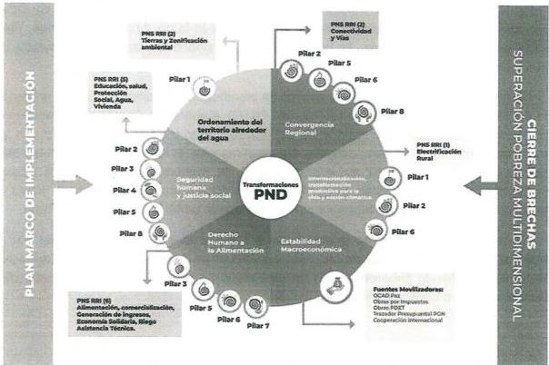
Figura 5

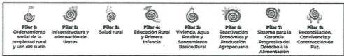
Fuente: ART (2023)

Finalmente, el Plan Participativo de Desarrollo Departamental 2024 – 2027, reconoce la importancia de apropiar las recomendaciones entregadas al pleno de la sociedad colombiana por parte de la Comisión de la Verdad (CEV). EL Gobierno departamental entiende que estas recomendaciones son vinculantes y pretenden que se avance en transformaciones estructurales que necesita en el país, con el objeto de poner fin a las confrontaciones armadas y superar los factores de persistencia del conflicto para la

---

Asamblea Departamental de Arauca

# ORDENANZA No. 161 de 2024

# "POR MEDIO DE LA CUAL SE ADOPTA EL PLAN PARTICIPATIVO DE DESARROLLO DEPARTAMENTAL 2024 - 2027"

construcción de la Paz Total y hacer de Colombia una potencia mundial de la vida (ART, 2023).

## 2.3.6. Articulación con políticas públicas nacionales

El Gobierno departamental basa su planificación estratégica en políticas públicas, tanto las emitidas por el Consejo Nacional de Política Económica y Social (CONPES) como las políticas públicas sancionadas por la Asamblea Departamental de Arauca y adoptadas mediante decreto por parte del Ejecutivo.

En ese sentido, los pilares estratégicos del Plan Participativo de Desarrollo Departamental 2024 – 2027 se alinean de la siguiente manera para cubrir la demanda de bienes y servicios por parte de la ciudadanía y así mejorar su calidad de vida:

- CONPES 4029. Política nacional de reindustrialización.
- CONPES 4098. Política para impulsar la competitividad agropecuaria.
- CONPES 4090. Política Nacional de Economía Naranja: Estrategias para Impulsar las Industrias Culturales y Creativas.
- CONPES 4085. Política de internacionalización para el desarrollo productivo regional.
- CONPES 4080. Política Pública de Equidad de Género para las Mujeres: Hacia el Desarrollo Sostenible del País.
- CONPES 4075. Política de transición energética.
- CONPES 4068. Política Nacional de Lectura, Escritura, Oralidad y Bibliotecas Escolares.
- CONPES 4070. Lineamientos de Política para la Implementación de un Modelo de Estado Abierto.
- CONPES 4062. Política nacional de propiedad intelectual.
- CONPES 4063. Política Pública de Garantías y Respeto a la Labor de Defensa de los Derechos Humanos y el Liderazgo Social.
- CONPES 4058. Política pública para reducir las condiciones de riesgo de desastres y adaptarse a los fenómenos de variabilidad climática.
- CONPES 4050. Política para la Consolidación del Sistema Nacional de Áreas Protegidas SINAP.
- CONPES 4051. Política Pública para el Desarrollo de la Economía Solidaria CONPES 4031. Política Nacional de Atención y Reparación Integral a Las Víctimas.

---

Asamblea Departamental de Arauca

# ORDENANZA No. 161 de 2024

# "POR MEDIO DE LA CUAL SE ADOPTA EL PLAN PARTICIPATIVO DE DESARROLLO DEPARTAMENTAL 2024 - 2027"

- CONPES 4023. Política para la reactivación, la repotenciación y el crecimiento sostenible e incluyente: Nuevo compromiso por el futuro de Colombia.
- CONPES 4021. Política Nacional para el Control de la Deforestación y la Gestión Sostenible de los Bosques.
- CONPES 4011. Política nacional de emprendimiento.
- CONPES 4012. Política nacional de comercio electrónico.
- CONPES 4008. Política Nacional de Información para la Gestión Financiera Pública. CONPES 4004. Economía circular en la gestión de los servicios de agua potable y manejo de aguas residuales.
- CONPES 4005. Política Nacional de Inclusión y Educación Económica y Financiera.
- CONPES 3995. Política Nacional de Confianza y Seguridad Digital.
- CONPES 3991. Política Nacional de Movilidad Urbana y Regional.
- CONPES 3892. Política Nacional Logística.
- CONPES 3975. Política Nacional para la Transformación Digital e Inteligencia Artificial.
- CONPES 3956. Política de Formalización Empresarial.
- CONPES 3943. Política para el mejoramiento de la calidad del aire.
- CONPES 3934. Política de Crecimiento Verde.
- CONPES 3931. Política Nacional para la Reincorporación Social y Económica de Exintegrantes de las FARC-EP.
- CONPES 3926. Política de Adecuación de Tierras 2018-2038.
- CONPES 3920. Política Nacional de Explotación de Datos (Big Data).
- CONPES 3918. Estrategia para la implementación de los Objetivos de Desarrollo Sostenible (ODS) en Colombia.
- CONPES 3874. Política Nacional para la Gestión Integral de Residuos Sólidos.
- CONPES 3866. Política Nacional de Desarrollo Productivo.
- CONPES 3859. Política para la adopción e implementación de un catastro multipropósito rural-urbano.
- CONPES 3854. Política Nacional de Seguridad Digital.

## 2.3.7. Articulación con políticas públicas departamentales

El departamento de Arauca cuenta actualmente con once (11) políticas públicas sectoriales, las cuales registran una baja implementación y la mayoría se encuentran a punto de fenecer. Situación que representa una oportunidad para establecer lineamientos públicos e instrumentos de planeación acordes a la normatividad vigente y las apuestas

---

Asamblea Departamental de Arauca
ORDENANZA No. 161 de 2024
"POR MEDIO DE LA CUAL SE ADOPTA EL PLAN PARTICIPATIVO DE DESARROLLO DEPARTAMENTAL 2024 – 2027"

de gobierno. Los documentos mencionados corresponden a las siguientes políticas públicas, las cuales registran un avance ponderado del 26 %:

- Política pública de afrodescendientes, por la diversidad araucana 2015-2025.
- Política pública para los pueblos indígenas del departamento de Arauca 2015-2025.
- Política pública de juventud, Arauca joven una apuesta para el desarrollo 2015-2025.
- Política pública de vivienda de interés social prioritaria en el departamento de Arauca 2016-2026.
- Política pública de la mujer, por una Arauca con equidad de género para las mujeres 2017-2027.
- Política pública de empleo decente 2018-2028.
- Política pública de emprendimiento y crecimiento empresarial 2018-2028.
- Política pública para las personas con discapacidad e inclusión social 2018-2028.
- Política pública de estilos de vida saludable 2019-2029.
- Política pública integral de libertad religiosa y de cultos 2020-2030.
- Política pública para el desarrollo territorial visión 2032.

### 2.3.8. Planeación y gestión orientada a resultados

La programación presupuestal debe orientarse a resultados, promover el uso eficiente y transparente de los recursos públicos y establecer una relación directa entre el ingreso, el gasto y los bienes y servicios entregados a la ciudadanía. Para el efecto, el presupuesto debe clasificarse mediante programas definidos que serán insumo para la elaboración de los planes de desarrollo y los planes plurianuales de inversión.

En concordancia con lo preceptuado anteriormente, la planificación presupuestal se enmarca en las competencias del departamento, las cuales contemplan acciones en los siguientes sectores:

**Tabla 2**
Sectores de competencia departamental

|  Código | Nombre  |
| --- | --- |
|  04 | Información Estadística  |
|  12 | Justicia y del Derecho  |
|  17 | Agricultura y Desarrollo Rural  |
|  19 | Salud y Protección Social  |

---

Asamblea Departamental de Arauca

# ORDENANZA No. 161 de 2024

# "POR MEDIO DE LA CUAL SE ADOPTA EL PLAN PARTICIPATIVO DE DESARROLLO DEPARTAMENTAL 2024 - 2027"

|  21 | Minas y Energía  |
| --- | --- |
|  22 | Educación  |
|  23 | Tecnologías de la Información y las Comunicaciones  |
|  24 | Transporte  |
|  25 | Organismos de Control  |
|  32 | Ambiente y Desarrollo Sostenible  |
|  33 | Cultura  |
|  35 | Comercio, Industria y Turismo  |
|  36 | Trabajo  |
|  39 | Ciencia, Tecnología e Innovación  |
|  40 | Vivienda, Ciudad y Territorio  |
|  41 | Inclusión Social y Reconciliación  |
|  43 | Deporte y Recreación  |
|  45 | Gobierno Territorial  |

Elaboración propia con información del DNP (2024)

Basados en la propuesta de gobierno, se han establecido tres (3) pilares, dieciséis (16) ejes estratégicos y cuarenta (40) acciones estratégicas, alineadas con los diferentes sectores de acuerdo con la clasificación presupuestal y como insumo para la elaboración de las matrices estratégicas, tal y como se observa en la Tabla núm. 3.

Tabla 3
Estructura estratégica del plan de desarrollo

|  PILARES | EJES ESTRATÉGICOS | PROGRAMA PRESUPUESTAL | SECTOR  |
| --- | --- | --- | --- |
|  1. ARAUCA CON PRODUCTIVIDAD Y DESARROLLO ECONÓMICO | 1. Desarrollo Productivo, Competitivo y Sostenible | 1. Agricultura, Desarrollo Rural y Seguridad Alimentaria | Agricultura y Desarrollo Rural  |
|   |  2. Generación de Empleo y Formación para el Trabajo | 2. Generación de Empleo | Trabajo  |
|   |   |  3. Formación para el Trabajo | Trabajo  |
|   |  3. Infraestructura, Vías y Transporte | 4. Espacio Público, Urbanismo y Equipamientos | Vivienda, Ciudad y Territorio  |
|   |   |  5. Infraestructura Vial y Transporte | Transporte  |
|   |  4. Minas y Energía | 6. Minas y Energía | Minas y Energía  |
|   |  5. Industria, Comercio y Turismo | 7. Industria, Comercio y Turismo | Comercio, Industria y Turismo  |
|   |  6. Tecnologías de la Información y la Comunicación (conectividad), y Ciencia, Tecnología e Innovación | 8. Accesibilidad y uso de las Tecnologías de la Información | Tecnologías de la Información y las Comunicaciones  |
|   |   |  9. Gestión en el Desarrollo del TIC  |   |
|   |   |  10. Ciencia, Tecnología e Innovación | Ciencia, Tecnología e Innovación  |

---

Asamblea Departamental de Arauca

# ORDENANZA No. 161 de 2024

# "POR MEDIO DE LA CUAL SE ADOPTA EL PLAN PARTICIPATIVO DE DESARROLLO DEPARTAMENTAL 2024 - 2027"

|   | 7. Recursos Naturales, Sostenibilidad Ambiental, Ecosistemas Estratégicos y Gestión del Riesgo | 11. Cambio Climático, Sostenibilidad Ambiental y Ecosistemas Estratégicos | Ambiente y Desarrollo Sostenible  |
| --- | --- | --- | --- |
|   |   |  12. Gestión del Riesgo | Gobierno Territorial  |
|  2. IGUALDAD DE OPORTUNIDADES PARA ARAUCA | 8. Educación | 13. Educación Superior | Educación  |
|   |   |  14. Calidad Educativa  |   |
|   |   |  15. Cobertura Educativa  |   |
|   |  9. Salud y Protección Social | 16. Salud Pública y Prestación de Servicios | Salud y Protección Social  |
|   |   |  17. Direccionamiento en Salud  |   |
|   |   |  18. Infraestructura, Dotación y Tecnologías en Salud  |   |
|   |  10. Deporte y Recreación | 19. Fomento de la Actividad Física, Recreación y el Deporte | Deporte y Recreación  |
|   |   |  20. Formación y Desarrollo de Deportistas  |   |
|   |  11. Cultura | 21. Fomento, Promoción y Gestión Cultural | Cultura  |
|   |   |  22. Patrimonio Cultural  |   |
|   |  12. Vivienda Digna | 23. Vivienda | Vivienda, Ciudad y Territorio  |
|   |  13. Saneamiento Básico y Agua Potable | 24. Agua y Saneamiento Básico | Vivienda, Ciudad y Territorio  |
|   |  14. Inclusión Social | 25. Primera Infancia, Niñez, Adolescencia y Familia | Inclusión Social y Reconciliación  |
|   |   |  26. Juventud  |   |
|   |   |  27. Mujer y Género  |   |
|   |   |  28. Orientación Sexual e Identidades de Género Diversas  |   |
|   |   |  29. Personas con Discapacidad  |   |
|   |   |  30. Adulto Mayor  |   |
|   |   |  31. Afrodescendientes  |   |
|   |   |  32. Indígenas  |   |
|   |   |  33. Víctimas  |   |
|  3. BUEN GOBIERNO | 15. Cooperación Internacional, Frontera, Seguridad y Paz | 34. Cooperación Internacional y Frontera | Comercio, Industria y Turismo  |
|   |   |  35. Seguridad y Convivencia Ciudadana | Gobierno Territorial  |
|   |   |  36. Paz, Derechos Humanos y DIH | Justicia y del Derecho  |
|   |   | 37. Fortalecimiento Comunitario y Ciudadano | Gobierno Territorial  |

---

Asamblea Departamental de Arauca

# ORDENANZA No. 161 de 2024

# "POR MEDIO DE LA CUAL SE ADOPTA EL PLAN PARTICIPATIVO DE DESARROLLO DEPARTAMENTAL 2024 - 2027"

|  16. Gobierno, Planificación Estratégica y Desarrollo Territorial | 38. Planeación, Gestión y Direccionamiento Institucional | Información Estadística
Gobierno Territorial
Organismos de Control  |
| --- | --- | --- |
|   |  39. Finanzas Públicas | Organismos de Control  |
|   |  40. Seguimiento, Control y Evaluación | Gobierno Territorial  |

# ARTÍCULO 4. PARTE 2. DIAGNÓSTICO SITUACIONAL Y PLAN ESTRATÉGICO

El desarrollo integral del COMPONENTE DIAGNÓSTICO SITUACIONAL Y PLAN ESTRATÉGICO, se encuentra como anexo a este documento y se relaciona como COMPONENTE DIAGNÓSTICO y contiene: diagnóstico de dieciséis (16) ejes estratégicos con sus respectivos planes estratégicos.

# ARTÍCULO 5. PARTE 3. DIAGNÓSTICO FINANCIERO Y PLAN PLURIANUAL DE INVERSIONES

El desarrollo integral del componente financiero se encuentra como anexo y se relaciona como ANEXOS FINANCIEROS y contiene:

- Análisis de la tendencia de las cifras contables históricas 2020-2023
- Plan financiero 2024-2027
- Plan plurianual de inversiones 2024-2027

# ARTÍCULO 6. PARTE 4. CAPÍTULO DE INVERSIONES CON CARGO AL SISTEMA GENERAL DE REGALÍAS

El desarrollo integral del capítulo de inversiones con cargo al sistema general de regalías se encuentra como anexo y se relaciona como CAPÍTULO DE INVERSIONES CON CARGO AL SISTEMA GENERAL DE REGALÍAS y contiene:

- Diagnóstico
- Proceso Participativo
- Componente estratégico
- Componente financiero

# ARTÍCULO 7. PARTE 5. CAPÍTULO ESPECIAL DE PAZ

El desarrollo integral del capítulo especial de paz se encuentra como anexo y se relaciona como Componente de seguridad humana y paz integradora, contiene:

---

Asamblea Departamental de Arauca

# ORDENANZA No. 161 de 2024

## "POR MEDIO DE LA CUAL SE ADOPTA EL PLAN PARTICIPATIVO DE DESARROLLO DEPARTAMENTAL 2024 – 2027"

- Diagnóstico
- Programas de Desarrollo con Enfoque Territorial
- Reincorporación e reintegración
- Nuevos diálogos
- Participación política
- Búsqueda de personas dadas como desaparecidas
- Acción integral contra minas
- Afectaciones del conflicto armado
- Reforma rural integral
- Sustitución de cultivos ilícitos

## ARTÍCULO 8. PARTE 6. SEGUIMIENTO Y EVALUACIÓN

El Plan Participativo de Desarrollo Departamental 2024 – 2027 se materializa a través de los diferentes mecanismos de seguimiento y evaluación, busca la implementación de herramientas para garantizar el buen gobierno a través de la planificación, el hacer, la verificación y el actuar a tiempo.

En consecuencia, se dará cumplimiento a lo preceptuado en el artículo 29 de la Ley 152 de 1994, donde se establece la obligatoriedad del Departamento Nacional de Planeación -DNP- de planificar, diseñar y organizar los sistemas de evaluación de la gestión pública; la instancia nacional viene implementada el Sistema de Planeación Territorial SisPT (https://sispt.dnp.gov.co/), el cual busca brindar insumos a las Entidades Territoriales para la etapa de formulación de los Planes de Desarrollo, facilitar la carga de volúmenes grandes de información, facilitar el seguimiento a estos a través de la visualización de tableros de control y reducir la cantidad de reportes a cargo de los municipios y departamentos.

En aras de garantizar la oportunidad y la calidad de la información requerida por las diferentes instancias, el Departamento de Arauca acogerá la herramienta descrita anteriormente para garantizar el proceso de seguimiento y evaluación, el cual se debe adelantar con una periodicidad de seis (6) meses y estará a cargo de todas las unidades ejecutoras en cabeza de la Secretaría de Planeación.

Adicionalmente, se utilizarán los mecanismos suficientes para realizar el monitoreo y evolución semestral de los indicadores correspondientes al Índice Departamental de

---

Asamblea Departamental de Arauca

# ORDENANZA No. 161 de 2024

# "POR MEDIO DE LA CUAL SE ADOPTA EL PLAN PARTICIPATIVO DE DESARROLLO DEPARTAMENTAL 2024 - 2027"

Competitividad, promulgado por el Consejo Privado de Competitividad y la Universidad del Rosario.

ARTÍCULO 9. La Administración Departamental consciente de la importancia de los procesos descritos en el artículo anterior, actualizará por Acto Administrativo el instructivo PR-PD-05 versión 04, relacionado con el seguimiento y evaluación del Plan Participativo de Desarrollo Departamental 2024 – 2027, de conformidad con las directrices emitidas por el gobierno nacional, considerando, además, los instrumentos de planificación que se detallan a continuación:

Plan Indicativo: instrumento de planificación cuatrienal, que contendrá la estructura estratégica del Plan Participativo de Desarrollo Departamental 2024 – 2027 con sus correspondientes pilares estratégicos, indicadores de resultado y sus metas, sectores, programas, indicadores de producto y sus metas; así como, las fuentes de financiación por anualidades.

Plan Operativo Anual de Inversiones POAI: instrumento de gestión que permite detallar de manera anualizada las inversiones del Departamento, especificando la estructura estratégica del Plan Participativo de Desarrollo Departamental 2024 – 2027, los proyectos de inversión y las diferentes fuentes de financiación de estos; con el propósito de materializar las apuestas de gobierno y las metas propuestas.

Plan de Acción: instrumento de planificación anualizado, donde se detalla la estructura estratégica del Plan Participativo de Desarrollo Departamental 2024 – 2027, los proyectos de inversión debidamente inscritos y viabilizados en el Sistema Unificado de Inversión y Finanzas Públicas (SUIFP) con sus correspondientes actividades y fuentes de financiación, con el propósito de planificar las diferentes acciones que se generan en el proceso de ejecución de los proyectos y su trazabilidad con el cumplimiento de metas producto del Plan.

Proyectos de Inversión: instrumento de inversión donde se contemplan un conjunto de actividades que se ejecutan en un período determinado, en el cual se involucran recursos (financieros, físicos, humanos, ambientales, etc.) con el fin de transformar una situación problemática de una población específica y el propósito de generar impactos positivos en la comunidad Araucana.

---

Asamblea Departamental de Arauca

# ORDENANZA No. 161 de 2024

# "POR MEDIO DE LA CUAL SE ADOPTA EL PLAN PARTICIPATIVO DE DESARROLLO DEPARTAMENTAL 2024 - 2027"

Aunado a los Instrumentos de planificación de la inversión, se considerarán los instrumentos financieros implementados por el gobierno nacional, debidamente adoptados por el Ente Territorial, entre los cuales se destacan:

Plan Financiero: instrumento de planificación y gestión financiera, que tiene como base las operaciones efectivas del Ente Territorial.

Marco Fiscal a mediano Plazo: instrumento de planeación fiscal y gestión, que contiene las proyecciones financieras del Ente Territorial a 10 años;

Plan Anual Mensualizado de Caja: instrumento de planeación y ejecución, cuyo fin es alcanzar las metas de ejecución presupuestal anual y regular los pagos mensuales, estableciendo los montos máximos de fondos disponibles por fuente de financiación, con los cuales se ejecutan las actividades relacionadas con la materialización de los proyectos de inversión del Ente Territorial Departamental.

Presupuesto: el Presupuesto Anual es el elemento del Sistema Presupuestal que estima los ingresos y los gastos, que han de efectuarse dentro del período fiscal respectivo. Además, es el instrumento financiero que permite iniciar la ejecución de los proyectos del Ente Territorial, estableciendo los gastos a efectuar y los recursos financieros para su destinación.

# ARTÍCULO 10. PARTE 7. ANEXOS

El documento técnico y sus anexos elaborados a partir del ejercicio realizado en los eventos de participación ciudadana, como fuente primaria y los soportes recopilados por las otras fuentes, se incorporan a la presente ordenanza, como anexos, según la siguiente relación:

|  ANEXOS  |
| --- |
|  I. ANEXOS TÉCNICOS  |
|  A) ANEXOS PILAR  |
|  PILAR 1. ARAUCA CON PRODUCTIVIDAD Y DESARROLLO ECONÓMICO  |
|  EJE ESTRATÉGICO 1. DESARROLLO PRODUCTIVO, COMPETITIVO Y SOOSTENIBLE  |
|  FASE DIAGNÓSTICA  |

FORMATO 3. DIAGNÓSTICO - CAUSAS Y CONSECUENCIAS

---

Asamblea Departamental de Arauca

# ORDENANZA No. 161 de 2024

# "POR MEDIO DE LA CUAL SE ADOPTA EL PLAN PARTICIPATIVO DE DESARROLLO DEPARTAMENTAL 2024 - 2027"

|  FORMATO 4. DIAGNÓSTICO-DIARIO DE CAMPO  |
| --- |
|  FORMATO 6. RELATORÍA DE MESAS SECTORIALES - AUDIENCIAS PARTICIPATIVAS  |
|  FORMATO 7. TRANSCRIPCIÓN MESAS SECTORIALES  |
|  FASE ESTRATÉGICA  |
|  FORMATO 9. MATRIZ ESTRATÉGICA  |
|  EJE ESTRATEGICO 2. GENERACION DE EMPLEO Y FORMACION PARA EL TRABAJO  |
|  FASE DIAGNÓSTICA  |
|  FORMATO 3. DIAGNÓSTICO - CAUSAS Y CONSECUENCIAS  |
|  FORMATO 4. DIAGNÓSTICO-DIARIO DE CAMPO  |
|  FORMATO 6. RELATORÍA DE MESAS SECTORIALES - AUDIENCIAS PARTICIPATIVAS  |
|  FORMATO 7. TRANSCRIPCIÓN MESAS SECTORIALES  |
|  FASE ESTRATÉGICA  |
|  FORMATO 9. MATRIZ ESTRATÉGICA  |
|  EJE ESTRATEGICO 3. INFRAESTRUCTURA, VIAS Y TRANSPORTE  |
|  FASE DIAGNÓSTICA  |
|  FORMATO 3. DIAGNÓSTICO - CAUSAS Y CONSECUENCIAS  |
|  FORMATO 4. DIAGNÓSTICO-DIARIO DE CAMPO  |
|  FORMATO 6. RELATORÍA DE MESAS SECTORIALES - AUDIENCIAS PARTICIPATIVAS  |
|  FORMATO 7. TRANSCRIPCIÓN MESAS SECTORIALES  |
|  FASE ESTRATÉGICA  |
|  FORMATO 9. MATRIZ ESTRATÉGICA  |
|  EJE ESTRATEGICO 4. MINAS Y ENERGÍA  |
|  FASE DIAGNÓSTICA  |
|  FORMATO 3. DIAGNÓSTICO - CAUSAS Y CONSECUENCIAS  |
|  FORMATO 4. DIAGNÓSTICO-DIARIO DE CAMPO  |
|  FORMATO 6. RELATORÍA DE MESAS SECTORIALES - AUDIENCIAS PARTICIPATIVAS  |
|  FORMATO 7. TRANSCRIPCIÓN MESAS SECTORIALES  |

---

Asamblea Departamental de Arauca
ORDENANZA No. 161 de 2024
"POR MEDIO DE LA CUAL SE ADOPTA EL PLAN PARTICIPATIVO DE DESARROLLO DEPARTAMENTAL 2024 - 2027"

|  FASE ESTRATÉGICA  |
| --- |
|  FORMATO 9. MATRIZ ESTRATÉGICA  |
|  EJE ESTRATEGICO 5. INDUSTRIA, COMERCIO Y TURISMO  |
|  FASE DIAGNÓSTICA  |
|  FORMATO 3. DIAGNÓSTICO - CAUSAS Y CONSECUENCIAS  |
|  FORMATO 4. DIAGNÓSTICO-DIARIO DE CAMPO  |
|  FORMATO 6. RELATORÍA DE MESAS SECTORIALES - AUDIENCIAS PARTICIPATIVAS  |
|  FORMATO 7. TRANSCRIPCIÓN MESAS SECTORIALES  |
|  FASE ESTRATÉGICA  |
|  FORMATO 9. MATRIZ ESTRATÉGICA  |
|  EJE ESTRATEGICO 6. TECNOLOGÍAS DE LA INFORMACIÓN Y COMUNICACIÓN (CONECTIVIDAD); CIENCIA, TECNOLOGÍA E INNOVACIÓN  |
|  FASE DIAGNÓSTICA  |
|  FORMATO 3. DIAGNÓSTICO - CAUSAS Y CONSECUENCIAS  |
|  FORMATO 4. DIAGNÓSTICO-DIARIO DE CAMPO  |
|  FORMATO 6. RELATORÍA DE MESAS SECTORIALES - AUDIENCIAS PARTICIPATIVAS  |
|  FORMATO 7. TRANSCRIPCIÓN MESAS SECTORIALES  |
|  FASE ESTRATÉGICA  |
|  FORMATO 9. MATRIZ ESTRATÉGICA  |
|  EJE ESTRATEGICO 7. RECURSOS NATURALES, SOSTENIBILIDAD AMBIENTAL, ECOSISTEMAS ESTRATÉGICOS Y GESTIÓN DEL RIESGO  |
|  FASE DIAGNÓSTICA  |
|  FORMATO 3. DIAGNÓSTICO - CAUSAS Y CONSECUENCIAS  |
|  FORMATO 4. DIAGNÓSTICO-DIARIO DE CAMPO  |
|  FORMATO 6. RELATORÍA DE MESAS SECTORIALES - AUDIENCIAS PARTICIPATIVAS  |
|  FORMATO 7. TRANSCRIPCIÓN MESAS SECTORIALES  |
|  FASE ESTRATÉGICA  |
|  FORMATO 9. MATRIZ ESTRATÉGICA  |

---

Asamblea Departamental de Arauca
ORDENANZA No. 161 de 2024

# "POR MEDIO DE LA CUAL SE ADOPTA EL PLAN PARTICIPATIVO DE DESARROLLO DEPARTAMENTAL 2024 - 2027"

|  PILAR 2. IGUALDAD DE OPORTUNIDADES PARA ARAUCA  |
| --- |
|  EJE ESTRATEGICO 8. EDUCACION  |
|  FASE DIAGNÓSTICA  |
|  FORMATO 3. DIAGNÓSTICO - CAUSAS Y CONSECUENCIAS  |
|  FORMATO 4. DIAGNÓSTICO-DIARIO DE CAMPO  |
|  FORMATO 6. RELATORÍA DE MESAS SECTORIALES - AUDIENCIAS PARTICIPATIVAS  |
|  FORMATO 7. TRANSCRIPCIÓN MESAS SECTORIALES  |
|  FASE ESTRATÉGICA  |
|  FORMATO 9. MATRIZ ESTRATÉGICA  |
|  EJE ESTRATEGICO 9. SALUD Y PROTECCION SOCIAL  |
|  FASE DIAGNÓSTICA  |
|  FORMATO 3. DIAGNÓSTICO - CAUSAS Y CONSECUENCIAS  |
|  FORMATO 4. DIAGNÓSTICO-DIARIO DE CAMPO  |
|  FORMATO 6. RELATORÍA DE MESAS SECTORIALES - AUDIENCIAS PARTICIPATIVAS  |
|  FORMATO 7. TRANSCRIPCIÓN MESAS SECTORIALES  |
|  FASE ESTRATÉGICA  |
|  FORMATO 9. MATRIZ ESTRATÉGICA  |
|  EJE ESTRATEGICO 10. DEPORTE Y RECREACION  |
|  FASE DIAGNÓSTICA  |
|  FORMATO 3. DIAGNÓSTICO - CAUSAS Y CONSECUENCIAS  |
|  FORMATO 4. DIAGNÓSTICO-DIARIO DE CAMPO  |
|  FORMATO 6. RELATORÍA DE MESAS SECTORIALES - AUDIENCIAS PARTICIPATIVAS  |
|  FORMATO 7. TRANSCRIPCIÓN MESAS SECTORIALES  |
|  FASE ESTRATÉGICA  |
|  FORMATO 9. MATRIZ ESTRATÉGICA  |
|  EJE ESTRATEGICO 11. CULTURA  |
|  FASE DIAGNÓSTICA  |

---

Asamblea Departamental de Arauca

# ORDENANZA No. 161 de 2024

# "POR MEDIO DE LA CUAL SE ADOPTA EL PLAN PARTICIPATIVO DE DESARROLLO DEPARTAMENTAL 2024 - 2027"

|  FORMATO 3. DIAGNÓSTICO - CAUSAS Y CONSECUENCIAS  |
| --- |
|  FORMATO 4. DIAGNÓSTICO-DIARIO DE CAMPO  |
|  FORMATO 6. RELATORÍA DE MESAS SECTORIALES - AUDIENCIAS PARTICIPATIVAS  |
|  FORMATO 7. TRANSCRIPCIÓN MESAS SECTORIALES  |
|  FASE ESTRATÉGICA  |
|  FORMATO 9. MATRIZ ESTRATÉGICA  |
|  EJE ESTRATEGICO 12. VIVIENDA DIGNA  |
|  FASE DIAGNÓSTICA  |
|  FORMATO 3. DIAGNÓSTICO - CAUSAS Y CONSECUENCIAS  |
|  FORMATO 4. DIAGNÓSTICO-DIARIO DE CAMPO  |
|  FORMATO 6. RELATORÍA DE MESAS SECTORIALES - AUDIENCIAS PARTICIPATIVAS  |
|  FORMATO 7. TRANSCRIPCIÓN MESAS SECTORIALES  |
|  FASE ESTRATÉGICA  |
|  FORMATO 9. MATRIZ ESTRATÉGICA  |
|  EJE ESTRATEGICO 13. SANEAMIENTO BÁSICO Y AGUA POTABLE  |
|  FASE DIAGNÓSTICA  |
|  FORMATO 3. DIAGNÓSTICO - CAUSAS Y CONSECUENCIAS  |
|  FORMATO 4. DIAGNÓSTICO-DIARIO DE CAMPO  |
|  FORMATO 6. RELATORÍA DE MESAS SECTORIALES - AUDIENCIAS PARTICIPATIVAS  |
|  FORMATO 7. TRANSCRIPCIÓN MESAS SECTORIALES  |
|  FASE ESTRATÉGICA  |
|  FORMATO 9. MATRIZ ESTRATÉGICA  |
|  EJE ESTRATEGICO 14. INCLUSIÓN SOCIAL  |
|  ACCIÓN ESTRATÉGICA 25. NIÑEZ, INFANCIA Y ADOLESCENCIA  |
|  FASE DIAGNÓSTICA  |
|  FORMATO 3. DIAGNÓSTICO - CAUSAS Y CONSECUENCIAS  |
|  FORMATO 4. DIAGNÓSTICO-DIARIO DE CAMPO  |

---

Asamblea Departamental de Arauca
ORDENANZA No. 161 de 2024
"POR MEDIO DE LA CUAL SE ADOPTA EL PLAN PARTICIPATIVO DE DESARROLLO DEPARTAMENTAL 2024 - 2027"

|  FORMATO 6. RELATORÍA DE MESAS SECTORIALES - AUDIENCIAS PARTICIPATIVAS  |
| --- |
|  FORMATO 7. TRANSCRIPCIÓN MESAS SECTORIALES  |
|  FASE ESTRATÉGICA  |
|  FORMATO 9. MATRIZ ESTRATÉGICA  |
|  ACCION ESTRATEGICA 26. JUVENTUD  |
|  FASE DIAGNÓSTICA  |
|  FORMATO 3. DIAGNÓSTICO - CAUSAS Y CONSECUENCIAS  |
|  FORMATO 4. DIAGNÓSTICO-DIARIO DE CAMPO  |
|  FORMATO 6. RELATORÍA DE MESAS SECTORIALES - AUDIENCIAS PARTICIPATIVAS  |
|  FORMATO 7. TRANSCRIPCIÓN MESAS SECTORIALES  |
|  FASE ESTRATÉGICA  |
|  FORMATO 9. MATRIZ ESTRATÉGICA  |
|  ACCION ESTRATEGICA 27. MUJER Y GENERO  |
|  FASE DIAGNÓSTICA  |
|  FORMATO 3. DIAGNÓSTICO - CAUSAS Y CONSECUENCIAS  |
|  FORMATO 4. DIAGNÓSTICO-DIARIO DE CAMPO  |
|  FORMATO 6. RELATORÍA DE MESAS SECTORIALES - AUDIENCIAS PARTICIPATIVAS  |
|  FORMATO 7. TRANSCRIPCIÓN MESAS SECTORIALES  |
|  FASE ESTRATÉGICA  |
|  FORMATO 9. MATRIZ ESTRATÉGICA  |
|  ACCION ESTRATEGICA 28. ORIENTACION SEXUAL E IDENTIDAD DE GENERO DIVERSAS  |
|  FASE DIAGNÓSTICA  |
|  FORMATO 3. DIAGNÓSTICO - CAUSAS Y CONSECUENCIAS  |
|  FORMATO 4. DIAGNÓSTICO-DIARIO DE CAMPO  |
|  FORMATO 6. RELATORÍA DE MESAS SECTORIALES - AUDIENCIAS PARTICIPATIVAS  |
|  FORMATO 7. TRANSCRIPCIÓN MESAS SECTORIALES  |
|  FASE ESTRATÉGICA  |

---

Asamblea Departamental de Arauca

# ORDENANZA No. 161 de 2024

# "POR MEDIO DE LA CUAL SE ADOPTA EL PLAN PARTICIPATIVO DE DESARROLLO DEPARTAMENTAL 2024 - 2027"

|  FORMATO 9. MATRIZ ESTRATÉGICA  |
| --- |
|  ACCION ESTRATEGICA 29. PERSONAS EN CONDICION DE DISCAPACIDAD  |
|  FASE DIAGNÓSTICA  |
|  FORMATO 3. DIAGNÓSTICO - CAUSAS Y CONSECUENCIAS  |
|  FORMATO 4. DIAGNÓSTICO-DIARIO DE CAMPO  |
|  FORMATO 6. RELATORÍA DE MESAS SECTORIALES - AUDIENCIAS PARTICIPATIVAS  |
|  FORMATO 7. TRANSCRIPCIÓN MESAS SECTORIALES  |
|  FASE ESTRATÉGICA  |
|  FORMATO 9. MATRIZ ESTRATÉGICA  |
|  ACCION ESTRATEGICA 30. ADULTO MAYOR  |
|  FASE DIAGNÓSTICA  |
|  FORMATO 3. DIAGNÓSTICO - CAUSAS Y CONSECUENCIAS  |
|  FORMATO 4. DIAGNÓSTICO-DIARIO DE CAMPO  |
|  FORMATO 6. RELATORÍA DE MESAS SECTORIALES - AUDIENCIAS PARTICIPATIVAS  |
|  FORMATO 7. TRANSCRIPCIÓN MESAS SECTORIALES  |
|  FASE ESTRATÉGICA  |
|  FORMATO 9. MATRIZ ESTRATÉGICA  |
|  ACCION ESTRATEGICA 31. AFRODESCENDIENTES  |
|  FASE DIAGNÓSTICA  |
|  FORMATO 3. DIAGNÓSTICO - CAUSAS Y CONSECUENCIAS  |
|  FORMATO 4. DIAGNÓSTICO-DIARIO DE CAMPO  |
|  FORMATO 6. RELATORÍA DE MESAS SECTORIALES - AUDIENCIAS PARTICIPATIVAS  |
|  FORMATO 7. TRANSCRIPCIÓN MESAS SECTORIALES  |
|  FASE ESTRATÉGICA  |
|  FORMATO 9. MATRIZ ESTRATÉGICA  |
|  ACCION ESTRATEGICA 32. INDIGENAS  |
|  FASE DIAGNÓSTICA  |

---

Asamblea Departamental de Arauca
ORDENANZA No. 161 de 2024
“POR MEDIO DE LA CUAL SE ADOPTA EL PLAN PARTICIPATIVO DE DESARROLLO DEPARTAMENTAL 2024 – 2027”

|  FORMATO 3. DIAGNÓSTICO - CAUSAS Y CONSECUENCIAS  |
| --- |
|  FORMATO 4. DIAGNÓSTICO-DIARIO DE CAMPO  |
|  FORMATO 6. RELATORÍA DE MESAS SECTORIALES - AUDIENCIAS PARTICIPATIVAS  |
|  FORMATO 7. TRANSCRIPCIÓN MESAS SECTORIALES  |
|  FASE ESTRATÉGICA  |
|  FORMATO 9. MATRIZ ESTRATÉGICA  |
|  ACCIÓN ESTRATÉGICA 33. VÍCTIMAS  |
|  FASE DIAGNÓSTICA  |
|  FORMATO 3. DIAGNÓSTICO - CAUSAS Y CONSECUENCIAS  |
|  FORMATO 4. DIAGNÓSTICO-DIARIO DE CAMPO  |
|  FORMATO 6. RELATORÍA DE MESAS SECTORIALES - AUDIENCIAS PARTICIPATIVAS  |
|  FORMATO 7. TRANSCRIPCIÓN MESAS SECTORIALES  |
|  FASE ESTRATÉGICA  |
|  FORMATO 9. MATRIZ ESTRATÉGICA  |
|  PILAR 3. BUEN GOBIERNO  |
|  EJE ESTRATÉGICO 15. COOPERACIÓN INTERNACIONAL, FORNTERA, SEGURIDAD Y PAZ  |
|  FASE DIAGNÓSTICA  |
|  FORMATO 3. DIAGNÓSTICO - CAUSAS Y CONSECUENCIAS  |
|  FORMATO 4. DIAGNÓSTICO-DIARIO DE CAMPO  |
|  FORMATO 6. RELATORÍA DE MESAS SECTORIALES - AUDIENCIAS PARTICIPATIVAS  |
|  FORMATO 7. TRANSCRIPCIÓN MESAS SECTORIALES  |
|  FASE ESTRATÉGICA  |
|  FORMATO 9. MATRIZ ESTRATÉGICA  |
|  EJE ESTRATÉGICO 16. GOBIERNO, PLANIFICACIÓN ESTRATÉGICA Y DESARROLLO TERRITORIAL  |
|  FASE DIAGNÓSTICA  |
|  FORMATO 3. DIAGNÓSTICO - CAUSAS Y CONSECUENCIAS  |

---

Asamblea Departamental de Arauca
ORDENANZA No. 161 de 2024
“POR MEDIO DE LA CUAL SE ADOPTA EL PLAN PARTICIPATIVO DE DESARROLLO DEPARTAMENTAL 2024 – 2027”

|  FORMATO 4. DIAGNÓSTICO-DIARIO DE CAMPO  |
| --- |
|  FORMATO 6. RELATORÍA DE MESAS SECTORIALES - AUDIENCIAS PARTICIPATIVAS  |
|  FORMATO 7. TRANSCRIPCIÓN MESAS SECTORIALES  |
|  FASE ESTRATÉGICA  |
|  FORMATO 9. MATRIZ ESTRATÉGICA  |
|  CAPÍTULO ESPECIAL: PAZ INTEGRADORA Y AMPLIADA, RECONCILIACIÓN, CONVIVENCIA Y NO ESTIGMATIZACIÓN  |
|  ANEXO 1. CAPÍTULO DE PAZ  |
|  ANEXO 2. SOPORTE DE EJERCICIO DE PARTICIPACIÓN  |
|  MATRICES ESTRATÉGICAS ORIENTADORAS  |
|  ANEXO 1. MATRIZ ESTRATÉGICA ORIENTADORA PAZ, DERECHOS HUMANOS Y DIH  |
|  ANEXO 2. MATRIZ ESTRATÉGICA ORIENTADORA AFRODESCENDIENTES  |
|  ANEXO 3. MATRIZ ESTRATÉGICA ORIENTADORA INDÍGENAS  |
|  CAPÍTULO ESPECIAL: SISTEMA GENERAL DE REGALIAS  |
|  ANEXO 1 CAPÍTULO INVERSIÓN SGR  |
|  ANEXO 2 SOPORTES CONVOCATORIA  |
|  ANEXO 3 POSTULACIÓN DE INICIATIVAS SGR  |
|  ANEXO 4 PRIORIZACIÓN DE INICIATIVAS SGR POR MUNICIPIO  |
|  ANEXO 5 SOPORTES PRESENTACIONES MESAS DE TRABAJO  |
|  ANEXO 6 TABULACIÓN DE INICIATIVAS  |
|  ANEXO 7 ESTRATEGIA PARTICIPATIVA  |
|  ANEXO 8 COMUNIDADES ETNICAS  |
|  ANEXO 9 MATRIZ DE INICIATIVAS SGR  |
|  B) ANEXOS TÉCNICOS CONSOLIDADOS  |
|  ANEXO B.1 MATRIZ DE ARTICULACIÓN PILARES PDET CON EL PLAN PARTICIPATIVO DE DESARROLLO DEPARTAMENTAL DE ARAUCA  |
|  ANEXO B.2 INFORME DE GESTIÓN Y BALANCE DE RESULTADOS 2020-2023  |
|  ANEXO B.3 ACTA DE EMPALME  |

---

Asamblea Departamental de Arauca
ORDENANZA No. 161 de 2024
“POR MEDIO DE LA CUAL SE ADOPTA EL PLAN PARTICIPATIVO DE DESARROLLO DEPARTAMENTAL 2024 – 2027”

|  C) ANEXOS FINANCIEROS  |
| --- |
|  PLAN FINANCIERO DESAGREGADO POR FUENTES DE RECURSOS DISPONIBLES DEL DEPARTAMENTO DE ARAUCA 2024-2027  |
|  ANEXO C.2 PLAN PLURIANUAL DE INVERSIONES PLAN PARTICIPATIVO DE DESARROLLO 2024-2027  |
|  II. ANEXOS SOPORTES LEGALES  |
|  ANEXO 1. PROGRAMA DE GOBIERNO.  |
|  ANEXO 1. PROGRAMA DE GOBIERNO  |
|  ANEXO 2. CERTIFICADO ALINEACION PROGRAMA DE GOBIERNO  |
|  ANEXO 2. ACTA DE POSESIÓN DR. RENSON JESUS MARTINEZ  |
|  ANEXO 3. DECRETO 345 DEL 15-02-2024 POR MEDIO DEL CUAL SE CONFORMA EL CONSEJO TERRITORIAL DE PLANEACIÓN.  |
|  ANEXO 4. CONVOCATORIA Y ARTICULACION PARA AUDIENCIAS PARTICIPATIVAS  |
|  ANEXO 4.1 REGISTRO FOTOGRÁFICO  |
|  ANEXO 4.2 CONVOCATORIA GENERAL AUDIENCIAS PARTICIPATIVAS  |
|  ANEXO 5. LISTAS DE ASISTENCIA DE AUDIENCIAS PARTICIPATIVAS.  |
|  ANEXO 5.1 ASISTENCIA MESAS PARTICIPATIVAS PDD CRAVO NORTE  |
|  ANEXO 5.2 ASISTENCIA MESAS PARTICIPATIVAS PDD PUERTO RONDON  |
|  ANEXO 5.3 ASISTENCIA MESAS PARTICIPATIVAS PDD TAME  |
|  ANEXO 5.4 ASISTENCIA MESAS PARTICIPATIVAS PDD FORTUL  |
|  ANEXO 5.5 ASISTENCIA MESAS PARTICIPATIVAS PDD SARAVENA  |
|  ANEXO 5.6 ASISTENCIA MESAS PARTICIPATIVAS PDD ARAUQUITA  |
|  ANEXO 5.7 ASISTENCIA MESAS PARTICIPATIVAS PDD ARAUCA  |
|  ANEXO 6. DOCUMENTO DE ANÁLISIS CONCLUSIVO DE PARTICIPACIÓN COMUNITARIA EN EL PLAN PARTICIPATIVO DE DESARROLLO.  |
|  ANEXO 7. CERTIFICACIÓN DE PROYECCIÓN DE RECURSOS DE LA SECRETARIA DE HACIENDA.  |
|  ANEXO 7.1 DISTRIBUCION SUPERAVIT VIGENCIA 2023  |
|  ANEXO 7.2 DISTRIBUCION SUPERAVIT REINTEGROS VIGENCIA 2023  |

---

Asamblea Departamental de Arauca
ORDENANZA No. 161 de 2024
“POR MEDIO DE LA CUAL SE ADOPTA EL PLAN PARTICIPATIVO DE DESARROLLO DEPARTAMENTAL 2024 – 2027”

|  ANEXO 7.3 SUPERAVIT DE RENDIMIENTOS FINANCIEROS VIGENCIA 2023  |
| --- |
|  ANEXO 7.4 DISTRIBUCION SUPERAVIT INGRESOS CORRIENTES DE LIBRE DESTINACION 2024  |
|  ANEXO 7.5 INGRESOS CORRIENTES DE LIBRE DESTINACION APROPIADOS PARA PAGO FONPET VIGENCIA 2024  |
|  ANEXO 7.6 PROYECCION ESTAMPILLAS VIGENCIA 2025  |
|  ANEXO 7.7 PROYECCION ICLD VIGENCIA 2026  |
|  ANEXO 7.8 PROYECCION ICLD VIGENCIA 2026-2  |
|  ANEXO 7.9 PROYECCION ESTAMPILLAS VIGENCIA 2026  |
|  ANEXO 7.10 PROYECCION ESTAMPILLAS VIGENCIA 2027  |
|  ANEXO 7.11 SICODIS  |
|  ANEXO 7.12 ACTA CODFIS  |
|  ANEXO 7.13 MARCO FISCAL DE MEDIANO PLAZO 2023-2032  |
|  ANEXO 8. COMUNICACIÓN DEL RADICADO DE ENTREGA DEL DOCUMENTO PRELIMINAR DEL PLAN PARTICIPATIVO DE DESARROLLO DEPARTAMENTAL AL CONSEJO TERRITORIAL DE PLANEACIÓN.  |
|  ANEXO 8.1 OFICIO REMISORIO 20240500788-2  |
|  ANEXO 8.2 CORREO ELECTRONICO REMISIÓN  |
|  ANEXO 9. COMUNICACIÓN DE RADICADO EN LA CORPORACIÓN AUTÓNOMA REGIONAL DE LA ORINOQUIA. CORPORINOQUIA, DEL PLAN PARTICIPATIVO DE DESARROLLO.  |
|  ANEXO 9.1 OFICIO REMISORIO 20240500789-2  |
|  ANEXO 9.2 CORREO ELECTRONICO REMISION  |
|  ANEXO 10. PRESENTACIÓN DEL DOCUMENTO PRELIMINAR DEL PLAN PARTICIPATIVO DE DESARROLLO DEPARTAMENTAL A LA ASAMBLEA DEPARTAMENTAL.  |
|  ANEXO 10.1 OFICIO REMISORIO 20240500790-2  |
|  ANEXO 10.2 CORREO ELECTRONICO REMISION  |
|  ANEXO 11. ACTA DE CONSEJO DE GOBIERNO DE ACUERDO CON LO ESTIPULADO EN LA LEY 152 ARTÍCULO 39 NUMERAL 3 PÁRRAFO 2.  |
|  ANEXO 12. ACTAS DE SOCIALIZACIÓN AL CONSEJO TERRITORIAL DE PLANEACIÓN.  |
|  ANEXO 12.1 ACTA DE REUNIÓN - CTP 12 MAR  |
|  ANEXO 12.2 ACTA DE REUNIÓN - CTP 13 MAR  |

---

Asamblea Departamental de Arauca

# ORDENANZA No. 161 de 2024

# "POR MEDIO DE LA CUAL SE ADOPTA EL PLAN PARTICIPATIVO DE DESARROLLO DEPARTAMENTAL 2024 - 2027"

|  ANEXO 13. LISTADOS DE ASISTENCIA DE LA SOCIALIZACIÓN AL CONSEJO TERRITORIAL DE PLANEACIÓN.  |
| --- |
|  ANEXO 13.1 LISTA ASISTENCIA SESION 12-03-2024  |
|  ANEXO 13.2 LISTA ASISTENCIA SESION 13-03-2024  |
|  ANEXO 14. ACTAS DE CONCERTACIÓN COMUNIDADES NEGRAS, AFRODESCENDIENTES, RAIZALES Y PALEQUEROS  |
|  ANEXO 14.1 CONVOCATORIA CONSULTIVA  |
|  ANEXO 14.2 RELATORIA MESA CONSULTIVA Y ASISTENCIA  |
|  ANEXO 14.3 ACTA DE PRIORIZACION AFRODESCENDIENTES  |
|  ANEXO 14.4 MATRIZ DE CONCERTACION AFRODESCENDIENTES  |
|  ANEXO 15. ACTAS DE CONCERTACIÓN COMUNIDADES INDÍGENAS.  |
|  ANEXO 15.1 CONVOCATORIA CONSULTIVA INDIGENA  |
|  ANEXO 15.2 CONCERTACIÓN CONSULTIVA INDIGENA  |
|  ANEXO 15.3 ASISTENCIA JORNADA DE TRABAJO  |
|  ANEXO 15.4 ASISTENCIA JORNADA DE TRABAJO 2  |
|  ANEXO 15.5 REGISTRO FOTOGRAFICO  |
|  ANEXO 16. CONCEPTO EMITIDO POR LA CORPORACIÓN AUTÓNOMA REGIONAL DE LA ORINOQUIA. CORPORINOQUIA.  |
|  ANEXO 17. RESPUESTA AL CONCEPTO EMITIDO POR LA CORPORACIÓN AUTÓNOMA REGIONAL DE LA ORINOQUIA. CORPORINOQUIA.  |
|  ANEXO 17.1 CORREO DE REMISION  |
|  ANEXO 17.2 OFICIO DE RESPUESTA A CONCEPTO TÉCNICO CORPORINOQUIA  |
|  ANEXO 18. CONCEPTO DEL PLAN PARTICIPATIVO DE DESARROLLO 2024-2027 POR PARTE DEL CONSEJO TERRITORIAL DE PLANEACIÓN.  |
|  ANEXO 19. RESPUESTA A OFICIO DEL CONSEJO TERRITORIAL DE PLANEACIÓN AL CONCEPTO DEL PLAN PARTICIPATIVO DE DESARROLLO 2024-2027.  |
|  ANEXO 19.1 CORREO DE REMISIÓN  |
|  ANEXO 19.2 OFICIO DE RESPUESTA CTP  |

---

Asamblea Departamental de Arauca
ORDENANZA No. 161 de 2024
“POR MEDIO DE LA CUAL SE ADOPTA EL PLAN PARTICIPATIVO DE DESARROLLO DEPARTAMENTAL 2024 – 2027”

|  ANEXO 20. REMISIÓN A LA OFICINA ASESORA JURÍDICA CON EL FIN DE EMITIR CONCEPTO DEL PLAN PARTICIPATIVO DE DESARROLLO 2024-2027.  |
| --- |
|  ANEXO 1. NOTA INTERNA 04029  |
|  ANEXO 2. NOTA INTERNA 04055  |
|  ANEXO 21. CONCEPTO JURÍDICO DE LA OFICINA ASESORA JURÍDICA DEL PLAN PARTICIPATIVO DE DESARROLLO 2024-2027.  |
|  ANEXO 22. ACTA DE CONSEJO DE GOBIERNO.  |
|  III. DOCUMENTO TÉCNICO DEL PPDD 2024-2027  |
|  ANEXO 1. PLAN PARTICIPATIVO DE DESARROLLO DEPARTAMENTAL  |
|  ANEXO 2. CERTIFICACION DE COMPETENCIAS DEL PLAN  |
|  IV. PROYECTO DE ORDENANZA Y EXPOSICIÓN DE MOTIVOS  |
|  ANEXO 1. PROYECTO DE ORDENANZA  |
|  ANEXO 2. EXPOSICIÓN DE MOTIVOS  |
|  V. OTROS ANEXOS  |
|  ANEXO 1. PLAN TERRITORIAL DE SALUD ARAUCA 2024-2027  |
|  ANEXO 2. CERTIFICACION DE COMPETENCIAS DEL PLAN DE SALUD  |

ARTÍCULO 11. AUTORÍCESE al Gobernador de Arauca para, en caso de modificación o desuso de la batería de indicadores de planificación estratégica aprobada en el presente Plan Participativo de Desarrollo Departamental 2024-2027, realice los cambios correspondientes en la estrategia de medición de efectividad e impacto establecida, producto de las directrices emanadas por el Departamento Nacional de Planeación (DNP).

PARÁGRAFO: La Asamblea Departamental deberá ser informada de los cambios que se surtan a raíz de los lineamientos emanados por parte del DNP en el término de un (1) mes.

---

Asamblea Departamental de Arauca

# ORDENANZA No. 161 de 2024

# "POR MEDIO DE LA CUAL SE ADOPTA EL PLAN PARTICIPATIVO DE DESARROLLO DEPARTAMENTAL 2024 - 2027"

ARTÍCULO 12. INSTRUMENTOS DE EJECUCIÓN. Los instrumentos jurídicos y administrativos que se tendrán en cuenta para el cumplimiento de ejecución del Plan Participativo de Desarrollo Departamental 2024 - 2027 serán los siguientes:

1. Alianzas Público-Privadas -APP-: las restricciones presupuestales a las que se ve enfrentada la administración departamental evidencian la necesidad de explorar fuentes de financiación alternativas, una de ellas son las Asociaciones Público-Privadas -APP- las cuales hacen posible la provisión de bienes y servicios para la población a través de la vinculación de capital público y privado para la financiación de proyectos de inversión pública.
2. Alianzas estratégicas.
3. Contratos y/o convenios.
4. Esquemas asociados territoriales.
5. Asociatividad.
6. Regímenes excepcionales a la ley 80 de 1993, 1150 de 2007 y 1882 de 2018.
7. Cumplimiento de metas colectivas determinadas en función de la Ley 1962 de 2019 "Por la cual se dictan normas orgánicas para el fortalecimiento de la Región Administrativa de Planificación, se establecen las condiciones para su conversión en Región Entidad Territorial y se dictan otras disposiciones, en desarrollo de los artículos 306 y 307 de la C.P."
8. Suscripción de convenios de cooperación Internacional.

ARTÍCULO 13. ARTICULACIÓN ENTRE SEGUIMIENTO Y PROGRAMACIÓN PRESUPUESTAL. Los planteamientos contenidos en el Plan Cuatrienal 2024-2027 se ajustan a las prioridades de bienestar generales contempladas en el artículo 366 de la Constitución Política y a lo consignado en el Programa de Gobierno. Los resultados que se obtengan a partir del seguimiento y la evaluación de la ejecución física y financiera de las metas físicas y los indicadores de producto serán un insumo para la programación presupuestal de la siguiente vigencia, de tal forma que se priorice la asignación de recursos y sean consistentes con los resultados obtenidos.

ARTÍCULO 14. CONTINUIDAD EN LA EJECUCIÓN DE PROYECTOS APROBADOS. Los proyectos que a la fecha de expedición de este Plan Participativo de Desarrollo Departamental 2024 - 2027 hayan sido aprobados por instancias nacionales, regionales o departamentales y que cuenten con disponibilidad presupuestal continuarán su proceso de ejecución y se articularán a las metas de este Plan Participativo de Desarrollo Departamental 2024-2027.

---

Asamblea Departamental de Arauca

# ORDENANZA No. 161 de 2024

## "POR MEDIO DE LA CUAL SE ADOPTA EL PLAN PARTICIPATIVO DE DESARROLLO DEPARTAMENTAL 2024 – 2027"

**ARTÍCULO 15. ARMONIZACIÓN PRESUPUESTAL.** Autorícese al Gobernador del Departamento de Arauca para que de conformidad con la Ley 152 de 1994 y el Estatuto Orgánico de Presupuesto, realice el proceso de armonización presupuestal entre el Plan de Inversiones del Plan Participativo de Desarrollo Departamental 2024 – 2027 y el Presupuesto de Rentas y Gastos de la Vigencia 2024, proyecto de Ordenanza que deberá presentarse a la Asamblea Departamental.

**Parágrafo:** Para los proyectos del presupuesto de Rentas y Gastos de la vigencia 2024, que a la fecha de aprobación de la ordenanza del Plan Participativo de Desarrollo Departamental 2024 - 2027, ya estén en proceso precontractual y contractual, el Gobernador expedirá el acto administrativo correspondiente de Homologación de estos proyectos con la nueva estructura del Plan Participativo de Desarrollo Departamental 2024 - 2027.

**ARTÍCULO 16. PLAN TERRITORIAL DE SALUD 2024 – 2027.** Como parte integral de este Plan Participativo de Desarrollo Departamental 2024-2027, se adopta el Plan Territorial de Salud 2024-2027 anexo a esta Ordenanza, para ser aprobado en cumplimiento del artículo 24 de la Resolución 100 de 2024 “Por la cual se dictan disposiciones sobre la Planeación Integral para la Salud y se deroga la Resolución 1536 de 2015” del Ministerio de Salud. Este Plan permitirá al Departamento, contribuir con el logro de las metas del Plan Decenal de Salud Pública.

**ARTÍCULO 17. FINANCIAMIENTO.** Para la ejecución del Plan Plurianual de Inversiones 2024-2027, la Administración departamental y sus entidades descentralizadas emprenderán acciones para obtener recursos de cofinanciación de otros niveles de la administración pública nacional y territorial, atraer inversión extranjera y gestionar la creación de estímulos de conformidad con el ordenamiento jurídico para que el sector privado y los particulares participen en la ejecución de las actividades que puedan asumir eficientemente.

**ARTÍCULO 18. PROYECTOS QUE IMPLEMENTAN INICIATIVAS DEL PROGRAMA DE DESARROLLO CON ENFOQUE TERRITORIAL (PDET).** En cumplimiento del parágrafo primero del artículo 6 de la Ley 418 de 1997, modificado por el artículo 4 de la Ley 2272 de 2022, la Administración Departamental, en el marco de sus competencias y de

---

Asamblea Departamental de Arauca

# ORDENANZA No. 161 de 2024

## "POR MEDIO DE LA CUAL SE ADOPTA EL PLAN PARTICIPATIVO DE DESARROLLO DEPARTAMENTAL 2024 – 2027"

acuerdo con la disponibilidad fiscal, promoverá, de manera prioritaria, la ejecución de proyectos que implementen iniciativas del PDET y se asocien a alguno o algunos programas, subprogramas y/o líneas estratégicas del presente plan de desarrollo.

**ARTÍCULO 19. RENDICIÓN DE CUENTAS.** El gobernador del Departamento de Arauca y su equipo de gobierno, rendirá cuentas, informando, explicando y dialogando con la sociedad civil sobre la forma como ha invertido los recursos, el avance de cumplimiento del Plan de Desarrollo y el avance de la gestión pública departamental.

En cumplimiento del artículo 43 de la ley 152 de 1994, el Gobernador presentará a la Asamblea Departamental anualmente los respectivos informes sobre la ejecución del Plan de Desarrollo Departamental.

**ARTÍCULO 20. VIGENCIA.** La presente ordenanza rige a partir de su sanción y publicación. Derogando todas las disposiciones que le sean contrarias.

## COMUNÍQUESE, NOTIFÍQUESE Y CÚMPLASE

Dada en Arauca (Arauca), a los treinta (30) días del mes de mayo de 2024

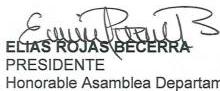

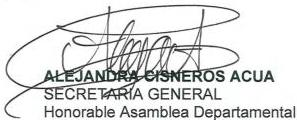