DANE

DANE

ELECTRONICO DE ENSINO

# Arauquita / Arauca

## ¿Cuántos somos?

Población total censada:

45.268

Población total ajustada por omisión:

49.841

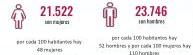

## Omisión total: 9,2%

Grandes grupos de edad

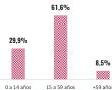

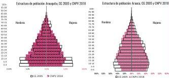

La población étnica en Arauquita se autorreconoció como:

Indígenas

2,5%

ROM(Gitanos)

0,0%

Afrocolombianos

6,7%

Ningún grupo étnico

90,7%

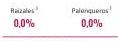

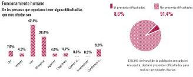

Altabetismo: leer y escribir

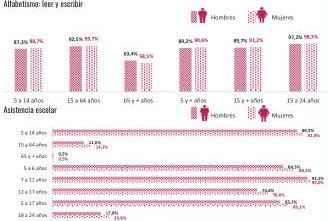

## ¿Dónde estamos?

Población ajustada por omisión en cabecera municipal: 13.720

Población ajustada por omisión en centros poblados y rural disperso: 36.121

Omisión censal cabecera: 3,7% Omisión censal resto: 11,2%

Distribución por áreas geográficas

29,2%

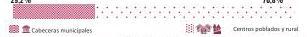

Lugar de nacimiento

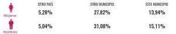

Notas: el porcentaje de población (denominador) no incluye a los personas que no respondieron esta pregunta, es decir, no incluye "sin información". De un total de 45.268 personas afectivamente censadas, 777 (1,7%) no respondieron esta pregunta de autorreconocimiento (pertenencia étnica).

## Funcionamiento humano

De las personas que reportaron tener alguna dificultad las que más afectan son:

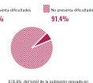

El 6,6% del total de la población censada en Arauquita, declaró presentar dificultades para realizar actividades diarias.

## ¿Cómo vivimos?

15.736*

Total unidades de vivienda

13.008

Total viviendas ocupadas con personal presentes

## Uso de vivienda

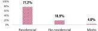

*Unidades de vivienda totales que incluyen las viviendas ocupadas con todas las personas ausentes, las viviendas ocupadas con personas presentes, las viviendas de uso temporal y las viviendas desocupadas

## Tipo de vivienda

Casa

14.334

Apartamento

279

Cuerto

911

Étnica

168

Otro

44

## Viviendas con acceso a servicios públicos

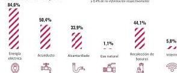

Notas: para los servicios de gas natural e internet se presentó 6,4% y 6,4% de no información respectivamente

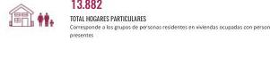

## 13.882

TOTAL HOGARES PARTICULARES

Corresponde a los grupos de personas residentes en viviendas ocupadas con personas presentes

## Número de personas por hogar

18,3%

UNA PERSONA

18,5%

 DOS PERSONAS

22,0%

TRES PERSONAS

20,5%

CUATRO PERSONAS

11,6%

CINCO PERSONAS

9,2%

SEIS PERSONAS (+)

---

^{}[]