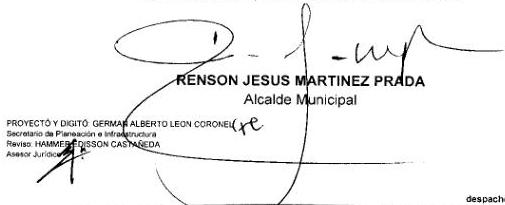

DESPACHO DEL ALCALDE
DEPARTAMENTO DE ARAUCA
MUNICIPIO DE ARAUQUITA
NIT 892099494-7
A
AQUA
AQUA
PODURITA

# DECRETO AA-D-100.04-039
## DEL 28 DE ABRIL DE 2017

# "POR MEDIO DEL CUAL SE REGLAMENTA LA LOCALIZACIÓN, INSTALACIÓN Y REGULARIZACIÓN DE LA INFRAESTRUCTURA Y REDES DE TELECOMUNICACIONES Y SE DICTAN OTRAS DISPOSICIONES EN EL MUNICIPIO DE ARAUQUITA".

## EL ALCALDE DEL MUNICIPIO DE ARAUQUITA

En uso de sus facultades constitucionales previstas en el Artículo 314 y 315, legales en especial las conferidas por la ley 388 de 1997, Decreto 1078 y demás normas concordantes y

## CONSIDERANDO

"Que, de acuerdo con la Constitución Política de Colombia, en su artículo 365, “Los servicios públicos son inherentes a la finalidad social del Estado. Es deber del Estado asegurar su prestación eficiente a todos los habitantes del territorio nacional”. En consecuencia, es deber de las entidades administrativas en representación del Estado mantener la regulación, control y la vigilancia de dichos servicios"

Que la Ley 388 de 1997 establece entre sus objetivos, en el numeral 4 del artículo 1°, el de “promover la armoniosa concurrencia de la Nación, las entidades territoriales, las autoridades ambientales y las instancias y autoridades administrativas y de planificación, en el cumplimiento de las obligaciones constitucionales y legales que prescriben al Estado el ordenamiento del territorio, para lograr el mejoramiento de la calidad de vida de sus habitantes”.

Que el Decreto 2201 del 5 de agosto de 2003, por el cual se reglamenta el artículo 10 de la Ley 388 de 1997, en el artículo 2 establece que los planes, planes básicos o esquemas de ordenamiento territorial de los municipios y distritos en ningún caso serán oponibles a la ejecución de proyectos, obras o actividades declarados de utilidad pública e interés social.

Que los Ministerios de la Protección Social, del Ambiente, Vivienda y Desarrollo Territorial, y de Tecnologías de la Información y las Comunicaciones en atención al principio de precaución, expidieron el Decreto 195 de 2005 compilado en el Capítulo Quinto del Título 2 de la Parte 2 del Libro 2 del Decreto 1078 de 2015, Decreto único reglamentario del Sector de Tecnologías de la Información y las Comunicaciones, adoptando los límites de exposición de las personas a campos electromagnéticos definidos por la ICNIRP, así como por la UIT en su Recomendación UIT-T K.52, los cuales están avalados por la Organización Mundial de la Salud.

despacho@arauquita-arauca.gov.co

CONTACTO
Dirección: Cra. 6 N° 3-13 Barrio el Centro
Tel: 907 801 0001 - 801 0002 - 801 0010
Código Postal 816010

---

DESPACHO DEL ALCALDE
DEPARTAMENTO DE ARAUCA
MUNICIPIO DE ARAUQUITA
107.89209446-7
ARAUQUITA
POR CENTRO
DE ALCALDE
PODER

Que el Decreto 1078 de 2015, Decreto único reglamentario del sector de Tecnologías de la información y las comunicaciones declara como fuente inherente conforme a los emisores de la telefonía móvil celular – entre otros sistemas – “por cuanto sus campos electromagnéticos emitidos cumplen con los límites de exposición pertinentes y no son necesarias precauciones particulares”, certificando con lo anterior la conformidad de las emisiones radioeléctricas.

Que la Agencia Nacional del Espectro público la Resolución N° 754 del 20 de octubre de 2016. “Por la cual se reglamentan las condiciones que deben cumplir las estaciones radioeléctricas, con el objeto de controlar los niveles de exposición de las personas a los campos electromagnéticos y se dictan disposiciones relacionados con el despliegue de antenas de radiocomunicaciones”, en virtud de lo establecido con los artículos 43 y 193 de la Ley 1753 de 2015 y se deroga la Resolución 387 de 2016.

Que es necesario tener en cuenta que la separación entre las estaciones radioeléctricas, su ubicación y altura, dependen de factores técnicos tales como frecuencia de operación, cantidad de usuarios móviles, tráfico de llamadas en cada zona, niveles de atenuación de la señal, condición topográfica de la zona, algunos de los cuales son particulares para cada proveedor de redes y servicios de telecomunicaciones móviles.

Que la Ley 1341 de 2009 en materia del sector de TIC, en su artículo 2, inciso 2° determino que “Las Tecnologías de la Información y las Comunicaciones deben servir al interés general y es deber del Estado promover su acceso eficiente y en igualdad de oportunidades, a todos los habitantes del territorio nacional. Igualmente, en sus numerales 2 y 8 del artículo 4 de la citada Ley determinó que “En desarrollo de los principios de intervención contenidos en la Constitución Política, el Estado intervendrá en el sector las Tecnologías de la Información y las Comunicaciones para lograr los siguientes fines: (...).”

2. Promover el acceso a las Tecnologías de la Información y las Comunicaciones, teniendo como fin último el servicio universal.
8. Promover la ampliación de la cobertura del servicio.

Que la Ley misma norma en su artículo 5 indica que “(...) las entidades de orden nacional y territorial promoverán, coordinarán y ejecutarán planes, programas y proyectos tendientes a garantizar el acceso y uso de la población, las empresas y las entidades públicas a las Tecnologías de la Información y las Comunicaciones. Para tal efecto, dichas autoridades incentivarán el desarrollo de infraestructura, contenidos y aplicaciones, así como la ubicación estratégica de terminales y equipos que permitan realmente a los ciudadanos acceder a las aplicaciones tecnológicas que beneficien a los ciudadanos (...)”.

Que el Municipio de Arauquita, reconoce la importancia del despliegue de las Tecnologías de la Información y las Comunicaciones en todo su territorio como un motor de desarrollo

despacho@arauquita-arauca.gov.co

CONTACTO Dirección: Cía. A N°. 3-13 Barrio el Centro 701-192 803 2100 - 803 8102 - 803 8106 Código Postal 816010

---

DESPACHO DEL ALCALDE
DEPARTAMENTO DE ARAUCA
MUNICIPIO DE ARAUQUITA
NIT. 892099494-7
ARAUQUITA
PRESIDENTA

social y económico y entiende que para que la población pueda disfrutar de esos beneficios se hace necesario ofrecer condiciones óptimas para el despliegue de la infraestructura que permitan la prestación de servicios TIC en un marco de libre competencia y concurrencia de acuerdo con la Constitución y la ley.

Que se hace necesario unificar las normas, requisitos y procedimientos que deben surtir Los Proveedores de Redes y Servicios de Telecomunicaciones para el despliegue y la instalación de estaciones radioeléctricas requeridas para la prestación de dichos servicios públicos en el municipio de Arauquita, conforme las normas de carácter nacional que existen sobre la materia.

Que el numeral 6 del artículo 1º de la Ley 99 de 1993, a través del cual se establecen los principios generales ambientales bajo los cuales se rige la política ambiental en el país, se consagra el principio de precaución, de acuerdo con el cual, cuando exista peligro de daño grave e irreversible, la falta de certeza científica absoluta no podrá utilizarse como razón para postergar la adopción de medidas eficaces para impedir la degradación del medio ambiente.

Que el Decreto 2041 de 2014, por medio del cual se reglamenta el Título VIII de la Ley 99 de 1993 sobre licencias ambientales, no exige dentro de las actividades sujetas a licencia ambiental, los servicios y redes de Tecnologías de la Información y las Comunicaciones.

Que el Decreto Nacional 019 de 2012 en su artículo 192 numeral 2, como el artículo 11 del Decreto Nacional N° 1669 de 2010 expedido por el Ministerio de Ambiente, Vivienda y Desarrollo Territorial, compilado en el decreto 1077 de 2015 determinaron que no se requiere licencia de construcción en ninguna de sus modalidades para la ejecución de estructuras especiales, tales como puentes, torres de transmisión, torres y equipos industriales, muelles, estructuras hidráulicas y todas aquéllas estructuras cuyo comportamiento dinámico difiera del de edificaciones convencionales.

Que la sección 4 del capítulo 5 del título 2 de la parte 2 del libro 2 del Decreto 1078 de 2015, establece los requisitos únicos para la instalación de estaciones radioeléctricas en telecomunicaciones.

Que la Comisión de Regulación de Comunicaciones, expidió el Código de Buenas Prácticas para el despliegue de infraestructura de redes de comunicaciones, el cual debe coadyuvar en el despliegue de infraestructura de telecomunicaciones en todo el país que brinda un punto común de análisis entre los Proveedores de Redes y Servicios de Telecomunicaciones y las autoridades municipales, además procede a establecer un mandato al determinar que los municipios deberán promover el despliegue de la infraestructura de telecomunicaciones, garantizando en todo caso la protección del patrimonio público y del interés general.

despacho@arauquita-arauca.gov.co

CONTACTO Dirección: Cía. 4 N°. 3-13 Barrio el Centro Tel: 089 693 6085 - 693 6012 - 693 0116 Código Postal 816010

---

DESPACHO DEL ALCALDE
DEPARTAMENTO DE ARAUCA
MUNICIPIO DE ARAUQUITA
NIT. 892099494-7
ARAUQUITA
PREFEITURA DE PRODUCTOS

Que a través de la Circular N° 121 de 2016, expedida por la Comisión de Regulación de Comunicaciones, de manera conjunta con el Ministerio de TIC y la ANE se dio a conocer a todos los proveedores de redes y servicios de telecomunicaciones móviles y entidades territoriales a nivel nacional, la actualización de los lineamientos tendientes a promover el despliegue de la infraestructura de telecomunicaciones, previamente definidos en la circular 108 de 2013.

Que en la Ley 1753 de 2015 "Por la cual se expide el Plan Nacional de Desarrollo, 2015-2018" en el Artículo 193 señala que "las autoridades de todos los órdenes territoriales identificarán los obstáculos que restrinjan, limiten o impidan el despliegue de infraestructura de telecomunicaciones necesaria para el ejercicio y goce de los derechos constitucionales y procederá a adoptar las medidas y acciones que considere idóneas para removerlos."

Que mediante circular conjunta 014 del 27 de Julio de 2015, el Procurador General de la Nación y el Ministro de la Información y las Comunicaciones, invita a las autoridades territoriales a cumplir con la función del Estado de promover el acceso a las TIC y despliegue de infraestructura de telecomunicaciones, de acuerdo a lo regulado por la Ley 1341 de 2009, el Artículo 193 de la Ley 1753 de 2015 y demás normas concordantes con la materia.

Que en atención a la normativa antes descrita y en concordancia con las políticas señaladas desde el nivel central de la administración nacional, el Municipio de Arauquita, reconoce la importancia del despliegue de las Tecnologías de la Información y las Comunicaciones en todo el territorio municipal como un motor de desarrollo social y económico. Entendiendo para que la población pueda disfrutar esos beneficios es necesario ofrecer condiciones óptimas para el despliegue de las redes que permitan la prestación de servicios TIC en un marco de libre competencia y concurrencia de acuerdo con la Constitución y la ley.

Que en virtud de las anteriores consideraciones se

## DECRETA

## CAPÍTULO I – GENERALIDADES.

**ARTÍCULO 1. OBJETO:** El presente Decreto tiene por objeto reglamentar los principios y las orientaciones generales, para la localización e instalación de las redes y la infraestructura de los servicios de telecomunicaciones en el Municipio de Arauquita, a fin de que su implantación se realice con todas las garantías de seguridad y se produzca el mínimo impacto visual y medioambiental en el entorno. Así como también, establecer las condiciones para el despliegue de redes futuras, la regularización de las existentes, y la prestación de todos los servicios de telecomunicaciones.

despacho@arauquita-arauca.gov.co

CONTACTO Dirección: Cra. 4 N°. 3-13 Barrio el Centro Tel.: 092 893 5085 - 893 6017 - 893 6175 Código Postal: 816010

---

DESPACHO DEL ALCALDE
DEPARTAMENTO DE ARAUCA
MUNICIPIO DE ARAUQUITA
NIT 852091494-7
GOBIERNO DE LA PROTECCIÓN CIVIL
AQUÍ
AQUÍ
AQUÍ
AQUÍ

**ARTÍCULO 2. ÁMBITO DE APLICACIÓN:** Están incluidas en el ámbito de aplicación de este Decreto las infraestructuras para redes de telecomunicaciones y los equipos transmisores y/o receptores de telecomunicaciones a ellas adheridas, susceptibles de generar campos electromagnéticos en el rango de frecuencia de entre 9 KHz a 300 GHz que se encuentren situadas en el Municipio de Arauquita o que a futuro sean instaladas, y todas aquellas que por evolución de la tecnología cumplan con el mismo objetivo y mejoren las condiciones generales de operación.

**ARTÍCULO 3. DEFINICIÓN DE LA CLASIFICACIÓN Y USOS DEL SUELO COMPATIBLES CON LA INFRAESTRUCTURA TIC.** La infraestructura TIC podrá instalarse en todas las clasificaciones y usos del suelo, de conformidad con lo dispuesto en la Ley 9 de 1987, la Ley 388 de 1997, la Ley 1341 de 2009, la Ley 1753 de 2015 y el Decreto 1078 de 2015, así como las que las modifiquen, adicionen, sustituyan o reglamenten.

# CAPÍTULO II – INSTALACIÓN, LOCALIZACIÓN Y DESPLIEGUE DE LA INFRAESTRUCTURA DE TELECOMUNICACIONES.

**ARTÍCULO 4. INSTALACIÓN, LOCALIZACIÓN Y DESPLIEGUE DE LA INFRAESTRUCTURA DE TELECOMUNICACIONES:** La localización, instalación y despliegue de la infraestructura y redes propias para la prestación de los servicios soportados en las Tecnologías de la información y las Comunicaciones (TIC) en el Municipio de Arauquita, deberán ajustarse a los siguientes lineamientos:

1. Podrá instalarse infraestructura de telecomunicaciones en todos los predios privados y públicos y en las edificaciones privadas y públicas, que cumplan las condiciones legales y físicas de conformidad con lo dispuesto en la Ley 9 de 1987, Ley 388 de 1997, la Ley 1341 de 2009, la Ley 1753 de 2015, los Decreto 1077 y 1078 de 2015 y la Resolución 754 de 2016 de la ANE y demás normatividad que la adicionen, complementen, sustituyan o modifiquen.

2. Se deberá consultar y buscar aprobación con autoridades de nivel superior, la instalación de la infraestructura y redes de telecomunicaciones sobre las áreas denominadas o catalogadas como Áreas Protegidas del SINAP, en concordancia a lo establecido en los Decreto 1076 de 2015 y en las áreas o zonas de protección ambiental y en suelo de protección salvo que se cuente con permiso de la autoridad ambiental correspondiente, quien determinará los criterios respectivos para su instalación conforme a las normas vigentes.

3. En los Bienes de Interés Cultural-BIC con declaratoria de patrimonio arquitectónico, histórico, cultural y ambiental del orden nacional y en las zonas e inmuebles de conservación arquitectónica, centro histórico y edificaciones consideradas de especial interés por su singularidad y configuración arquitectónica, salvo que se cuente con permiso de la entidad encargada de la protección arquitectónica y

despacho@arauquita-arauca.gov.co

|  CONTACTO | Dirección: Cra. 4 N° 3-13 Barrio el Centro
NIT 000 003 0000 - 003 0000 - 003 010 | Código Postal 816010  |
| --- | --- | --- |

servicio, sin que se restrinja, limite o impida el despliegue de redes e infraestructura de telecomunicaciones.

despacho@arauquita-arauca.gov.co

|  CONTACTO | Dirección: Cra. 4 N° 3-13 Barrio el Centro
NIT 000 003 0000 - 003 0000 - 003 010 | Código Postal 816010  |
| --- | --- | --- |

despacho@arauquita-arauca.gov.co

|  CONTACTO | Dirección: Cra. 4 N° 3-13 Barrio el Centro
NIT 000 003 0000 - 003 0001 - 003 010 | Código Postal 816010  |
| --- | --- | --- |

---

DESPACHO DEL ALCALDE
DEPARTAMENTO DE ARAUCA
MUNICIPIO DE ARAUQUITA
NIT. 892099496-7
ARAUQUITA
PRESIDENTE
PÚBLICA

en cualquier tiempo por el proveedor de redes y servicios de telecomunicaciones o instalador de infraestructura.

La información que comprende el Plan Tentativo de Despliegue deberá tratarse conforme las reglas propias de la confidencialidad de los documentos, so pena de las sanciones a que haya lugar.

## ARTÍCULO 16. NATURALEZA DEL PLAN TENTATIVO DE DESPLIEGUE:

El Plan de Despliegue constituye un documento que recoge como mínimo el número de sitios o zonas a ser intervenidos con el despliegue de redes, así como el cronograma tentativo de instalación. El Plan tendrá carácter no vinculante para los proveedores de redes y servicios y/o proveedores de infraestructura de telecomunicaciones y será actualizado por los mismos a medida que sea necesario, por lo que se deberá proceder a su actualización de acuerdo con lo estipulado en el artículo 18.

## ARTÍCULO 17. CONTENIDO DEL PLAN TENTATIVO DE DESPLIEGUE.

17.1. El Plan de Despliegue reflejará el número de sitios o zonas a ser intervenidas con localización de infraestructuras para redes de telecomunicaciones y/o los equipos transmisores y/o receptores de telecomunicaciones en el municipio donde el prestador de redes y servicios de tenga interés en prestar los servicios ofrecidos.

17.2. El Plan estará integrado como mínimo, por la siguiente documentación la cual deberá ser entregada en medio magnético y físico a la Secretaria de Planeación de Arauquita:

a) Copia del título habilitante para la prestación de los servicios de telecomunicaciones, de conformidad con lo previsto en la Ley 1341 de 2009. En el caso que sea una empresa instaladora de infraestructura deberán entregar copia del título habilitante del operador con el cual se acordó buscar el sitio, así como un documento en el cual se certifique esta relación.

b) Listado de sitios a ser intervenidos y tipo de red a ser desplegada.

c) Cronograma tentativo para la intervención de los sitios o zonas identificados por el proveedor de redes y servicios de telecomunicaciones.

## ARTÍCULO 18. ACTUALIZACIÓN Y MODIFICACIÓN DEL PLAN TENTATIVO DE DESPLIEGUE.

18.1. Los proveedores de redes y las empresas que instalen, operen y/o controlen directa o indirectamente infraestructura de telecomunicaciones deberán comunicar a la autoridad municipal competente las modificaciones o actualizaciones, si las hubiere, del contenido del Plan tentativo de Despliegue presentado.

18.2. Los PRST y las empresas que instalen, operen y/o controlen directa o indirectamente infraestructura de telecomunicaciones podrán realizar las modificaciones que consideren necesarias al Plan tentativo de Despliegue e informarlo al municipio a efectos de tener un

despacho@arauquita-arauca.gov.co

CONTA
CONTACTO
Dirección: S.r. 4 NIT, 3-12 Barrio el Centro
Tel: (50) 693 6065 - 093 6197 - 093 6179
Código Postal: 016010

---

DESPACHO DEL ALCALDE
DEPARTAMENTO DE ARAUCA
MUNICIPIO DE ARAUQUITA
NIT. 892099494-7
ARAUQUITA
PREFEITURA DE PRODUCTOS

**ARTÍCULO 23. PÓLIZAS.** En todos los casos donde se realizan instalaciones de infraestructura soporte (Auto soportada, Templada o Riendada y Monopolos) donde se instalen elementos de transmisión y recepción de servicios de Telecomunicaciones, deberán contar con una póliza de responsabilidad civil extracontractual para efectos del amparo del riesgo de daños a terceros y bienes. Esta condición le será aplicable a toda la infraestructura de telecomunicaciones.

**ARTÍCULO 24. SANCIONES.** Toda infraestructura de redes y de telecomunicaciones que se localice y se instale sobre áreas privadas y/o públicas, sin la debida autorización, permiso o viabilidad expedidas por las autoridades competentes, cometerá una infracción urbanística y, por tanto, serán sancionadas en el marco del Decreto Nacional 1077 de 2015 y las Leyes 810 de 2003 y 388 de 1997 y demás sanciones municipales.

**ARTÍCULO 25. DIVULGACIÓN CON LA CIUDADANÍA.** Una vez otorgada la licencia y notificado el solicitante se tendrán 15 días calendario para que beneficiario de la licencia o permiso dé a conocer la intervención a ser realizada con los vecinos colindantes, dicha divulgación se realizará en un único evento que será dirigido por el Secretario de Planeación Municipal o su delegado debidamente autorizado para sostener esta reunión con la comunidad, de la cual se levantará acta, las conclusiones de este evento no constituye la revocación de la licencia o permiso ya otorgado.

Si transcurrido los (15) días la Secretaría de Planeación o la comunidad no facilitaron la realización de la reunión de divulgación la licencia o permiso quedará en firme.

Si el inconveniente por la no realización de divulgación fuere originado por el promotor de la infraestructura, se darán (15) días más y si no se realizase dicha divulgación por su nuevo incumplimiento la licencia o permiso será revocado.

**ARTÍCULO 26.** El presente Decreto rige a partir de la fecha de su publicación y deroga todas aquellas disposiciones que le sean contrarias o que regulen la misma materia.

Dado en Arauquita a los veintiocho (28) días del mes de Abril de 2017.

COMUNÍQUESE, PUBLÍQUESE Y CÚMPLASE.

CONTACTO
Dirección: Cía. d.N°. 3-13 Barrio el Centro
Tel.: 501 801 0005 - 501 8012 - 501 800
Código Postal 806010