TIC

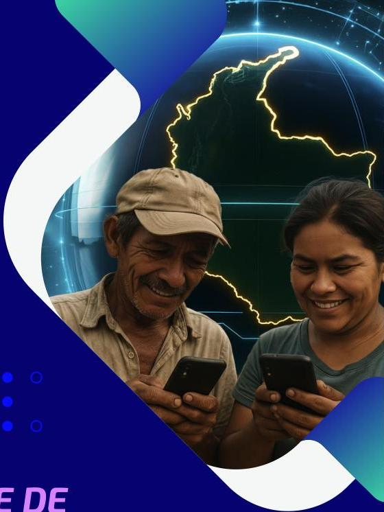

# ÍNDICE DE BRECHA DIGITAL

Resultados 2024

MINISTERIO TIC 2025

Publicado: Bogotá D.C - Colombia, Octubre de 2025

---

ONTIC
Observatorio Nacional de Tecnologías de la Información y las Comunicaciones
^{}[]
INFORMACIÓN ESTADÍSTICA
PARA TIC

Los resultados para el año 2024 se obtienen al replicar la definición, metodología e indicadores adoptados por el Ministerio de Tecnologías de la Información y comunicaciones (MINTIC), en atención a los productos recibidos de la ejecución del contrato 865 de 2019. Puede consultar los productos publicados en 2020 en el portal del Observatorio Nacional de Tecnologías de la Información y las Comunicaciones (ONTIC) en el siguiente enlace:

https://ontic.mintic.gov.co/857/articles-405064_recurso_1.pdf

ÍNDICE DE BRECHA DIGITAL - RESULTADOS 2024
Octubre 2025

REPÚBLICA DE COLOMBIA
Ministra de Tecnologías de la Información y las Comunicaciones
Carina Murcia Yela
Viceministra de Conectividad
Gloria Patricia Perdomo Rangel
Viceministro Transformación Digital (E)
Oscar Alexander Ballén Cifuentes
Secretaria General (E)
Flor Angela Castro
Jefe Oficina Asesora de Planeación y Estudios Sectoriales (OAPES)
Juddy Alexandra Amado Sierra
Coordinador GIT Estadísticas y Estudios sectoriales OAPES
Néstor Alonso Jiménez Estrada
Equipo GIT Estadísticas y Estudios sectoriales OAPES
Sandra Liliana Arenas Pérez
Carlos Uriel Romero Cepeda
Diana Carolina Bastidas Melo
Mauricio Albeiro Jiménez Jiménez
Andrea Paola Palencia Argel
Andrés Felipe Gutiérrez Díaz
Jefe Oficina Asesora de Prensa (E)
Lilian Paola Casallas Zambrano
Diagramación
Bibiana Natalia Angel Vanegas

www.mintic.gov.co

---

TIC

# CONTENIDO

Introducción 5
1. Índice de Brecha Digital Colombia 6
2. Índice de Brecha Digital regional 8
3. Dimensiones del Índice de Brecha Digital 9
3.1. Dimensión de Motivación 11
3.2. Dimensión de Acceso Material 13
3.3. Dimensión de Habilidades Digitales 15
3.4. Dimensión de Aprovechamiento 17

Conclusiones 19

Anexo 21

Referencias 23

# LISTA DE TABLAS

Tabla 1. Ranking IBD Colombia 6
Tabla 2. Ponderación de las dimensiones del IBD 10
Tabla 3. Ranking Dimensión Motivación 11
Tabla 4. Indicadores de la dimensión Motivación 12
Tabla 5. Ranking Dimensión Acceso Material 13
Tabla 6. Indicadores de la dimensión Acceso Material 14
Tabla 7. Ranking Dimensión Habilidades Digitales 15
Tabla 8. Indicadores de la dimensión Habilidades digitales 16
Tabla 9. Ranking Dimensión Aprovechamiento 17

# LISTA DE FIGURAS

Figura 1. Resultados Índice de Brecha Digital 4
Figura 2. Mapa Índice de Brecha Digital 6
Figura 3. Índice de Brecha Digital y dimensiones 8
Figura 4. Contribución de las dimensiones al IBD 10
Figura 5. Mapa Dimensión Motivación 11
Figura 6. Resultados Dimensión Motivación 11
Figura 7. Mapa Dimensión Acceso Material 13
Figura 8. Resultados Dimensión Acceso Material 13
Figura 9. Mapa Dimensión Habilidades Digitales 15
Figura 10. Resultados dimensión Habilidades digitales 15
Figura 11. Mapa dimensión Aprovechamiento 17
Figura 12. Resultados dimensión Aprovechamiento 17

ÍNDICE DE BRECHA DIGITAL

---

www.mintic.gov.co

Figura 1.
Resultados Índice de Brecha Digital
Total nacional
2018 - 2024

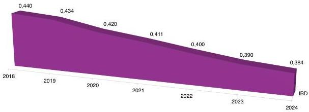

Fuente: Fuente: MinTIC 2024, IBD
Este índice mide la brecha digital en un rango de 0 a 1, donde valores más próximos a cero representan una menor brecha. La línea muestra la evolución del indicador entre 2018 y 2024, evidenciando una tendencia sostenida de reducción a nivel nacional. En este período, el índice registró una disminución acumulada del 12,72%, reflejando avances significativos en el cierre de la brecha digital.

---

TIC

# INTRODUCCIÓN

El Índice de Brecha Digital (IBD) tiene como objetivo principal fortalecer las capacidades territoriales para monitorear y dar seguimiento a la brecha digital en Colombia. Este índice permite realizar comparaciones a nivel departamental y regional, considerando cuatro dimensiones fundamentales: i) grado de motivación, ii) acceso material, iii) dominio de habilidades digitales y iv) aprovechamiento de las tecnologías.

Para la construcción de este índice se desarrolló una metodología integral que garantiza la robustez técnica y la pertinencia de los resultados obtenidos. El estudio, disponible en el portal del Observatorio Nacional de Tecnologías de la información y las comunicaciones ONTIC, se fundamenta en una revisión sistemática de literatura científica, experiencias nacionales e internacionales, así como en un desarrollo metodológico basado en análisis estadísticos que permitió definir los indicadores, los mecanismos de normalización y la formulación matemática del IBD. Entre las principales fuentes de información se destacan la Encuesta Nacional de Calidad de Vida (ECV), desarrollada por el DANE, los reportes trimestrales que presentan al MinTIC los Proveedores de Redes y Servicios de Telecomunicaciones (PRST), la Encuesta Nacional de Presupuesto de los Hogares – DANE y la Tasa de Cobertura Bruta Media remitida por el Ministerio de Educación Nacional.

La Brecha Digital es entendida como un fenómeno multidimensional en el que cada dimensión e indicador recibe un peso específico dentro del cálculo. Esto permite realizar un seguimiento riguroso al desarrollo del ecosistema digital en el país, así como identificar las causas de avances y retrocesos en cada territorio.

En esta publicación se presentan los resultados del IBD 2024, junto con el histórico de la medición entre 2018 y 2024, lo que facilita un análisis de tendencias y evolución. Los resultados se encuentran desagregados para los 32 departamentos del país más Bogotá (33 en total), y también organizados en nueve regiones: Antioquia, Caribe, Bogotá, Oriental, Central, Pacífica, Valle del Cauca, Orinoquía-Amazónica y San Andrés. Asimismo, el índice puede ser explorado de manera dinámica a través del informe interactivo en Power BI, disponible en el siguiente enlace:

https://ontic.mintic.gov.co/portal/Secciones/Temas-Macro/Indice-de-Brecha-Digital/384050:Indice-de-Brecha-Digital

El IBD constituye una herramienta clave para orientar la formulación de políticas públicas orientadas al fortalecimiento del sector de las tecnologías y las comunicaciones. En este sentido, al final del boletín se presentan conclusiones que ofrecen un enfoque estratégico para el diseño de acciones destinadas a reducir la brecha digital, especialmente en los departamentos con mayores rezagos.

ÍNDICE DE BRECHA DIGITAL

---

# 1. INDICE DE BRECHA DIGITAL COLOMBIA

Para el año 2024 el Índice de Brecha Digital para Colombia fue de 0,384 presentando una disminución de 0,006 puntos frente al año 2023.

Figura 2. Mapa Índice de Brecha Digital por departamentos 2024
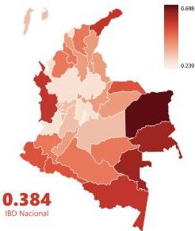
Fuente: MinTIC, IBD 2024.

Tabla 1. Ranking IBD Colombia por Departamentos 2023 y 2024

|  Departamento | Ranking 2024 | 2023 | 2024  |
| --- | --- | --- | --- |
|  Bogotá D.C. | 1 | 0,251 | 0,239  |
|  Atlántico | 2 | 0,375 | 0,362  |
|  Antioquia | 3 | 0,375 | 0,362  |
|  San Andrés Islas* | 4 | 0,445 | 0,368  |
|  Valle del Cauca | 5 | 0,363 | 0,370  |
|  Cundinamarca | 6 | 0,376 | 0,375  |
|  Santander | 7 | 0,367 | 0,375  |
|  Meta | 8 | 0,375 | 0,380  |
|  Risaralda | 9 | 0,374 | 0,385  |
|  Caldas | 10 | 0,388 | 0,386  |
|  Quindío | 11 | 0,365 | 0,395  |
|  Tolima | 12 | 0,416 | 0,398  |
|  Boyacá | 13 | 0,409 | 0,414  |
|  Casanare | 14 | 0,435 | 0,414  |
|  Norte de Santander | 15 | 0,426 | 0,419  |
|  Huila | 16 | 0,427 | 0,426  |
|  Cesar | 17 | 0,439 | 0,428  |
|  Bolívar | 18 | 0,450 | 0,436  |
|  Caquetá | 19 | 0,467 | 0,448  |
|  Guaviare | 20 | 0,479 | 0,454  |
|  Magdalena | 21 | 0,460 | 0,460  |
|  Cauca | 22 | 0,481 | 0,464  |
|  Córdoba | 23 | 0,497 | 0,468  |
|  Sucre | 24 | 0,483 | 0,472  |
|  Arauca | 25 | 0,494 | 0,494  |
|  Nariño | 26 | 0,482 | 0,495  |
|  Putumayo | 27 | 0,498 | 0,507  |
|  Amazonas | 28 | 0,568 | 0,531  |
|  La Guajira | 29 | 0,523 | 0,531  |
|  Chocó | 30 | 0,560 | 0,544  |
|  Guainía | 31 | 0,556 | 0,597  |
|  Vaupés | 32 | 0,621 | 0,624  |
|  Vichada | 33 | 0,680 | 0,698  |

* Archipiélago de San Andrés, Providencia y Santa Catalina. Fuente: MinTIC, IBD 2024.

www.mintic.gov.co

---

TIC

En el ranking de 2024, Bogotá D.C. y Valle del Cauca se mantienen dentro del top 6 de departamentos con menor brecha digital. Por su parte, Atlántico y Antioquia ocuparon el segundo y tercer lugar, ambos con un IBD de 0,362. En comparación con 2023, cuando registraban un valor de 0,375, estos departamentos lograron una disminución de 0,013 puntos, lo que evidencia una mejora en sus indicadores de brecha digital. Asimismo, cabe destacar el departamento de San Andrés, Providencia y Santa Catalina, que pasó del puesto 17 en 2023 al puesto 4 en 2024, gracias a la reducción de su índice de 0,445 a 0,368. El top 6 lo completa Cundinamarca, que en 2023 ocupaba la posición 9 y en 2024 ascendió tres lugares, alcanzando un índice de 0,370, lo que refleja un avance significativo en la reducción de su brecha digital.

En 2024, los departamentos de Vichada y Vaupés continúan registrando los niveles más altos de brecha digital, con índices de 0,698 y 0,624, respectivamente. No obstante, se observan avances en departamentos como Amazonas y Chocó, que presentaron mejoras frente a 2023: Amazonas redujo su índice en 0,037 puntos y alcanzó un IBD de 0,531, lo que le permitió ascender tres posiciones en el ranking y ubicarse en el puesto 28; mientras que Chocó disminuyó 0,016 puntos, manteniéndose en el puesto 30. En contraste, el departamento de Guainía mostró un retroceso, ya que su IBD aumentó de 0,556 en 2023 a 0,597 en 2024, ubicándolo en el puesto 31 del ranking nacional.

# 2. ÍNDICE DE BRECHA DIGITAL REGIONAL

El análisis del índice de brecha digital a nivel regional² revela que Bogotá presenta el menor índice, con un valor de 0,239, presentando también los menores valores en cada una de las dimensiones que componen el índice. Por otra parte, la región Orinoquía-Amazonia presenta la mayor brecha digital con un IBD de 0,499 para el año 2024.

ÍNDICE DE BRECHA DIGITAL

---

Figura 3.
Índice de Brecha Digital y dimensiones
Por regiones 2024

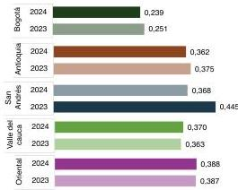
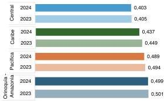
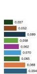
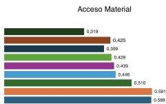
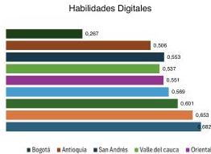
Fuente: MinTIC, IBD 2024.
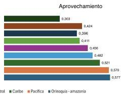

La dimensión que mostró los valores más cercanos a 1, indicando la mayor brecha, fue la de Habilidades Digitales, con la región Orinoquía-Amazonia alcanzando el valor más alto de 0,682. En contraste, la dimensión con los valores más cercanos a 0 fue la de Motivación, donde Bogotá se destaca con el valor más bajo de 0,037.

Los niveles más altos de brecha en las diferentes dimensiones se presentaron en las regiones Orinoquía-Amazonia, Pacífica y Caribe y los niveles más bajos en Bogotá, Antioquia y San Andrés.

www.mintic.gov.co

---

# 3. DIMENSIONES DEL ÍNDICE DE BRECHA DIGITAL

El Índice de Brecha Digital se fundamenta en la propuesta metodológica de Van Dijk (2005) y en la adaptación realizada por el MinTIC y la Fundación para la Educación Superior (FES) en 2018, que identifican cuatro dimensiones centrales para explicar la desigualdad en el acceso, uso y apropiación de las TIC. Estas dimensiones son: Motivación, entendida como el interés y disposición de las personas para adoptar la tecnología; Acceso Material, que contempla la disponibilidad de dispositivos y conectividad; Habilidades Digitales, relacionadas con el nivel de conocimientos y competencias para interactuar con las TIC; y Aprovechamiento, que refleja los usos efectivos y los beneficios derivados de estas herramientas. La combinación de estas dimensiones permite obtener una visión integral sobre los factores que configuran la brecha digital en el país.

Cada una de estas dimensiones aporta de manera diferenciada al cálculo del IBD, reflejando su relevancia en la medición integral de la brecha digital. En este sentido, se ha establecido una ponderación porcentual fija que distribuye el peso de cada dimensión de la siguiente manera:

ÍNDICE DE BRECHA DIGITAL

---

www.mintic.gov.co

|  Motivación | Acceso Material | Habilidades Digitales | Aprovechamiento | IBD  |
| --- | --- | --- | --- | --- |
|  22,19% | 26,37% | 25,33% | 26,10% | 100,00%  |

Fuente: MinTIC, IBD 2024.

Es importante destacar que estas ponderaciones representan el peso teórico asignado a cada dimensión, pero la contribución real al índice puede variar en función de los resultados observados cada año.

Al aplicar las ponderaciones para el cálculo del Índice, sobre los años 2024 y 2023, se observa que las Habilidades Digitales redujeron su participación en 0,004 puntos; sin embargo, continúa siendo la dimensión con mayor contribución dentro del índice al explicar el 34,7% de la brecha digital. De manera similar, el Acceso Material disminuyó en 0,005 puntos y explica el 31% del total. En contraste, la Motivación registró un leve aumento de 0,001 puntos, con una contribución del 3,5%, mientras que el Aprovechamiento creció en 0,003 puntos y aporta el 30,8% del índice (véase Figura 4). Estos resultados reflejan ajustes marginales en la estructura del IBD, donde las Habilidades Digitales y el Acceso Material continúan siendo los principales determinantes de la brecha.

Figura 4.
Contribución de las dimensiones al IBD 2023 - 2024
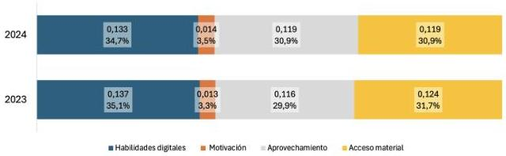
Fuente: MinTIC, IBD 2024.

---

TIC

# 3.1. DIMENSIÓN DE MOTIVACIÓN

Esta dimensión permite discernir los motivos detrás de la decisión de cada individuo de usar o no las TIC, haciendo referencia a sus percepciones. Estas percepciones pueden estar influenciadas por diversos factores sociales, personales o del entorno, como la falta de tiempo, una valoración social desfavorable de las TIC, una percepción de utilidad limitada, tecnofobia, entre otros.

Figura 5.
Mapa Dimensión Motivación
Por departamentos
2024
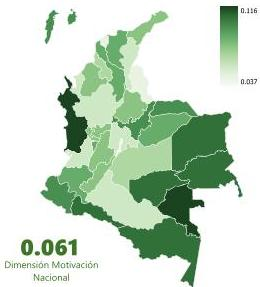
Fuente: MinTIC, IBD 2024.

Figura 6.
Resultados Dimensión Motivación
Total Nacional, 2020-2024
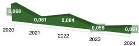
Fuente: MinTIC, IBD 2024.

Tabla 3.
Ranking Dimensión Motivación
Por departamentos 2024

|  Departamento | Ranking | Motivación  |
| --- | --- | --- |
|  Bogotá D.C | 1 | 0,037  |
|  Atlántico | 2 | 0,048  |
|  Norte de Santander | 3 | 0,048  |
|  Antioquia | 4 | 0,052  |
|  Cesar | 5 | 0,055  |
|  Cundinamarca | 6 | 0,056  |
|  Caquetá | 7 | 0,056  |
|  Valle del Cauca | 8 | 0,058  |
|  Meta | 9 | 0,063  |
|  Sucre | 10 | 0,065  |
|  Santander | 11 | 0,068  |
|  Huila | 12 | 0,069  |
|  La Guajira | 13 | 0,069  |
|  Tolima | 14 | 0,070  |
|  Córdoba | 15 | 0,070  |
|  Caldas | 16 | 0,071  |
|  Risaralda | 17 | 0,072  |
|  Bolívar | 18 | 0,075  |
|  Magdalena | 19 | 0,080  |
|  Casanare | 20 | 0,080  |
|  Quindío | 21 | 0,081  |
|  Cauca | 22 | 0,081  |
|  Boyacá | 23 | 0,084  |
|  Nariño | 24 | 0,085  |
|  San Andrés Islas* | 25 | 0,089  |
|  Arauca | 26 | 0,090  |
|  Vichada | 27 | 0,100  |
|  Amazonas | 28 | 0,101  |
|  Guainía | 29 | 0,102  |
|  Putumayo | 30 | 0,105  |
|  Guaviare | 31 | 0,106  |
|  Chocó | 32 | 0,111  |
|  Vaupés | 33 | 0,116  |

* Archipiélago de San Andrés, Providencia y Santa Catalina. Fuente: MinTIC, IBD 2024.

ÍNDICE DE BRECHA DIGITAL

---

La dimensión de Motivación presentó un aumento de 0,002 puntos en comparación con el año 2023, alcanzando un valor de 0,061 en 2024. No obstante, desde 2018 esta dimensión ha mostrado una tendencia decreciente, acumulando una disminución del 25,9% hasta 2024.

En el ranking de este último año, los departamentos con menores índices de brecha en la dimensión Motivación fueron Bogotá D.C. (0,037), Atlántico (0,048) y Norte de Santander (0,048), mientras que en 2023 ocuparon estas posiciones Bogotá D.C. (0,032), Atlántico (0,045) y Valle del Cauca (0,045).

Por el contrario, los territorios con mayores niveles de brecha por motivación en 2024 fueron Vaupés (0,116), Chocó (0,111) y Guaviare (0,106), en tanto que en 2023 los más rezagados fueron Vichada (0,134), Amazonas (0,127) y San Andrés Islas (0,120).

## Tabla 4.
Indicadores de la dimensión Motivación 2023, 2024
Total nacional

|  Ponderación | Indicador | 2023 | 2024 | Diferencia  |
| --- | --- | --- | --- | --- |
|  10,2% | % de personas que no utiliza Internet porque es muy costoso | 4,2% | 3,8% | –0,42  |
|  17,8% | % de personas que no utiliza Internet porque no lo considera necesario | 5,6% | 4,9% | –0,70  |
|  1,6% | % de personas que no utiliza Internet por razones de seguridad o privacidad | 0,5% | 0,3% | –0,23  |
|  17,7% | % de hogares que no tienen computador porque no están interesados | 18,0% | 20,6% | 2,63  |
|  20,6% | Costo medio de acceso a internet fijo por MBps de velocidad (como % de SMMV, PIB/cápita o PIB/hogar) | 0,1% | 0,1% | 0,02  |
|  18,6% | Valor del plan de internet fijo más económico disponible (como % de PIB/cápita o PIB/hogar) | 0,5% | 0,6% | 0,07  |
|  13,5% | % de hogares que no tienen computador porque no saben como usarlo | 9,1% | 8,3% | –0,76  |

Nota: Los íconos indican si el cambio fue ☐ inferior a -0,1, ▲ entre -0,1 y 0,1 o ▲ superior a 0,1.
Fuente: MinTIC, IBD 2024.

Entre 2023 y 2024, la dimensión de Motivación presenta una tendencia positiva en la mayoría de los indicadores que la componen, mostrando avances en la reducción de barreras de uso de Internet en el país. Disminuyó el porcentaje de personas que no utilizan Internet porque lo consideran muy costoso (de 4,2% a 3,8%) o innecesario (de 5,6% a 4,9%), así como aquellas que lo evitan por desconocimiento en el uso del computador (de 9,1% a 8,3%). Estos cambios indican que cada vez más hogares y personas reconocen el valor y utilidad de la conectividad digital. Sin embargo, persiste un desafío importante: aumentó en 2,6 puntos porcentuales el porcentaje de hogares que no cuentan con computador porque no están interesados (del 18,0% al 20,6%). En cuanto al costo de los planes de Internet fijo, los resultados permanecieron estables, mostrando mejoras marginales.

www.mintic.gov.co

---

TIC

# 3.2. DIMENSIÓN DE ACCESO MATERIAL

Esta dimensión analiza las condiciones materiales que permiten el acceso a las TIC, teniendo en cuenta la disponibilidad de servicios, la infraestructura necesaria para la conexión y la presencia de dispositivos tecnológicos. Para ello, contempla varios aspectos clave: el acceso a canales, que mide la disponibilidad de servicios y la cobertura de red para el uso e intercambio de información; el acceso a terminales, vinculado con la disponibilidad de hardware y software indispensables para aprovechar la tecnología; las características del acceso, que evalúan la forma en que se conecta la población y la calidad de los servicios de telecomunicaciones; y finalmente, la categorización del sitio de acceso, que identifica si las personas pueden conectarse desde su hogar, lugar de estudio o de trabajo.

Figura 7. Mapa Dimensión Acceso Material Por departamentos 2024
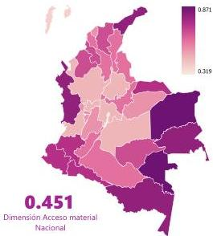
Fuente: MinTIC, IBD 2024.

Figura 8. Resultados Dimensión Acceso Material Total Nacional, 2020-2024
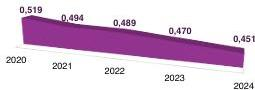
Fuente: MinTIC, IBD 2024.

Tabla 5. Ranking Dimensión Acceso Material Por departamentos 2024

|  Departamento | Ranking | Acceso material  |   |
| --- | --- | --- | --- |
|  Bogotá D.C | 1 | 0,319 |   |
|  San Andrés Islas* | 2 | 0,399 |   |
|  Meta | 3 | 0,417 |   |
|  Cundinamarca | 4 | 0,419 |   |
|  Caldas | 5 | 0,424 |   |
|  Antioquia | 6 | 0,425 |   |
|  Santander | 7 | 0,425 |   |
|  Valle del Cauca | 8 | 0,429 |   |
|  Tolima | 9 | 0,435 |   |
|  Risaralda | 10 | 0,436 |   |
|  Atlántico | 11 | 0,437 |   |
|  Casanare | 12 | 0,443 |   |
|  Quindío | 13 | 0,454 |   |
|  Huila | 14 | 0,465 |   |
|  Cesar | 15 | 0,474 |   |
|  Norte de Santander | 16 | 0,476 |   |
|  Caquetá | 17 | 0,488 |   |
|  Boyacá | 18 | 0,491 |   |
|  Bolívar | 19 | 0,500 |   |
|  Guaviare | 20 | 0,527 |   |
|  Magdalena | 21 | 0,539 |   |
|  Córdoba | 22 | 0,541 |   |
|  Sucre | 23 | 0,549 |   |
|  Cauca | 24 | 0,563 |   |
|  Arauca | 25 | 0,580 |   |
|  Nariño | 26 | 0,587 |   |
|  Putumayo | 27 | 0,604 |   |
|  La Guajira | 28 | 0,637 |   |
|  Amazonas | 29 | 0,657 |   |
|  Chocó | 30 | 0,676 |   |
|  Guainía | 31 | 0,788 |   |
|  Vaupés | 32 | 0,835 |   |
|  Vichada | 33 | 0,871 |   |

* Archipiélago de San Andrés, Providencia y Santa Catalina. Fuente: MinTIC, IBD 2024.

ÍNDICE DE BRECHA DIGITAL

---

La brecha en la dimensión de Acceso Material sigue mostrando avances. En 2024 se redujo en 0,019 puntos frente al año anterior y acumula una disminución del 26,7% desde 2018. A nivel departamental, Bogotá D.C. registró el valor más bajo (0,319), mientras que Vichada presentó la brecha más alta (0,871). En cuanto a las regiones, Bogotá ocupa el primer lugar con el menor nivel de brecha (0,319), seguida por San Andrés (0,399). Por el contrario, Orinoquía–Amazonía y la región Pacífica presentan las mayores brechas, con valores de 0,588 y 0,591, respectivamente.

## Tabla 6.
Indicadores de la dimensión Acceso Material 2023, 2024

|  Ponderación | Indicador | 2023 | 2024 | Diferencia  |
| --- | --- | --- | --- | --- |
|  15,2% | % de personas que accede a Internet en el hogar | 73,7% | 75,0% | 1,28  |
|  12,8% | % de personas que accede a Internet en el trabajo | 26,1% | 28,2% | 2,12  |
|  5,3% | % de personas que accede a Internet en la institución educativa | 13,0% | 13,0% | 0,00  |
|  2,4% | % de personas que accede a Internet en centros de acceso público gratis | 3,5% | 4,6% | 1,09  |
|  14,3% | % hogares con computador | 32,4% | 34,6% | 2,17  |
|  14,3% | % de hogares con conexión a internet | 45,2% | 48,3% | 3,05  |
|  12,0% | % de personas con internet móvil | 40,3% | 42,1% | 1,83  |
|  10,9% | Velocidad promedio de acceso a internet fijo residencial (Mbps) | 175,3 | 227,2 | 51,95  |
|  12,8% | % población cubierta por redes móviles al menos 4G | 87,3% | 91,3% | 4,09  |

Nota: Los iconos indican si el cambio fue ☐ superior a 0,1, ▲ entre -0,1 y 0,1 o ☑ inferior a -0,1.
Fuente: MinTIC, IBD 2024.

En los indicadores de la dimensión de Acceso Material, los resultados de 2024 evidencian un avance sostenido en la reducción de la brecha digital. El acceso a Internet en el hogar alcanzó el 75% de la población, mientras que en el ámbito laboral llegó al 28,2%, reflejando un mayor aprovechamiento de la conectividad en espacios de uso cotidiano. En paralelo, la proporción de hogares con computador llegó al 34,6% y aquellos con conexión a Internet al 48,3%, lo que sugiere una mejora en la dotación tecnológica de los hogares colombianos.

Desde el punto de vista de la calidad, la velocidad promedio del Internet fijo residencial se incrementó en un 29,6%, alcanzando los 227 Mbps, mientras que la cobertura de redes móviles de al menos 4G ya cubre al 91,3% de la población, consolidando la infraestructura digital a nivel nacional.

www.mintic.gov.co

---

TIC

# 3.3. DIMENSIÓN DE HABILIDADES DIGITALES

La dimensión evalúa si los individuos poseen las cualificaciones necesarias para operar o utilizar tecnologías, clasificando las habilidades en tres niveles según la complejidad de las tareas y el conocimiento o destreza requerido: habilidades básicas (operacionales y funcionales), habilidades intermedias (aplicadas en estructuras formales) y habilidades avanzadas (programación y desarrollos).

Figura 9. Mapa Dimensión Habilidades Digitales Por departamentos 2024
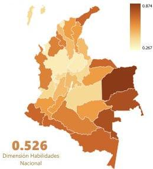
Fuente: MinTIC, IBD 2024.

Figura 10. Resultados Dimensión Acceso Material Total Nacional, 2020-2024
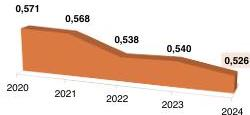
Fuente: MinTIC, IBD 2024.

Tabla 7. Ranking Dimensión Habilidades Digitales Por departamentos 2024

|  Departamento | Ranking | Habilidades digitales  |
| --- | --- | --- |
|  Bogotá D.C | 1 | 0,267  |
|  Atlántico | 2 | 0,488  |
|  Antioquia | 3 | 0,506  |
|  Risaralda | 4 | 0,512  |
|  Santander | 5 | 0,519  |
|  Quindío | 6 | 0,523  |
|  Boyacá | 7 | 0,526  |
|  Valle del Cauca | 8 | 0,537  |
|  Meta | 9 | 0,544  |
|  Caldas | 10 | 0,547  |
|  San Andrés Islas | 11 | 0,553  |
|  Tolima | 12 | 0,568  |
|  Cundinamarca | 13 | 0,569  |
|  Norte de Santander | 14 | 0,582  |
|  Bolívar | 15 | 0,595  |
|  Magdalena | 16 | 0,610  |
|  Casanare | 17 | 0,613  |
|  Cauca | 18 | 0,624  |
|  Huila | 19 | 0,627  |
|  Guaviare | 20 | 0,632  |
|  Cesar | 21 | 0,633  |
|  Sucre | 22 | 0,647  |
|  Córdoba | 23 | 0,660  |
|  Caquetá | 24 | 0,661  |
|  Chocó | 25 | 0,669  |
|  Nariño | 26 | 0,675  |
|  Putumayo | 27 | 0,683  |
|  Arauca | 28 | 0,689  |
|  Amazonas | 29 | 0,690  |
|  La Guajira | 30 | 0,705  |
|  Guainía | 31 | 0,744  |
|  Vaupés | 32 | 0,750  |
|  Vichada | 33 | 0,874  |

* Archipiélago de San Andrés, Providencia y Santa Catalina. Fuente: MinTIC, IBD 2024.

ÍNDICE DE BRECHA DIGITAL

---

En la dimensión de habilidades digitales³, la brecha continuó reduciéndose en 2024 frente a 2023, al situarse en 0,526, lo que representa una mejora de 0,014 puntos. Los mejores resultados se registraron en Bogotá D.C. (0,267), Atlántico (0,486) y Antioquia (0,506), departamentos que consolidan su liderazgo en el desarrollo de competencias digitales. En contraste, los niveles más altos de rezago se observaron en Vichada (0,874), Vaupés (0,750) y Guainía (0,744). No obstante, tanto Vaupés como Guainía evidencian una evolución positiva respecto a 2023, con reducciones de 0,028 y 0,009 puntos, respectivamente, lo que refleja avances en la disminución de la brecha. (Ver Figura 10)

## Tabla 8.
Indicadores de la dimensión Habilidades digitales 2023, 2024
Total nacional

|  Ponderación | Indicador | 2023 | 2024 | Diferencia  |
| --- | --- | --- | --- | --- |
|  21,2% | Años promedio de escolarización | 8,76 | 8,74 | –0,25  |
|  9,2% | Tasa de inscripción bruta en educación secundaria | 77,5% | 91,0% | 13,52  |
|  18,4% | Tasa de inscripción bruta en educación terciaria | 58,1% | 60,8% | 2,64  |
|  21,8% | Número promedio de habilidades básicas | 1,51 | 1,48 | –0,03  |
|  21,6% | Número promedio de habilidades intermedias | 0,96 | 0,96 | 0,00  |
|  7,9% | % de personas que consideran tener buenas habilidades en un lenguaje de programación especializado (programación, apps, web) | 7,3% | 7,2% | -0,12  |

Nota: Los iconos indican si el cambio fue ☐ superior a 0,1, ▲ entre -0,1 y 0,1 o ● inferior a -0,1.

Fuente: MinTIC, IBD 2024.

En cuanto a los indicadores de esta dimensión, los resultados muestran avances importantes, aunque con algunos desafíos por superar. El indicador con mayor mejora fue la tasa de inscripción bruta en educación secundaria, que pasó del 77,5% en 2023 al 91,0% en 2024, lo que representa un aumento de 13,5 puntos porcentuales y evidencia un mayor acceso de la población a niveles educativos básicos para el desarrollo de competencias digitales. De manera complementaria, la tasa de inscripción en educación terciaria también registró un avance, al pasar del 58,1% al 60,8%, reflejando un mayor acceso a formación superior.

Por otro lado, se observa estabilidad en el número promedio de habilidades intermedias, que se mantuvo en 0,96, mientras que las habilidades básicas disminuyeron levemente de 1,51 a 1,48, lo cual señala la necesidad de reforzar competencias iniciales en el uso de TIC. Asimismo, el porcentaje de personas que reportan tener buenas habilidades en lenguajes de programación cayó ligeramente de 7,3% a 7,2%, lo que refleja la necesidad de seguir impulsando la formación en capacidades avanzadas y especializadas.

³ Habilidades operacionales: ¿la persona es capaz de llevar a cabo las acciones necesarias para operar el medio digital?
Habilidades formales: ¿la persona es capaz de manejar las estructuras formales del medio digital, es decir, aquellas que permiten que se utilice la tecnología con el propósito para el cual fue diseñada?
Habilidades informacionales: ¿la persona es capaz de buscar, seleccionar y evaluar la información en el medio digital?
Habilidades comunicativas: ¿la persona es capaz de poder comunicarse a través de un medio digital?
Habilidades de programación y desarrollo digital: ¿la persona es capaz de crear, editar y hacer contribuciones a un medio digital con un objetivo particular?

www.mintic.gov.co

---

TIC

# 3.4. DIMENSIÓN DE APROVECHAMIENTO

Esta dimensión refleja el uso real de las TIC, relacionado con los hábitos de las personas en cuanto a su utilización. Se evalúan los siguientes elementos: la frecuencia de uso (¿con qué regularidad se utiliza la tecnología?) y la diversidad de propósitos (¿para qué actividades se emplea la tecnología?).

Figura 11.
Mapa dimensión Aprovechamiento
Por departamentos
2024
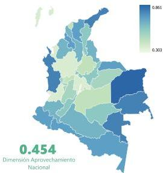
Fuente: MinTIC, IBD 2024.

Figura 12.
Resultados dimensión Aprovechamiento
Total Nacional, 2020-2024
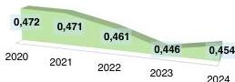
Fuente: MinTIC, IBD 2024.

Tabla 9.
Ranking Dimensión Aprovechamiento
Por departamentos 2024

|  Departamento | Ranking | Aprovechamiento  |   |
| --- | --- | --- | --- |
|  Bogotá D.C | 1 | 0,303 |   |
|  San Andrés Islas | 2 | 0,396 |   |
|  Valle del Cauca | 3 | 0,411 |   |
|  Cundinamarca | 4 | 0,414 |   |
|  Antioquia | 5 | 0,424 |   |
|  Atlántico | 6 | 0,430 |   |
|  Santander | 7 | 0,446 |   |
|  Meta | 8 | 0,453 |   |
|  Caldas | 9 | 0,461 |   |
|  Risaralda | 10 | 0,476 |   |
|  Tolima | 11 | 0,476 |   |
|  Quindío | 12 | 0,477 |   |
|  Casanare | 13 | 0,477 |   |
|  Huila | 14 | 0,495 |   |
|  Cesar | 15 | 0,500 |   |
|  Guaviare | 16 | 0,505 |   |
|  Boyacá | 17 | 0,508 |   |
|  Norte de Santander | 18 | 0,516 |   |
|  Bolívar | 19 | 0,523 |   |
|  Caquetá | 20 | 0,532 |   |
|  Cauca | 21 | 0,533 |   |
|  Córdoba | 22 | 0,545 |   |
|  Magdalena | 23 | 0,557 |   |
|  Arauca | 24 | 0,562 |   |
|  Sucre | 25 | 0,571 |   |
|  Nariño | 26 | 0,574 |   |
|  Putumayo | 27 | 0,578 |   |
|  Amazonas | 28 | 0,613 |   |
|  La Guajira | 29 | 0,647 |   |
|  Chocó | 30 | 0,659 |   |
|  Guainía | 31 | 0,681 |   |
|  Vaupés | 32 | 0,720 |   |
|  Vichada | 33 | 0,861 |   |

* Archipiélago de San Andrés, Providencia y Santa Catalina. Fuente: MinTIC, IBD 2024.

ÍNDICE DE BRECHA DIGITAL

---

En 2024, la dimensión de Aprovechamiento se ubicó en 0,454, lo que representa un aumento de 0,008 puntos frente a 2023. No obstante, el histórico muestra una reducción acumulada del 8,7% desde 2018. A nivel departamental, Bogotá presentó la brecha más baja (0,303), mientras que Vichada alcanzó el valor más alto (0,861).

## Tabla 10.
Indicadores de la dimensión Aprovechamiento
2023, 2024
Total nacional

|  Ponderación | Indicador | 2023 | 2024 | Diferencia  |
| --- | --- | --- | --- | --- |
|  25,3% | Frecuencia media uso de computadores y similares (días por semana) | 2,67 | 2,78 | 0,11  |
|  26,8% | Número promedio de usos del internet | 2,65 | 2,69 | 0,04  |
|  27,0% | Frecuencia de utilización de Internet (días por semana) | 5,08 | 5,23 | 0,14  |
|  20,9% | Frecuencia de utilización de celular (días por semana) | 6,58 | 6,01 | -0,57  |

Nota: Los iconos indican si el cambio fue ☐ superior a 0,1, ☐ entre -0,1 y 0,1 ☐ inferior a -0,1.

Fuente: MinTIC, IBD 2024.

En cuanto a los indicadores de esta dimensión, los resultados de 2024 muestran una evolución moderada en la mayoría de los indicadores. La frecuencia media de uso de computadores aumentó de 2,67 a 2,78 días por semana, mientras que la utilización de Internet pasó de 5,08 a 5,23 días por semana, lo que evidencia un nivel ligeramente mayor de apropiación de estas herramientas en la vida cotidiana. Asimismo, el número promedio de usos del Internet se mantuvo estable, con una ligera variación de 2,65 a 2,69, lo que refleja continuidad en la diversificación de actividades digitales.

No obstante, se observa una disminución en la frecuencia de utilización del celular, pasando de 6,58 a 6,01 días por semana. Este comportamiento puede interpretarse como un ajuste hacia un uso más equilibrado entre diferentes dispositivos, donde el computador gana relevancia como medio de conexión.

www.mintic.gov.co

---

TIC

# CONCLUSIONES

El análisis del Índice de Brecha Digital (IBD) para 2024 confirma una tendencia positiva y sostenida en la reducción de la brecha digital en Colombia. A nivel nacional, el índice se ubicó en 0,384, con una mejora de 0,006 puntos respecto a 2023 y una reducción acumulada del 12,7 % desde 2018. Aunque persisten diferencias regionales y departamentales, los valores cada vez más cercanos a cero reflejan avances consistentes en cobertura, acceso y apropiación de las TIC.

El análisis regional revela marcadas disparidades que reflejan las desigualdades estructurales del país. Bogotá se consolida como la región con menor brecha digital (0,239), presentando los valores más favorables en todas las dimensiones del índice. En contraste, la región Orinoquía-Amazonía registra la mayor brecha (0,499), evidenciando los retos particulares que enfrentan los territorios periféricos en términos de acceso, uso y apropiación de las TIC.

El análisis por dimensiones revela patrones específicos que podrían orientar la formulación de políticas públicas. Habilidades Digitales (34,7%) y Acceso Material (31%) concentran el 65,7 % del aporte total al índice, lo que plantea la importancia de priorizar políticas públicas destinadas a la alfabetización digital, expansión de infraestructura tecnológica y acceso a dispositivos.

El Acceso Material presenta los avances más notables, con incrementos del 29,6 % en velocidad de Internet y una cobertura móvil 4G o superior que alcanzó a 91,3 % de la población nacional. Por su parte, la dimensión de Habilidades Digitales se destacan los mayores avances en las tasas de inscripción brutas en educación secundaria y terciaria. Aumentar las habilidades digitales básicas, intermedias y avanzadas de los colombianos sigue siendo un desafío, lo que evidencia la necesidad de continuar fortaleciendo los programas de formación en materia TIC.

ÍNDICE DE BRECHA DIGITAL

---

Por otro lado, la dimensión de aprovechamiento (30,8%) muestra una evolución moderada, con un promedio en la frecuencia de uso de Internet de más de 5 días por semana y una diversidad de usos de Internet que mantuvo un promedio de 2,69. Asimismo, en la dimensión Motivación (3,5%), aunque de menor contribución al índice, se observan avances al reducirse barreras de uso como el costo, la percepción de inutilidad o el desconocimiento, simultáneamente emerge un reto actitudinal al crecer en 2,6 puntos porcentuales el porcentaje de hogares sin computador por falta de interés.

Los resultados desagregados por departamentos evidencian avances significativos siendo el cambio más notable el de San Andrés, Providencia y Santa Catalina, que ascendió del puesto 17 al 4 en el ranking nacional, con una reducción de su índice de 0,445 a 0,368.

Por dimensiones, los mayores avances se registraron en los departamentos históricamente más rezagados. Norte de Santander, Caquetá, San Andrés, Vichada y Amazonas registraron los mayores cierres de la brecha en la dimensión Motivación, con reducciones mayores al 20% en entre 2023 y 2024. En cuanto a la dimensión de Acceso Material, 25 de los 33 departamentos redujeron la brecha, destacándose San Andrés (-20,9%), Córdoba (-14,9%), Casanare y Amazonas (-14,5%) con las caídas más significativas entre ambos años. En Habilidades digitales 27 departamentos mejoraron, destacándose nuevamente San Andrés (-12,9%), seguido de Atlántico, Guaviare y Chocó (-6,9%).

Sin embargo, Aprovechamiento surge como la dimensión más desafiante: solo 7 departamentos lograron reducir esta brecha (destacándose San Andrés con una variación de -17,2%), mientras que Guainía (+18,6%), Vichada (+14,5%) y Quindío (+12,7%) experimentaron retrocesos significativos. Esto sugiere que el acceso a la tecnología no garantiza un uso efectivo y diversificado en muchos territorios de Colombia.

Cabe destacar que el Índice de Brecha Digital se consolida como una herramienta metodológicamente robusta para el seguimiento del ecosistema digital nacional. Su diseño multidimensional, que articula motivación, acceso, habilidades y aprovechamiento, y su desagregación territorial permiten monitorear de manera comparativa el comportamiento de los territorios, identificando avances, retrocesos o estancamientos en el cierre de la brecha digital. Además, posibilitan la detección de tendencias que contribuyen a orientar decisiones estratégicas basadas en evidencia.

En síntesis, los avances de 2024 confirman que Colombia progresa hacia la reducción de la brecha digital, pero también subrayan que el cierre definitivo exige esfuerzos sostenidos, focalizados y con visión integral, para garantizar que la transformación digital beneficie de manera equitativa a toda la población.

www.mintic.gov.co

---

TIC

# ANEXO EVOLUCIÓN RANKING DEPARTAMENTOS

ANEXO: EL EVALUACIÓN DE LA EVALUACIÓN RANKING DEPARTAMENTOS

## TOP 6 DEPARTAMENTOS CON MENOR BRECHA DIGITAL

Los puntajes más cercanos a cero reflejan un mayor avance en el cierre de la brecha digital.

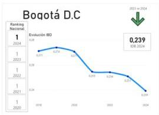

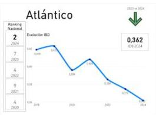

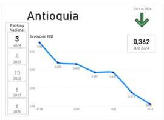

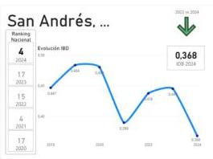

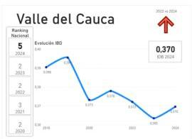

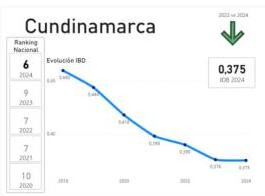

ÍNDICE DE BRECHA DIGITAL

---

# TOP 6 DEPARTAMENTOS CON MAYOR BRECHA DIGITAL

Los puntajes más cercanos a cero reflejan un mayor avance en el cierre de la brecha digital.

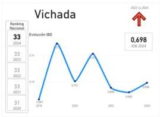

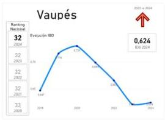

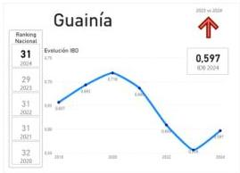

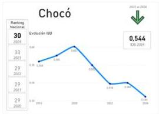

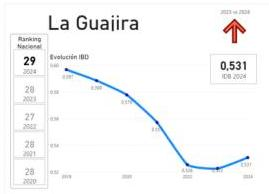

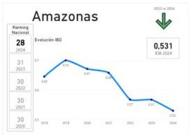

www.mintic.gov.co

---

TIC

EVOLUCIÓN DEL RANKING A NIVEL DEPARTAMENTAL

|  Departamento | 2018 | 2019 | 2020 | 2021 | 2022 | 2023 | 2024  |
| --- | --- | --- | --- | --- | --- | --- | --- |
|  Bogotá D.C | 1 | 1 | 0 | 1 | 0 | 1 | 0  |
|  Atlántico | 4 | 7 | -3 | 4 | 3 | 9 | -5  |
|  Antioquia | 7 | 4 | 3 | 6 | -2 | 6 | 0  |
|  San Andrés, |  |  |  |  |  |  |   |
|  Providencia y Sta | 8 | 14 | -6 | 17 | -3 | 4 | 13  |
|  Catalina |  |  |  |  |  |  |   |
|  Valle del Cauca | 2 | 2 | 0 | 2 | 0 | 3 | -1  |
|  Cundinamarca | 11 | 9 | 2 | 10 | -1 | 7 | 3  |
|  Santander | 5 | 6 | -1 | 8 | -2 | 10 | -2  |
|  Meta | 10 | 8 | 2 | 9 | -1 | 11 | -2  |
|  Risaralda | 6 | 3 | 3 | 3 | 0 | 2 | 1  |
|  Caldas | 9 | 10 | -1 | 7 | 3 | 8 | -1  |
|  Quindio | 3 | 5 | -2 | 5 | 0 | 5 | 0  |
|  Tolima | 12 | 12 | 0 | 12 | 0 | 13 | -1  |
|  Boyacá | 13 | 15 | -2 | 11 | 4 | 12 | -1  |
|  Casanare | 14 | 17 | -3 | 13 | 4 | 15 | -2  |
|  Norte de Santander | 16 | 11 | 5 | 14 | -3 | 14 | 0  |
|  Huila | 15 | 19 | -4 | 16 | 3 | 16 | 0  |
|  Cesar | 17 | 18 | -1 | 15 | 3 | 18 | -3  |
|  Bolívar | 18 | 13 | 5 | 18 | -5 | 17 | 1  |
|  Caquetá | 24 | 24 | 0 | 20 | 4 | 19 | 1  |
|  Guaviare | 28 | 26 | 2 | 26 | 0 | 26 | 0  |
|  Magdalena | 19 | 16 | 3 | 19 | -3 | 20 | -1  |
|  Cauca | 21 | 21 | 0 | 22 | -1 | 25 | -3  |
|  Córdoba | 23 | 23 | 0 | 24 | -1 | 22 | 2  |
|  Sucre | 22 | 22 | 0 | 23 | -1 | 24 | -1  |
|  Arauca | 25 | 25 | 0 | 25 | 0 | 23 | 2  |
|  Nariño | 20 | 20 | 0 | 21 | -1 | 21 | 0  |
|  Putumayo | 27 | 27 | 0 | 27 | 0 | 27 | 0  |
|  Amazonas | 30 | 31 | -1 | 30 | 1 | 30 | 0  |
|  La Guajira | 29 | 28 | 1 | 28 | 0 | 28 | 0  |
|  Chocó | 26 | 29 | -3 | 29 | 0 | 29 | 0  |
|  Guainía | 32 | 30 | 2 | 32 | -2 | 31 | 1  |
|  Vaupés | 31 | 32 | -1 | 33 | -1 | 32 | 1  |
|  Vichada | 33 | 33 | 0 | 31 | 2 | 33 | -2  |

Fuente: MinTIC, IBD 2024.

# REFERENCIAS

- Ministerio de Tecnologías de la Información y las Comunicaciones, FES Fundación para la Educación y el Desarrollo Social, &amp; Universidad de los Andes. (2018). Modelo regional de cierre de brecha digital.
- Ministerio de Tecnologías de la Información y las Comunicaciones (2022, julio) Índice de brecha digital regional: Metodología [Documento técnico]. MinTIC. Disponible en: https://ontic.mintic.gov.co/857/articles-384050_recurso_6.pdf
- Ministerio de Tecnologías de la Información y las Comunicaciones (2022, julio). Índice de brecha digital regional: Apéndices [Apéndices]. MinTIC. Disponible en: https://ontic.mintic.gov.co/857/articles-384050_recurso_7.pdf

ÍNDICE DE BRECHA DIGITAL

---

# TIC

# NTIC

Observatorio Nacional de Tecnologías de la Información y las Comunicaciones

Ministerio de Tecnologías de la Información y las Comunicaciones

2025

ministerio_tic

@ministerio_TIC

@ministerio_tic

@ministerio_tic

@ministerio_TIC. Colombia

@ministeriotic